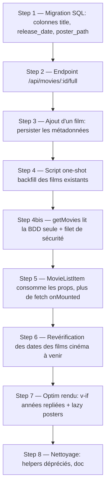

# Persistance des métadonnées films en BDD + optimisation du chargement

## Summary of intent

Aujourd'hui, à chaque chargement du calendrier, l'app tire **~2 requêtes TMDB par film** (une pour `release_dates`, une pour le titre + poster via `getMovieById` dans `MovieListItem`). Avec ~400 films en liste, ça fait ~800 appels simultanés → TMDB répond `429 Too Many Requests`. L'objectif est de **stocker les métadonnées d'un film en base au moment de l'ajout** (titre, date de sortie résolue, poster, média/état déjà présents) pour que le chargement du site ne fasse **aucun appel TMDB** en régime normal. On ajoute ensuite une **revérification ciblée** des dates de sortie pour les films cinéma **pas encore sortis** (seul cas où la date peut encore bouger), et quelques optimisations de rendu (montage paresseux des années repliées, lazy-load des posters). "Done" = ouvrir le site charge la liste depuis Supabase seul, zéro `429`, et les dates des films à venir se corrigent automatiquement.

## Related context

- **Goal / issue:** éliminer les `429 Too Many Requests` au chargement + fiabiliser les dates des sorties à venir.
- **Branch:** `feature/persist-movie-metadata`
- **Rules pertinentes:** aucune. La seule rule du repo (`f-github-pr-cross-repo-linking`) ne concerne que les PR cross-repo, hors sujet ici (repo unique).
- **Skills mobilisées (cf. `f-plan` Step 1.5), adaptées Nuxt :** le catalogue `f-*` cible à l'origine le starter WordPress FCINQ, mais plusieurs skills s'adaptent à ce projet **Nuxt 3 + Supabase + TMDB** :
  - `f-implement` → **pilote l'exécution** du plan step-by-step (Steps 1→8), coche les todos au fur et à mesure.
  - `f-commit` → **phase commit** : découpe en commits atomiques Conventional Commits (sans trailer Claude, cf. mémoire projet).
  - `f-pr` → **phase PR** : remplit le template et ouvre la PR via `gh`.
  - `f-use-flex` / `f-use-wrapper` / `f-typography-mixins` → **esprit adapté** au Step 7 (seul step qui touche du markup/SCSS) : réutiliser les classes/tokens existants du projet (`.flex`, `.wrapper`, variables de `app/assets/styles/`), **pas de magic number**, valeurs en `rem`. Pas de nouveau composant de design ici, donc pas de portage 1:1 du système WP — on applique la discipline "toujours passer par les tokens/utilitaires du projet".
  - **Non applicables :** `f-manage-component` / `f-use-js-component` (systèmes PHP/`AComponent` WordPress, sans équivalent dans les SFC Vue), `f-figma-*` (pas de design source), `f-acf-*` / `f-create-cpt` / `f-create-taxo` (WordPress only).

### État actuel (fichiers clés)

- Table Supabase `calendar` — colonnes existantes : `id`, `movie_id`, `media`, `state`, `manual_release_date`.
- `app/composables/useMovieCalendar.js` — `getMovies()` fait un `Promise.all` sur tous les films → 1 appel `release_dates` chacun (ligne 98). Contient la logique de résolution de la date FR (`getReleaseDateFromId`, type 3 = théâtrale, sinon notes CNC/Netflix/Amazon/Disney+).
- `app/components/MovieListItem.vue` — `onMounted → getMovieById(movie_id)` : 1 appel `/api/movies/:id` par film pour récupérer titre + poster (ligne 64-74).
- `app/components/nav/MovieAddForm.vue` — `addMovie()` insère juste `{ movie_id, media, state }` (ligne 46).
- `app/pages/index.vue` — les années sont dans `<Transition><div v-show="isYearExpanded(year)">` (ligne ~76) : **`v-show` garde tout monté**, donc même les années repliées déclenchent les fetch de `MovieListItem`.
- Server routes : `server/api/movies/[id]/index.js` (détail), `[id]/release_dates.js`, `search.js`. Toutes en `defineCachedEventHandler` sauf `search`.

### Décision "stockage des posters"

Le `429` vient de l'**API JSON** `api.themoviedb.org`, **pas** du CDN images `image.tmdb.org` (un CDN, pas de rate limit gênant). Donc :

- **Retenu :** stocker le `poster_path` TMDB (ex. `/abc123.jpg`) en BDD, et continuer à servir l'image depuis `image.tmdb.org`. Zéro coût de stockage, zéro appel API supplémentaire au chargement, robuste.
- **Écarté :** télécharger le fichier dans Supabase Storage. Ça consomme du quota, ajoute de la complexité (upload, URLs signées, purge) pour **aucun gain** sur le problème réel (les images ne sont pas la cause des `429`). À garder en tête seulement si un jour TMDB coupe l'accès CDN — pas le cas.

### Décision "lien Letterboxd"

Le lien est **entièrement dérivable** de `movie_id` : `https://letterboxd.com/tmdb/{movie_id}/` (déjà fait dans `MovieListItem.vue:84`). **Pas de colonne dédiée** — la stocker serait de la donnée redondante. On garde la dérivation.

## Proposed implementation flow



## Implementation steps

### Step 1 — Migration BDD : ajouter les colonnes de métadonnées

- [x] **Todo:** Ajouter à la table `calendar` les colonnes `title text`, `release_date date` (date FR théâtrale résolue, nullable), `poster_path text` (chemin TMDB relatif, nullable). `manual_release_date`, `media`, `state` existent déjà.
- **Files:** SQL à exécuter dans le SQL editor Supabase (documenter le script dans le plan / un fichier `_ressources/sql/`).
- **SQL:**
  ```sql
  alter table calendar
    add column if not exists title text,
    add column if not exists release_date date,
    add column if not exists poster_path text;
  ```
- **Acceptance:** Les 3 colonnes existent dans `calendar` ; les lignes existantes les ont à `null` (elles seront backfillées au Step 4).

### Step 2 — Endpoint serveur unifié `/api/movies/:id/full`

- [x] **Todo:** Créer une route qui appelle TMDB **une seule fois** avec `append_to_response=release_dates` et renvoie l'objet déjà résolu `{ title, poster_path, release_date }` (date FR théâtrale calculée côté serveur). Déplacer la logique de résolution de date FR (actuellement `getReleaseDateFromId` dans le composable) ici, source unique de vérité.
- **Files:** `server/api/movies/[id]/full.js` (create) ; réutiliser la logique type 3 / notes CNC·Netflix·Amazon·Disney+ de `useMovieCalendar.js` (lignes 22-38).
- **Détails:** `defineCachedEventHandler` (comme les routes voisines) ; URL TMDB : `/movie/{id}?api_key=...&language=fr-FR&region=FR&append_to_response=release_dates`. `getKey: movie_full:{id}`. Renvoyer `release_date` au format `YYYY-MM-DD` ou `null`.
- **Acceptance:** `GET /api/movies/<id>/full` renvoie `{ title, poster_path, release_date }` correct pour un film connu (théâtrale) et un film sans date FR (→ `release_date: null`).

### Step 3 — Ajout d'un film : persister les métadonnées en BDD

- [x] **Todo:** Dans `addMovie()`, avant l'insert Supabase, récupérer les métadonnées via `/api/movies/:id/full` et insérer `{ movie_id, media, state, title, poster_path, release_date }`. Émettre l'entrée complète (avec métadonnées) dans `movie-added` pour que la home l'affiche sans refetch.
- **Files:** `app/components/nav/MovieAddForm.vue` (modify).
- **Détails:** Gérer le cas `manual_release_date` : à l'ajout il n'y en a pas, donc `release_date` = date TMDB résolue. Conserver la détection de doublon existante (`.eq('movie_id', ...)`).
- **Acceptance:** Ajouter un film écrit `title`, `poster_path`, `release_date` en base ; le film apparaît immédiatement dans la liste avec poster + titre sans appel `/api/movies/:id` supplémentaire.

### Step 4 — Script one-shot de backfill des ~400 films existants

- [x] **Todo:** Écrire un **script de migration unique** qui lit toutes les lignes `calendar` sans `title`, résout leurs métadonnées via `/api/movies/:id/full` (ou directement TMDB) avec concurrence limitée (lots de ≤8), et écrit `title` / `poster_path` / `release_date` en base. À lancer **une seule fois** après la migration SQL, avant que les users rechargent.
- **Files:** `_ressources/sql/` ou `scripts/backfill-movies.mjs` (create) ; helper de concurrence `app/utils/promisePool.js` (create — N promesses max en parallèle, réutilisé au Step 6).
- **Détails:** Choix retenu = **script one-shot** (base perso, ~400 lignes connues) plutôt que backfill auto client, pour garder le composable propre (pas de branche legacy permanente). Le script peut taper Supabase directement (service key en `.env` local) ou passer par les endpoints. Throttle à 8 concurrents pour éviter le `429`.
- **Acceptance:** Après exécution, toutes les lignes `calendar` ont `title` / `poster_path` / `release_date` renseignés (les films sans date FR gardent `release_date: null`) ; aucun `429` pendant le run.

### Step 4bis — `getMovies` : lecture BDD seule (+ filet de sécurité)

- [x] **Todo:** Réécrire `getMovies()` pour lire directement `title`, `poster_path`, `release_date`, `manual_release_date`, `media`, `state` depuis `calendar` **sans aucun appel TMDB**. Date effective = `manual_release_date ?? release_date`. **Filet de sécurité minimal** : si une ligne arrive sans `title` (edge case ajout pendant la transition), la résoudre à la volée via `/api/movies/:id/full` et persister — cas résiduel, pas le chemin nominal.
- **Files:** `app/composables/useMovieCalendar.js` (modify).
- **Détails:** `formateDate` / `sortMovies` / `applyAutoInTheaters` restent mais opèrent sur la date déjà stockée.
- **Acceptance:** Sur une base backfillée, ouvrir le site → **0 requête** vers `/api/movies/*` (vérifier l'onglet Network).

### Step 5 — `MovieListItem` : consommer les props, supprimer le fetch `onMounted`

- [x] **Todo:** Supprimer `getMovieById` + `onMounted` de `MovieListItem.vue`. Recevoir `title` et `poster_path` en props (fournis par `index.vue` depuis les données BDD) et les afficher directement.
- **Files:** `app/components/MovieListItem.vue` (modify) ; `app/pages/index.vue` (modify — passer `:title` et `:poster-path` aux deux boucles `MovieListItem`, lignes 82 et 102).
- **Acceptance:** Les titres/posters s'affichent sans qu'aucun `MovieListItem` ne déclenche de requête réseau ; le lien Letterboxd (dérivé de `movie_id`) fonctionne toujours.

### Step 6 — Revérification des dates des sorties cinéma à venir

- [x] **Todo:** Après `getMovies()`, sélectionner les films `media === 'cinema'`, **sans** `manual_release_date`, dont la date effective est **dans le futur** (ou `null`), et re-fetcher `/api/movies/:id/full` (throttlé via le même pool). Si la `release_date` a changé, mettre à jour la ligne `calendar` **et** l'état local, puis re-trier.
- **Files:** `app/composables/useMovieCalendar.js` (modify).
- **Détails:** Ne jamais écraser un `manual_release_date` (override utilisateur prioritaire). L'ensemble revérifié est petit (uniquement les à-venir), donc peu d'appels. Le cache serveur (`swr`) absorbe les revérifs répétées d'une même journée.
- **Acceptance:** Si TMDB modifie la date d'un film à venir, un rechargement du site met à jour la date affichée **et** la valeur en base ; les films déjà sortis ne sont pas revérifiés ; aucun `429`.

### Step 7 — Optimisation du rendu : montage paresseux + lazy posters

- [x] **Todo:** (a) Remplacer le `v-show` des années repliées par un montage paresseux (`v-if` sur le contenu de l'année, ou ne monter les `MovieListItem` d'une année qu'une fois dépliée) pour que les années repliées ne créent ni DOM ni ``. (b) Ajouter `loading="lazy"` (et `format`/`sizes` si pertinent) sur les `NuxtImg` des posters.
- **Files:** `app/pages/index.vue` (modify) ; `app/components/MovieListItem.vue` (modify — attribut lazy sur le poster).
- **Détails:** Garder l'année courante dépliée par défaut (comportement actuel). Conserver la `Transition` d'ouverture si possible (envelopper le `v-if`). Vérifier que `scrollToMovie` / `scrollToClosestDate` fonctionnent toujours quand une année cible est repliée (déplier avant scroll — l'event `expand-year` existe déjà).
- **Acceptance:** À l'ouverture, seuls les posters de l'année dépliée sont dans le DOM ; déplier une année ancienne monte ses items à la demande ; le scroll vers un film d'une année repliée la déplie puis scrolle.

### Step 8 — Nettoyage et documentation

- [x] **Todo:** Retirer le code mort (`getReleaseDateFromId` côté client si totalement remplacé par `/full`, ancien `getMovieById`), s'assurer que `handleMovieAdded` / `handleReleaseDateUpdated` utilisent les données persistées, et documenter les nouvelles colonnes + le flux dans `CLAUDE.md` (section Data flow) et le SQL dans `_ressources/sql/`.
- **Files:** `app/composables/useMovieCalendar.js`, `CLAUDE.md`, `_ressources/sql/` (modify/create).
- **Acceptance:** Pas de fonction inutilisée résiduelle ; `CLAUDE.md` décrit que les métadonnées vivent en base et que TMDB n'est appelé qu'à l'ajout et à la revérif des à-venir.

## Dependencies and ordering

- Step 1 (colonnes) **avant** tout le reste (les inserts/reads en dépendent).
- Step 2 (endpoint `/full`) **avant** Steps 3, 4, 4bis, 6 (tous consomment `/full`).
- Step 4 (helper `promisePool`) réutilisé par Step 6.
- Step 4 (script backfill) à lancer **avant** de compter sur le read seul du Step 4bis en prod.
- Step 5 dépend de Step 4bis (les props titre/poster viennent des données BDD chargées).
- Step 7 et 8 en dernier (optim + nettoyage), après validation fonctionnelle des Steps 1-6.

## Risks and unknowns

| Risk / unknown | Mitigation |
|----------------|------------|
| Lignes legacy sans métadonnées au premier chargement post-déploiement | Script one-shot (Step 4, lots ≤8) lancé avant les users ; filet de sécurité client (Step 4bis) pour les cas résiduels |
| Résolution de date FR divergente entre ancien code client et nouvel endpoint serveur | Reprendre **exactement** la logique existante (type 3 puis notes CNC/Netflix/Amazon/Disney+) dans `/full`, tester sur quelques films connus |
| `manual_release_date` écrasé par la revérif | Exclure explicitement les films avec `manual_release_date` du Step 6 |
| `poster_path` évoluant côté TMDB (rare) | Couvert incidemment par la revérif des à-venir ; sinon la valeur reste valable (les posters ne changent quasi jamais) |
| Sécurité : le client écrit `title`/`poster_path` en base (confiance client) | Cohérent avec l'archi actuelle (le client écrit déjà `media`/`state`) ; les RLS Supabase existantes s'appliquent |
| `scrollToMovie` vers une année repliée après passage en `v-if` | Déplier la cible avant scroll via l'event `expand-year` déjà présent |

## Handoff to implementation

- **Plan file:** `_ressources/plans/2607241048-persist-movie-metadata-and-optimize-load.md`
- **First todo:** Step 1 — Migration BDD (ajouter `title`, `release_date`, `poster_path`)
- **Out of scope:** Téléchargement des posters dans Supabase Storage ; colonne Letterboxd (dérivée) ; virtualisation/pagination complète de la liste ; refonte du prerender de la home.

**Next action:** Work implementation steps in order, checking off each `- [ ]` as completed.
