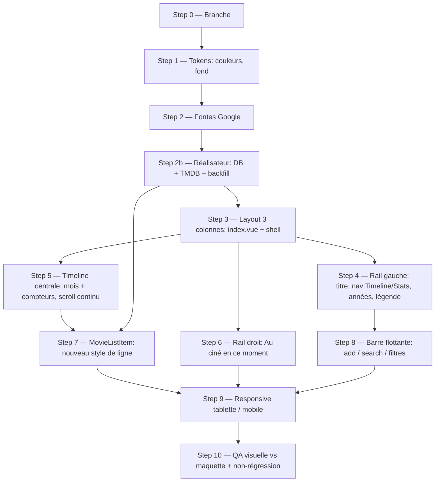

# Refonte visuelle de la page Timeline (design Claude Design)

## Summary of intent

Appliquer à la page calendrier (`/`) le nouveau style conçu par Claude Design (`_ressources/Timeline.html`) : passage d'une liste centrée mono-colonne + accordéon par année à un **layout 3 colonnes** (rail gauche de navigation, timeline centrale continue, rail droit « Au ciné en ce moment »), avec une nouvelle palette, de nouvelles fontes et un nouveau traitement des lignes de film. Le modèle de données (`media` / `state` / dates) et toute la logique métier existante (Supabase, TMDB, overrides de date, auto-inTheaters, revérif) restent inchangés — c'est **uniquement la couche présentation** qui évolue. « Done » = la timeline rend visuellement comme la maquette sur desktop, tablette et mobile, sans régression fonctionnelle (ajout, filtres, changement média/état, édition de date, suppression, scroll-to-today, recherche). La page Stats est **hors périmètre** (implémentée plus tard).

## Related context

- **Goal / issue:** Refonte du site par Claude Design ; appliquer le style de `_ressources/Timeline.html` au projet Nuxt existant. Priorité au comportement proposé par la version HTML en cas de divergence.
- **Branch:** `feature/refonte-style-timeline`
- **Rules pertinentes:**
  - `.claude/rules/f-scss-spacing-rounding.md` — arrondir les margins/paddings repris de la maquette au multiple de 8/10 le plus proche (base 10px = 1rem).
  - `.claude/rules/f-scss-no-reset-redeclaration.md` — ne pas redéclarer ce que `_reset.scss` couvre déjà.
  - `.claude/rules/f-rscss.md` — nommage classes/éléments/variantes (le code existant suit déjà `.movie-list-item` + modifiers `-`).
  - ⚠️ `f-scss-variables.md` **ne s'applique pas** : ce projet n'utilise pas `@use "styles/variables"` — les variables SCSS sont auto-injectées globalement via `additionalData` (nuxt.config), on écrit `$color-primary` directement.
- **Skills mobilisées (cf. `f-plan` Step 1.5):** **Aucune.** Les skills FCINQ disponibles ciblent le starter **WordPress** (PHP, ACF, `include_template`, scaffolder `npm run create:component`, système `.grid/.col/.wrapper` du starter, pipeline SVG WP, Figma→SCSS). Ce projet est **Nuxt 3 / Vue** avec sa propre stack SCSS ; les rattacher serait un faux positif. La source de design est un fichier HTML local (pas d'URL Figma → aucune skill Figma). `f-commit` / `f-pr` pourront être invoquées manuellement en fin de travail (hors plan).

## Proposed implementation flow

## Décisions validées (réponses utilisateur)

- **Q1 — Années :** ✅ **Scroll continu** comme la maquette. On **supprime l'accordéon** ; le rail gauche scrolle vers l'année et surligne l'année active au scroll.
- **Q4 — Contrôles média/état :** ✅ **Restent des dropdowns interactifs restylés** (comportement `SelectBtn` conservé, look maquette). Confirmé aussi côté mobile (`openMedia`/`openState` cliquables).
- **Q5 — Fontes & palette :** ✅ **Tout adopter, fontes via Google Fonts** (lien externe) + nouvelle palette complète.
- **Q6 — Responsive :** ✅ Spec **extraite du bundle** (section `<!-- MOBILE -->`, bascule `matchMedia('(min-width:1000px)')`). Voir « Layout mobile » ci-dessous. Q2 (filtres) et Q3 (rail droit) tranchés par défaut, cf. notes de step.

## Décisions de design relevées dans la maquette (source de vérité)

Tokens extraits des styles calculés de `Timeline.html` :

- **Fond page:** `#0C0D11` (rgb 12,13,17). **Texte:** `#F4F2EE`.
- **Accent primaire:** `#FF3D77` (remplace `#ec008b`).
- **Statuts (bord gauche 3px + fond teinté ~15%):**
  - Vu au ciné → vert `#2FBF71` (bg `rgba(47,191,113,.15)`)
  - Vu en streaming → ambre `#F0A935` (bg `rgba(240,169,53,.14)`)
  - En salle → rose `#FF3D77` (bg `rgba(255,61,119,.16)`)
  - À venir → gris `#3A3F4A` (bord seul, pas de fond)
- **Fontes:** titres = `Bricolage Grotesque` (800, letter-spacing ~-0.5px) ; corps = `Schibsted Grotesk` ; mono = `Space Mono` (numéros de jour, compteurs « N films »).
- **Structure ligne:** `[n° jour] [poster] [titre]  ……  [libellé statut/réalisateur] [badge média] [icône état] [⋮]`.
  - badge média : boîte pellicule (cinéma) ou pastille plateforme colorée (`N` Netflix rouge, `P` plateforme bleue…).
  - icône état : œil vert (vu ciné) / flèche download (streaming) / ticket rose (en salle).
  - menu `⋮` : « Modifier la date » + « Supprimer » (= `MovieActionsBtn` actuel).
- **Rail gauche:** titre « Ma cinémathèque », toggle `Timeline | Stats` (Timeline actif = fond `#FF3D77`), liste des années (2023→2027 + « Sans date ») avec compteur de films par année, bloc « STATUTS » (légende 4 pastilles).
- **Rail droit:** « AU CINÉ EN CE MOMENT » — films actuellement en salle (poster + date courte).
- **Timeline centrale:** scroll continu, en-têtes de mois (`Février`, `Mars`…) avec compteur « N films » à droite ; **pas d'accordéon** par année.
- **Barre flottante bas-centre:** champ « Titre du film — ajouter… » + icônes calendrier / recherche / filtres.
- **Greys/borders maquette (à réutiliser):** surfaces `#14161c` / `#181a22` / `#191b23`, borders `#20232c` / `#23262f` / `#262932`, texte atténué `#8a8f9c`, texte faible `#565b66` / `#6b7280`, rose clair `#ff6d97`. À intégrer comme tokens dérivés au fil des steps (ne pas tout figer d'un coup).

## Layout mobile (extrait du bundle, `<1000px`)

Bascule desktop/mobile via `matchMedia('(min-width:1000px)')`. Le mobile a une structure dédiée dans la maquette :

- **En-tête** (`padding 24px 18px 10px`) : titre « Ma cinémathèque » + **pastille année** (Space Mono, chevron, ouvre un sélecteur d'année — le year picker survit sur mobile sous forme de dropdown) ; en dessous un **segmented control `Timeline | Stats`** pleine largeur (onglet actif fond `#ff3d77`).
- **« Au ciné en ce moment »** → **bande horizontale scrollable repliable** en haut de la timeline (posters 86×128, `overflow-x:auto`, bordure rose), avec pastille rose pulsante + compteur + chevron de repli.
- **Timeline** : zone scrollable, en-têtes de mois **sticky** (fond `rgba(12,13,17,.92)` + `backdrop-filter: blur(8px)`), nom de mois + filet + compteur.
- **Ligne film mobile** : `[jj Space Mono 24px] [poster 36×54] [titre + sous-titre] [mediaChip] [icône état] [⋮]`, `border-left: 3px` accent + fond teinté (identique desktop, compacté). mediaChip/état/⋮ cliquables.
- **STATUTS (légende)** : **absente du mobile** (droppée).
- **Barre du bas** : input pill pleine largeur « Titre du film — ajouter… » avec dropdown **Suggestions TMDB** au-dessus, puis une rangée d'icônes centrée (aujourd'hui / recherche / filtres). Dégradé de fond `linear-gradient(transparent, #0c0d11)`.
- **État vide** : « Aucun film ne correspond. »

## Pastilles média & libellés (extrait du bundle — source de vérité)

**Pastille média** (`mediaBadge`, 24×24 desktop / 22×22 mobile, `border-radius:6px`, `font 800 10px Schibsted`) — ✅ **pastilles retenues** (pas les PNG) :

| Clé maquette | Rendu | bg | couleur |
|---|---|---|---|
| `cinema` | icône pellicule (`ic-film`) | `#2a2d36` | `#c9ccd4` |
| `netflix` | lettre `N` | `#e50914` | `#fff` |
| `prime` | lettre `P` | `#00a8e1` | `#fff` |
| `disney` | lettre `D+` | `#113ccf` | `#fff` |
| `streaming` | icône play (`ic-play`) | `#3a3f4a` | `#c9ccd4` |

**Mapping clés app → maquette** (l'app utilise `cinema / vod / primeVideo / disney+ / netflix / streaming` +`unknown`) :
`cinema→pellicule`, `netflix→N`, `primeVideo→P`, `disney+→D+`, `streaming→play`, **`vod→streaming` (fusion ✅, pastille play)**, `unknown→play/neutre`.

**Icône état** (`vis()`), pilote aussi `accent` (bord 3px) + `tint` (fond) :

| État app | → maquette | accent / eyeColor | icône | tint | label |
|---|---|---|---|---|---|
| `inTheaters` | `theater` | `#ff3d77` | ticket | `rgba(255,61,119,.16)` | En salle maintenant |
| `seen` (cinéma) | `seen` | `#2fbf71` | œil | `rgba(47,191,113,.15)` | — (sub = réal.) |
| `seen` (streaming) | `seen` | `#f0a935` | œil | `rgba(240,169,53,.14)` | — (sub = réal.) |
| `downloadAvailable` | `download` | `#3a3f4a` (œil `#8a8f9c`) | download | transparent (dim) | Dispo en téléchargement |
| `unseen` / autre | défaut | `#3a3f4a` | — | transparent | Envie de voir |

**Libellé de droite (`sub`)** — logique maquette :
`sub = (state===seen) ? (director || label_média) : (En salle ? 'En salle maintenant' : (director || label_état))`.
→ **Le sous-titre affiche le réalisateur quand il est connu** (`f.dir`), sinon retombe sur le libellé média/état. Le champ `director` est ajouté à la table `calendar` (cf. Step 2b) et branché sur ce `sub`.

## Implementation steps

### Step 0 — Créer la branche

- [x] **Todo:** Créer et se placer sur `feature/refonte-style-timeline` depuis `main`.
- **Files:** —
- **Acceptance:** `git branch` montre la branche courante.

### Step 1 — Tokens de couleur & variables

- [x] **Todo:** Mettre à jour `_variables.scss` avec la nouvelle palette (fond, texte, primaire, vert, ambre, gris statut). Conserver les anciens noms de variables (`$color-primary`, `$color-green`, `$color-yellow`, `$color-orange`) mais réaffecter leurs valeurs aux teintes de la maquette pour propager automatiquement dans `MovieListItem`, `SelectBtn`, `FilterPanel`. Ajouter les tokens manquants (fond `#0C0D11`, texte `#F4F2EE`, gris statut `#3A3F4A`).
- **Files:** `app/assets/styles/_variables.scss`, `app/assets/styles/_ui.scss` (fond/texte body si défini là)
- **Rules:** `f-rscss` (nommage), `f-scss-variables` (N/A ici, cf. note)
- **Acceptance:** le fond global, la couleur de texte et l'accent des lignes existantes reflètent la maquette sans toucher aux composants.
- score / 10

### Step 2 — Intégration des fontes

- [x] **Todo:** Charger **via Google Fonts** (Q5) Bricolage Grotesque, Schibsted Grotesk et Space Mono — ajouter les `<link>` `preconnect` + stylesheet dans `nuxt.config.ts` (`app.head.link`). Introduire `$font-title` (Bricolage 800) / `$font-body` (Schibsted) / `$font-mono` (Space Mono) dans `_variables.scss` et brancher les mixins de `_typography-mixins.scss` (`title-2/4/5`, `body`, `input-body`) sur ces familles + graisses de la maquette. `_fonts.scss` : retirer les `@font-face` Futura/Do Hyeon devenus inutiles (ou les garder si d'autres pages en dépendent — vérifier `/login`, `/search`, `/movies/[id]`).
- **Files:** `nuxt.config.ts`, `app/assets/styles/_typography-mixins.scss`, `app/assets/styles/_variables.scss`, `app/assets/styles/_fonts.scss`
- **Rules:** `f-scss-no-reset-redeclaration`
- **Acceptance:** titres en Bricolage, corps en Schibsted, numéros de jour/compteurs en Space Mono ; aucune fonte manquante en console.
- score / 10

### Step 2b — Données réalisateur (DB + TMDB + backfill)

- [x] **Todo:** Ajouter la persistance du **réalisateur** pour alimenter le sous-titre des lignes (Q « réalisateur » ✅ oui).
  1. **Schéma** : ajouter une colonne `director` (text, nullable) à la table `calendar` — SQL de migration dans `_ressources/sql/`.
  2. **Route TMDB** : dans `server/api/movies/[id]/full`, ajouter `credits` à `append_to_response` et extraire le réalisateur (`crew` où `job === 'Director'`, joindre si plusieurs) ; renvoyer `director` dans le payload `{ title, poster_path, release_date, director }`.
  3. **Insertion** : persister `director` à l'ajout (`MovieAddForm` → insert Supabase).
  4. **Chargement** : propager `director` dans `useMovieCalendar` (filet de sécurité `getMovies` + `recheckUpcomingCinema` + `handleMovieAdded`).
  5. **Backfill** : étendre `scripts/backfill-movies.mjs` pour renseigner `director` sur les lignes existantes (throttle inchangé via `promisePool`).
- **Files:** `_ressources/sql/` (create migration), `server/api/movies/[id]/full.*`, `app/components/nav/MovieAddForm.vue`, `app/composables/useMovieCalendar.js`, `scripts/backfill-movies.mjs`
- **Acceptance:** un film ajouté persiste son réalisateur ; les lignes existantes sont backfillées ; `director` disponible côté front pour le sous-titre.
- score / 10

### Step 3 — Shell layout 3 colonnes

- [x] **Todo:** Restructurer `index.vue` en grille 3 colonnes (rail gauche fixe / timeline scrollable / rail droit) au lieu du `wrapper -large` centré. Extraire éventuellement le shell dans un layout Nuxt (`app/layouts/`) si réutilisé par la future page Stats. La colonne centrale devient le seul zone scrollable ; rails latéraux `sticky`/fixes.
- **Files:** `app/pages/index.vue`, éventuellement `app/layouts/default.vue` (create)
- **Acceptance:** 3 colonnes alignées comme la maquette sur desktop ; largeur/gouttières calées sur la maquette (arrondies).
- score / 10

### Step 4 — Rail gauche (navigation)

- [x] **Todo:** Créer un composant rail gauche : titre « Ma cinémathèque », toggle `Timeline | Stats` (Stats = lien inactif/placeholder pour l'instant), liste des années avec compteur par année (réutiliser le `computed` de comptage déjà présent dans `index.vue`), entrée « Sans date », et bloc légende « STATUTS » (4 pastilles). L'onglet **Stats** du toggle est un **placeholder inactif** (visible, non cliquable, pas de routing) tant que la page Stats n'existe pas. Câbler le clic année → scroll vers l'année (réutiliser l'event `scroll-to-year` existant) + surlignage de l'année active au scroll (Q1 ✅ scroll continu). Ce composant remplace l'ancien `YearPicker` du bas (desktop).
- **Files:** `app/components/nav/SideNav.vue` (create), `app/components/nav/YearPicker.vue` (retirer/rapatrier), `app/pages/index.vue`
- **Rules:** `f-rscss`
- **Acceptance:** rail gauche conforme ; clic année scrolle la timeline ; compteurs corrects ; légende affichée.
- score / 10

### Step 5 — Timeline centrale (scroll continu + compteurs mois)

- [x] **Todo:** Retirer l'accordéon par année (`expandedYears`, `toggleYear`, `isYearExpanded`, `expandYear`, chevrons, `<Transition>`, event `expand-year`) au profit d'un **scroll continu** (Q1 ✅). Restyler les en-têtes d'année et de mois selon la maquette et ajouter le **compteur « N films »** par mois (calculé depuis `sortedMovies`). Conserver la structure année→mois→jour et les `data-year`/`data-date` (nécessaires au scroll).
- **Files:** `app/pages/index.vue`, `app/composables/useMovieCalendar.js` (si un comptage par mois est ajouté au tri)
- **Acceptance:** timeline continue, en-têtes de mois avec compteur, ancres de scroll préservées.
- score / 10

### Step 6 — Rail droit « Au ciné en ce moment »

- [x] **Todo:** Créer un composant rail droit listant les films en salle en ce moment (`state === 'inTheaters'`), avec poster + date courte, trié par date. Clic sur un item → scroll vers la ligne du film (réutiliser `scrollToMovie`). (Q3 ✅ : source = `inTheaters`, clic = scroll.)
- **Files:** `app/components/CinemaNowPanel.vue` (create), `app/pages/index.vue`
- **Rules:** `f-rscss`
- **Acceptance:** le panneau liste exactement les films `inTheaters` ; clic scrolle vers la ligne.
- score / 10

### Step 7 — MovieListItem (nouveau style de ligne)

- [x] **Todo:** Restyler `MovieListItem.vue` selon la maquette : n° de jour (Space Mono), poster arrondi, titre, libellé de droite (réalisateur ou statut « En salle maintenant »/« Cinéma »/plateforme), puis groupe d'actions `[badge média][icône état][⋮]`. Conserver le mécanisme `--accent` existant (bord 3px + fond teinté) qui mappe déjà exactement les 4 statuts. Les deux `SelectBtn` (média/état) **restent des dropdowns interactifs restylés** (Q4 ✅) : badge média cliquable + icône état cliquable. **Média = pastilles CSS** (cf. « Pastilles média » — pas les PNG `/images/*.png`), avec mapping des clés app→maquette. État = icône ticket/œil/download selon `vis()`. Conserver `MovieActionsBtn` pour le menu `⋮`. Le sous-titre de droite suit la logique `sub` (réalisateur si dispo, sinon libellé — dépend de la décision « director », cf. Risks).
- **Files:** `app/components/MovieListItem.vue`, `app/components/SelectBtn.vue`, `app/components/MovieActionsBtn.vue`
- **Rules:** `f-rscss`, `f-scss-spacing-rounding`, `f-scss-no-reset-redeclaration`
- **Acceptance:** ligne visuellement conforme pour les 4 statuts ; changement média/état et menu fonctionnels.
- score / 10

### Step 8 — Barre flottante (add / recherche / filtres)

- [x] **Todo:** Restyler la barre flottante bas-centre (`nav/Header.vue`) selon la maquette (champ d'ajout + icônes calendrier/recherche/filtres). Retirer le `YearPicker` de la barre sur desktop (déplacé au rail gauche, Step 4). **Q2 ✅ :** le panneau de filtres **reste ancré à la barre du bas** (desktop & mobile), comme dans la maquette — pas dans le rail gauche.
- **Files:** `app/components/nav/Header.vue`, `app/components/nav/FilterPanel.vue`, `app/components/nav/MovieAddForm.vue`
- **Rules:** `f-scss-spacing-rounding`
- **Acceptance:** barre conforme ; add / recherche / filtres / scroll-to-today fonctionnels.
- score / 10

### Step 9 — Responsive tablette & mobile

- [x] **Todo:** Implémenter le **layout mobile de la maquette** (bascule `<1000px`, cf. section « Layout mobile ») : en-tête titre + pastille année (dropdown) + segmented `Timeline | Stats` ; « Au ciné » en **bande horizontale scrollable repliable** en haut ; rail gauche masqué ; légende STATUTS droppée ; barre du bas en pill + rangée d'icônes ; mois sticky avec blur. Palier tablette (`1024→1000px`) : garder le 3-colonnes tant que la largeur suffit, sinon basculer mobile au seuil 1000px de la maquette.
- **Files:** `app/pages/index.vue`, `app/components/MovieListItem.vue`, composants rails, `nav/Header.vue`
- **Rules:** `f-scss-spacing-rounding`
- **Acceptance:** aucun débordement horizontal ; timeline lisible et utilisable sur mobile.
- score / 10

### Step 10 — QA visuelle & non-régression

- [ ] **Todo:** Lancer `npm run dev`, comparer visuellement avec la maquette (desktop/tablette/mobile) et vérifier la non-régression fonctionnelle : ajout d'un film, filtres état/média, changement média/état sur une ligne, édition/retrait de date manuelle, suppression, scroll-to-today, recherche, panneau « au ciné », auto-inTheaters, revérif TMDB (pas de 429).
- **Files:** —
- **Acceptance:** rendu fidèle à la maquette et zéro régression fonctionnelle constatée.
- score / 10

## Dependencies and ordering

- Step 0 en premier. Steps 1–2 (tokens + fontes) avant tout le reste (fondations visuelles). **Step 2b (réalisateur, backend)** indépendant du visuel mais **prérequis du Step 7** (sous-titre) ; peut être mené en parallèle du shell. Step 3 (shell) avant 4/5/6 (contenus des colonnes). Step 7 (ligne) après 5 (contexte timeline) **et** 2b. Step 9 (responsive) après 3–8. Step 10 en dernier.
- Toutes les questions de cadrage sont tranchées (scroll continu, dropdowns interactifs, Google Fonts, mobile depuis la maquette, pastilles média, réalisateur = oui, vod→streaming, Stats placeholder).

## Risks and unknowns

| Risk / unknown | Mitigation |
|----------------|------------|
| Suppression de l'accordéon (`expandedYears` & co) touche plusieurs handlers/events dans `index.vue` | Retirer proprement `expand-year`, `onExpandYear`, `expandYear` et vérifier qu'aucun autre listener ne casse (Step 5). |
| Dépendance à Google Fonts (réseau externe) au chargement | Q5 tranché (Google Fonts). Ajouter `preconnect` + `display=swap` ; accepter le coût réseau. |
| Réalisateur (`director`) : migration DB + coût TMDB (append `credits`) + backfill | ✅ Décidé (Step 2b). Backfill throttlé (`promisePool`) ; `director` nullable → fallback libellé si absent. |
| Extraction réalisateur TMDB (plusieurs `Director` possibles, ou aucun) | Joindre les noms si plusieurs, `null` si aucun crew Director ; le `sub` gère le `null` via fallback. |
| Mapping clés média app→maquette (`vod` fusionné dans `streaming`) | ✅ `vod→streaming` (pastille play) ; `unknown→neutre`. Vérifier que les filtres média (`FilterPanel`) restent cohérents avec la fusion vod/streaming. |
| Onglet `Stats` alors que la page est hors périmètre | ✅ Placeholder inactif (visible, non cliquable). |
| Rail droit `inTheaters` : `state` mis à jour à la volée (`applyAutoInTheaters`) | Alimenter le panneau depuis `movies.value` réactif pour refléter les bascules auto. |
| Rails latéraux + `prerender` de `/` (route rules) | Vérifier que le rendu SSR/prerender du shell 3 colonnes reste correct (rails `sticky`, pas de dépendance `window` au render initial). |
| Seuil responsive maquette = `1000px` (≠ breakpoints projet 767/1024) | Adopter le seuil `1000px` de la maquette pour la bascule mobile plutôt que forcer 767/1024. |

## Handoff to implementation

- **Plan file:** `_ressources/plans/2607241545-refonte-style-timeline.md`
- **First todo:** Step 0 — Créer la branche
- **Out of scope:** Page **Stats** (plus tard) ; pages `/login`, `/search`, `/movies/[id]` (sauf ajustements de tokens hérités) ; logique métier Supabase/TMDB (inchangée).

**Next action:** Work implementation steps in order, checking off each `- [ ]` as completed.
