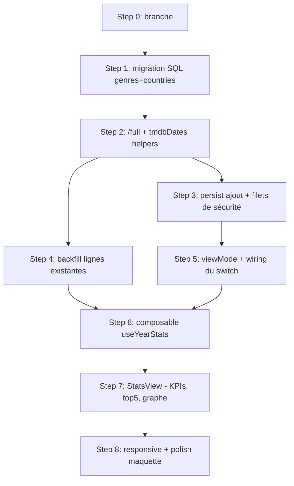

# Page Statistiques par année

## Summary of intent

Ajouter une vue « Statistiques » consultable pour l'année actuellement sélectionnée, accessible via le switch **Timeline | Stats** déjà présent dans la maquette (rail gauche desktop + en-tête mobile, aujourd'hui désactivé). La vue affiche, pour l'année en cours : le nombre total de films, le ratio vu/à voir, le ratio cinéma/streaming, le top 5 des genres, le top 5 des pays, et un graphe en bâtons du nombre de films vus par mois (avec surcouche « vus au cinéma »). « Done » = depuis le calendrier, cliquer sur **Stats** bascule la zone principale sur les statistiques de l'année sélectionnée, sans changer de route, avec les 6 blocs ci-dessus alimentés par les données réelles.

## Recommandation d'architecture (réponse à ta question)

> « Une page par année + page stats, ou autre arbo ? »

**Recommandé : garder la page unique `/` et ajouter un `viewMode` (`'timeline' | 'stats'`) — pas de nouvelle route.**

Raisons :
- La sélection d'année vit déjà **en mémoire dans `/`** (`selectedYear`), pas dans l'URL. Il n'y a donc pas de « page par année » à créer — l'année est un état, et les stats sont juste une **autre vue du même état**.
- Le switch **Timeline | Stats** de la maquette est déjà intégré dans `SideNav.vue` et `index.vue` : sa sémantique naturelle est un toggle de vue sur le contexte courant (l'année sélectionnée), pas une navigation.
- Une route `/stats/[year]` dupliquerait tout le shell (rails, nav années, bande ciné) et la logique de sélection d'année, pour zéro gain fonctionnel.

Conséquence : la vue Stats se recalcule pour `selectedYear`. Changer d'année dans le rail met à jour aussi bien la Timeline que les Stats.

## Related context

- **Goal / issue:** Feature demandée en direct (voir prompt `/f-plan`). Maquette de référence : `_ressources/Statistiques.html` (page « bundlée » — markup packé dans un blob JS ; la fidélité visuelle sera calée en rendant la maquette au moment de l'implémentation).
- **Branch:** `feature/page-statistiques-par-annee`
- **Rules pertinentes:** aucune rule `.claude/rules/*` applicable (les rules du repo concernent le PR cross-repo GitHub et la typo FCINQ WordPress — hors sujet ici, projet Nuxt/Vue).
- **Skills mobilisées (cf. `f-plan` Step 1.5):** `dataviz` (rattachée au Step 7 — graphe bâtons + visuels de ratio). Les skills `f-*` (manage-component, figma-to-scss, typography-mixins, use-grid/flex…) sont **écartées** : elles ciblent le FCINQ Starter v5 (PHP/WordPress, `include_template()`, mixins typo autogénérés, helper `\F\utils\SVG`), incompatible avec ce projet Nuxt 3 (SFC Vue, SCSS avec variables `$font-futura`, helper `<Svg>`). On suit les conventions **locales** du repo (composants `.vue`, variables SCSS auto-injectées, utilitaire `.flex`).

## Décisions & conventions retenues

- **Genres & pays absents de la base.** La table `calendar` ne stocke ni genre ni pays, et `/full` ne les renvoie pas. On suit le principe CLAUDE.md (« metadata lives in the DB, not fetched on every load ») : **on ajoute deux colonnes** et on persiste à l'ajout + backfill, exactement comme `title` / `director` / `poster_path`. Aucun appel TMDB au chargement de la page stats.
- **Format de stockage :** `genres text[]` (noms FR, déjà localisés par `language=fr-FR`) et `countries text[]` (codes ISO `iso_3166_1`). Affichage FR des pays via `Intl.DisplayNames(['fr'], { type: 'region' })` (natif, pas de dict à maintenir).
- **Ratio vu / à voir :** ✅ tranché — `vu = state === 'seen'` uniquement. `à voir = unseen + inTheaters + downloadAvailable` (tout ce qui n'est pas explicitement vu).
- **Ratio cinéma / streaming :** `cinéma = media === 'cinema'`. `streaming = netflix | primeVideo | disney+ | streaming | vod` (tout le reste). Vocab confirmé dans `MovieListItem.vue`.
- **Graphe mensuel :** ✅ tranché — regroupement par **mois de la `release_date`** (seule date dispo, cohérent avec le calendrier). Le graphe compte les films **vus** (`state === 'seen'`) par mois, sur l'année sélectionnée. Surcouche = sous-ensemble `media === 'cinema'`.
- **Composant dédié `StatsView.vue`** (nouveau) rendu dans `shell-main`. `YearStats.vue` existant est **du code mort** (non importé) — on le laisse tel quel, hors scope.

## Proposed implementation flow

## Implementation steps

### Step 0 — Créer la branche

- [x] **Todo:** Créer et basculer sur `feature/page-statistiques-par-annee` depuis `main`.
- **Files:** —
- **Acceptance:** `git branch --show-current` renvoie `feature/page-statistiques-par-annee`.

### Step 1 — Migration SQL : colonnes genres + countries

- [x] **Todo:** Écrire une migration ajoutant `genres text[]` et `countries text[]` à la table `calendar` (nullable, pas de default contraignant), sur le modèle des migrations existantes.
- **Files:** `_ressources/sql/2607271048-add-genres-countries-columns.sql` (create)
- **Acceptance:** SQL exécutable ; après exécution, `calendar` possède `genres` et `countries`. (Exécution manuelle en base par l'utilisateur, comme pour les migrations précédentes.)

### Step 2 — `/full` renvoie genres + pays

- [x] **Todo:** Ajouter `extractGenres(movie)` et `extractCountries(movie)` dans `server/utils/tmdbDates.js` (source unique), puis les renvoyer depuis la route `/full`. `genres` = `movie.genres.map(g => g.name)`, `countries` = `movie.production_countries.map(c => c.iso_3166_1)`. Aucun `append_to_response` supplémentaire nécessaire (déjà dans l'objet movie de base).
- **Files:** `server/utils/tmdbDates.js` (modify), `server/api/movies/[id]/full.js` (modify)
- **Acceptance:** `GET /api/movies/:id/full` renvoie `{ title, poster_path, release_date, director, genres, countries }` avec des tableaux peuplés.

### Step 3 — Persister à l'ajout + filets de sécurité

- [x] **Todo:** Persister `genres` / `countries` (a) à l'insertion dans `MovieAddForm.vue`, (b) dans le filet de sécurité `getMovies` (lignes sans `title`), (c) dans le patch de `recheckUpcomingCinema` de `useMovieCalendar.js`. Étendre l'objet `newEntry` / `handleMovieAdded` pour qu'ils portent aussi ces champs.
- **Files:** `app/components/nav/MovieAddForm.vue` (modify), `app/composables/useMovieCalendar.js` (modify)
- **Acceptance:** Ajouter un film écrit `genres` et `countries` en base ; recharger ne les efface pas et ne déclenche pas d'appel TMDB superflu.

### Step 4 — Backfill des lignes existantes

- [x] **Todo:** Étendre `scripts/backfill-movies.mjs` (`fetchMeta` + update) pour remplir `genres` / `countries` sur les lignes déjà en base, en réutilisant les helpers de `tmdbDates.js`. Faire tourner en `--dry-run` puis en réel.
- **Files:** `scripts/backfill-movies.mjs` (modify)
- **Acceptance:** `node scripts/backfill-movies.mjs --dry-run` liste les patchs genres/pays ; run réel → lignes existantes peuplées.

### Step 5 — État `viewMode` + câblage du switch

- [x] **Todo:** Ajouter `viewMode` (`ref('timeline')`) dans `index.vue`. Activer le bouton **Stats** (retirer `-disabled`/`disabled`) dans `SideNav.vue` et l'en-tête mobile d'`index.vue`, émettre un event `@select-view` / gérer le toggle, refléter l'état actif (`-active`) sur les deux boutons. Afficher `<StatsView>` vs Timeline dans `shell-main` selon `viewMode`. La bande ciné + rails restent visibles dans les deux vues (comme la maquette).
- **Files:** `app/pages/index.vue` (modify), `app/components/nav/SideNav.vue` (modify)
- **Acceptance:** Clic sur **Stats** (desktop + mobile) bascule la zone principale sur la vue stats de l'année sélectionnée ; clic sur **Timeline** revient au calendrier ; l'onglet actif est visuellement marqué.

### Step 6 — Composable `useYearStats`

- [x] **Todo:** Créer `useYearStats(movies, selectedYear)` renvoyant en `computed` : `total`, `seen`/`toWatch` (+ ratio), `cinema`/`streaming` (+ ratio), `topGenres` (5), `topCountries` (5, ISO → nom FR via `Intl.DisplayNames`), et `monthly` (12 mois : `{ seen, cinemaSeen }`). Filtre sur les films dont `release_date` tombe dans `selectedYear`. Robuste aux `genres`/`countries` `null` (lignes pré-backfill).
- **Files:** `app/composables/useYearStats.js` (create)
- **Acceptance:** Pour une année donnée, les agrégats correspondent à un comptage manuel sur un petit échantillon.

### Step 7 — Composant `StatsView` : KPIs, top 5, graphe

- [x] **Todo:** Créer `StatsView.vue` consommant `useYearStats`. Rendre : (1) total films, (2) ratio vu/à voir, (3) ratio ciné/streaming, (4) top 5 genres, (5) top 5 pays, (6) graphe bâtons mensuel (série « vus » + surcouche « vus au ciné »). Graphe et visuels de ratio hand-rollés en SVG/CSS (pas de lib externe), palette et lisibilité selon la skill `dataviz`. Ignorer toute autre catégorie de la maquette.
- **Files:** `app/components/StatsView.vue` (create)
- **Skill:** `dataviz`
- **Acceptance:** Les 6 blocs s'affichent avec les vraies données de l'année sélectionnée ; le graphe montre 12 mois avec la surcouche ciné distincte ; aucune dépendance npm ajoutée.

### Step 8 — Responsive & alignement maquette

- [x] **Todo:** Rendre `_ressources/Statistiques.html` dans le navigateur pour caler la fidélité visuelle (espacements, couleurs, forme des ratios/donuts, graphe), puis ajuster le SCSS de `StatsView.vue` en desktop et mobile (breakpoint 999px comme le shell existant). Réutiliser les variables SCSS globales et l'utilitaire `.flex`.
- **Files:** `app/components/StatsView.vue` (modify)
- **Skill:** `dataviz`
- **Acceptance:** La vue stats est cohérente avec la maquette en desktop et mobile ; pas de scroll horizontal ; le graphe reste lisible en étroit.

## Dependencies and ordering

- Step 1 (colonnes) avant Step 2/3/4 (écriture des données).
- Step 2 avant Step 3 et Step 4 (les deux consomment la sortie de `/full` et les helpers).
- Step 3 et Step 4 sont indépendants entre eux (nouveaux ajouts vs existants) et peuvent se faire en parallèle.
- Step 6 (composable) requiert que des données genres/pays existent (Step 4) pour un rendu réaliste, mais peut être codé avant (tolère `null`).
- Step 7 dépend de 5 (montage de la vue) et 6 (données) ; Step 8 vient en dernier.

## Risks and unknowns

| Risk / unknown | Mitigation |
|----------------|------------|
| ~~Définition de « vu » / « à voir »~~ | ✅ Tranché : vu = `seen`, à voir = le reste. |
| ~~Sémantique du graphe mensuel~~ | ✅ Tranché : regroupement par mois de `release_date`. |
| `production_countries` peut être vide ou multiple ; noms TMDB en anglais | On stocke les codes ISO et on affiche en FR via `Intl.DisplayNames` ; films sans pays exclus du top 5. |
| Lignes pré-backfill sans genres/pays pendant la transition | Composable tolère `null` ; backfill (Step 4) régularise ; filet de sécurité `getMovies` complète à la volée. |
| Migration SQL exécutée manuellement (pas d'outil de migration dans le repo) | Fichier SQL fourni + rappel à l'utilisateur de l'exécuter avant le run backfill, comme pour les migrations précédentes. |
| Maquette non lisible statiquement (page bundlée) | La fidélité visuelle est calée au Step 8 en rendant la maquette dans le navigateur. |

## Handoff to implementation

- **Plan file:** `_ressources/plans/2607271048-page-statistiques-par-annee.md`
- **First todo:** Step 0 — Créer la branche
- **Out of scope:** Toutes les catégories de la maquette non listées par l'utilisateur ; refonte de `YearStats.vue` (code mort) ; persistance d'une vraie « date de visionnage » ; export/partage des stats ; routing dédié `/stats/[year]`.

**Next action:** Work implementation steps in order, checking off each `- [ ]` as completed.
