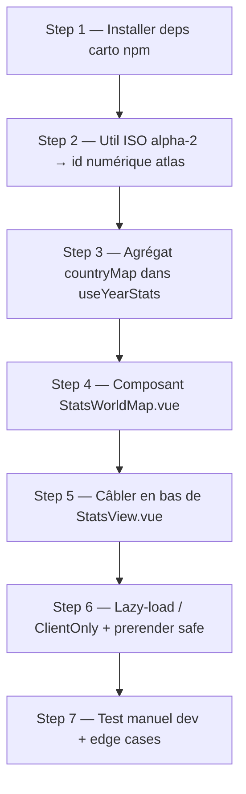

# Carte du monde des films vus (page Stats)

## Summary of intent

Ajouter à la page Statistiques une carte du monde choroplèthe : chaque pays est coloré selon le nombre de films **vus** produits dans ce pays sur l'année sélectionnée (dégradé de vert, plus c'est vert plus il y a de vus), gris pour les pays sans film. Au survol, une bulle affiche le nom du pays + le nombre de films vus / à voir. Au clic sur un pays, un panneau se déplie sous la carte avec la liste des films concernés. La maquette visuelle et la logique d'interaction existent déjà dans `_ressources/tmpl/Statistiques.html` (React/mockup) ; il s'agit de la **porter en composant Vue** branché sur les vraies données Supabase. « Done » = la carte s'affiche dans la vue Stats, se recalcule au changement d'année, réagit au survol et au clic, sans casser le prerender de `/`.

## Related context

- **Goal / issue:** Demande utilisateur — carte du monde interactive dans la page Stats, portage de l'intégration déjà maquettée dans `_ressources/tmpl/Statistiques.html`. Rester sur `main`, **pas de nouvelle branche**.
- **Branch:** `main` (imposé par l'utilisateur — aucun `git checkout -b`).
- **Rules pertinentes (le repo a porté les conventions SCSS FCINQ sur Nuxt — utilitaires `_flex.scss` / `_grid.scss`, `.wrapper`, `_typography-mixins.scss` bien présents) :**
  - `.claude/rules/f-rscss.md` — convention RSCSS pour tout le SCSS du composant (classe racine multi-mots, éléments un mot scopés en `> .child`, variantes `-`, imbrication reflétant le DOM). **Applicable** aux Steps 4 & 5.
  - `.claude/rules/f-scss-typography-mixins.md` — jamais de `font-*` / `line-height` / `letter-spacing` à la main ; classe utilitaire de `_typography.scss` d'abord, sinon `@include typography-mixins.*()` en dernière position ; ne jamais cibler une classe utilitaire comme sélecteur. **Applicable** Steps 4 & 5.
  - `.claude/rules/f-scss-variables.md` — préfixer `variables.$…` quand `@use "styles/variables"`. **Applicable.**
  - `.claude/rules/f-scss-no-reset-redeclaration.md` — ne pas redéclarer les props déjà au reset (`_reset.scss`). **Applicable.**
  - `.claude/rules/f-scss-spacing-rounding.md` — margin/padding arrondis au multiple de 8/10, en `rem` (1rem = 10px), en réutilisant les tokens de spacing si exposés. **Applicable.**
  - `.claude/rules/f-github-pr-cross-repo-linking.md` — **non applicable ici** (feature mono-repo, pas d'issue cross-repo). Ne concernera qu'une éventuelle PR ultérieure.
- **Skills mobilisées (cf. `f-plan` Step 1.5):**
  - **`f-use-flex`** → **Step 4** : classe utilitaire `.flex` (+ modifiers `-align-center`, `-justify-space-between`…) pour la rangée de légende et les lignes de films du panneau détail (layouts mono-axe). Défini dans `app/assets/styles/components/_flex.scss`.
  - **`f-use-grid`** → **Step 4** : classe `.grid.-two` (`app/assets/styles/components/_grid.scss`) pour la liste de films en 2 colonnes du panneau détail (comme la maquette `1fr 1fr`).
  - **`f-typography-mixins`** → **Step 4 & 5** : tout le texte (titre uppercase de carte, tooltip, nom de pays, titres de films, compteurs mono) via classes/mixins typo — jamais de `font-*` manuel.
  - **`dataviz`** → **Step 4** : palette **séquentielle** verte, **légende**, **tooltip**, lisibilité light/dark d'une carte choroplèthe. À charger **avant** d'écrire le rendu carte.
  - **`f-implement`** → pilote l'exécution du plan step par step (pas rattachée à un step précis).
  - **Non applicables (justifié) :** `f-use-svg` (pipeline WP `\F\utils\SVG::g` inexistant — Nuxt a son `Svg.vue` ; et les `<path>` pays sont générés dynamiquement par `geoPath`, pas des icônes statiques Figma), `f-use-wrapper` (la carte vit dans la grille Stats, pas de conteneur max-width), `f-manage-component` / `f-use-js-component` (scaffolder WP + classe `AComponent` ; Nuxt auto-importe les `.vue`), `f-figma-*` (source = mockup React, pas de node Figma), `f-acf-*` / `f-create-cpt` / `f-create-taxo` / `f-use-composer` / `f-use-ajax` (backend WordPress), `f-commit` / `f-pr` / `f-review` (post-implémentation).

## Proposed implementation flow

## Data model — ce que la maquette fait vs les vraies données

| | Maquette (`Statistiques.html`) | Vraies données (projet) |
|---|---|---|
| Pays d'un film | `f.c` = **1 nom FR** (string) | `m.countries` = **tableau d'ISO alpha-2** (`["US","GB"]`, source `production_countries[].iso_3166_1`) |
| Matching carte | `COUNTRY_ATLAS[f.c]` (20 entrées FR → nom anglais atlas) → match sur `feature.properties.name` | besoin d'un mapping **ISO alpha-2 → id numérique** (`feature.id` de world-atlas, ex. `"US"` → `"840"`) |
| Multi-pays | non géré (1 pays/film) | **oui** : un film compte dans chaque pays de `m.countries` (cf. `topNBy` existant) |
| Nom affiché | `f.c` directement | `countryName(iso)` via `Intl.DisplayNames(['fr'])` — **déjà présent** dans `useYearStats.js` |

Logique maquette à reproduire (réf. `_ressources/tmpl/Statistiques.html`, template décodé lignes ~1005–1305) :
- **countryStats** : films de l'année ayant un pays, groupés par pays → `{ seen, todo, films[] }`.
- **couleur fill** : `max = max(seen par pays)` ; si `seen>0` → `interpolateRgb('#1e4a33','#4fe89a')(0.25 + 0.75*seen/max)` ; sinon si le pays a des films (todo only) → `#33383f` ; sinon aucun film → `#20232c`.
- **projection** : `d3.geoNaturalEarth1().fitSize([960, 440], worldFeatures)` + `geoPath`.
- **hover** : bulle `<b>Pays</b> · X vus · Y à voir` (ou « — aucun film »).
- **clic** : sélectionne le pays (`stroke #ff3d77`, width 1.6) et déplie sous la carte la liste des films (pastille verte ciné / orange streaming / gris à voir).
- **légende** : swatches `#20232c #1e4a33 #2a7a4f #3ab873 #4fe89a` (« moins » → « plus »).

## Implementation steps

### Step 1 — Installer les dépendances cartographiques

- [x] **Todo:** Ajouter les deps npm nécessaires au rendu carte : `d3-geo` (projection + `geoPath`), `topojson-client` (`feature()`), `world-atlas` (fichier `countries-110m.json`) et `d3-interpolate` (`interpolateRgb`). Vérifier build ok.
- **Files:** `package.json`, `package-lock.json` (modify)
- **Acceptance:** `npm install` passe ; `npm run build` ne casse pas ; les 4 packages sont dans `dependencies`.
- **Note:** On **n'utilise pas** le chargement CDN runtime de la maquette (`unpkg`/`jsdelivr`) — fragile, hors-ligne KO, non SSR. On bundle en local via npm. `d3-interpolate` peut être évité par un lerp RGB manuel à 2 couleurs si on veut zéro dep de plus — mais le garder est plus fidèle et trivial.

### Step 2 — Util de mapping ISO alpha-2 → id numérique atlas

- [x] **Todo:** Créer un util qui convertit un code ISO 3166-1 **alpha-2** (celui stocké dans `countries`) vers l'**id numérique** ISO 3166-1 utilisé comme `feature.id` par world-atlas (`countries-110m.json`). Table statique (~250 entrées) pour rester dépendance-free et offline. Exposer `iso2ToNumeric(code)` et éventuellement l'inverse.
- **Files:** `app/utils/isoCountries.js` (create)
- **Acceptance:** `iso2ToNumeric('US') === '840'`, `iso2ToNumeric('FR') === '250'`, `iso2ToNumeric('GB') === '826'` ; code inconnu → `null` (film ignoré proprement sur la carte).
- **Note:** Matching par `feature.id` numérique = robuste. Éviter le matching par `properties.name` (fragile : « United States of America » vs « United States », « Russia » vs « Russian Federation »). Le mapping FR de la maquette (`COUNTRY_ATLAS`, 20 entrées) est **jeté** — insuffisant et basé sur des noms.

### Step 3 — Agrégat `countryMap` dans `useYearStats`

- [x] **Todo:** Ajouter au composable un computed `countryMap` : pour tous les films de l'année ayant `countries`, produire une Map `{ [iso2]: { iso, name, numericId, seen, todo, total, movies[] } }`. Un film multi-pays incrémente chaque pays. `seen = state==='seen'`, `todo = reste`. `name` via `countryName(iso)` déjà présent. `movies` triés par `byReleaseDate` (helper existant). Renvoyer aussi `maxSeen` (pour l'échelle de couleur).
- **Files:** `app/composables/useYearStats.js` (modify)
- **Acceptance:** Pour un jeu de films connu, `countryMap` renvoie les bons compteurs seen/todo par pays et gère le multi-pays. Se recalcule au changement d'année (computed sur `yearMovies`).
- **Note:** Distinct de `topCountries` existant (qui ne prend que les **vus** et top 10). La carte prend **tous** les films de l'année (vus + à voir) → cohérent avec l'ask « films vus / pas vu ».

### Step 4 — Composant `StatsWorldMap.vue`

- [x] **Todo:** Créer le composant carte sous `app/components/stats/`. Rendu **déclaratif Vue** (pas de manipulation d3 impérative façon maquette) : au mount client, `import()` dynamique de `countries-110m.json`, `topojson.feature(...)` → features ; calcul `geoNaturalEarth1().fitSize([960,440], features)` + `geoPath` pour générer le `d` de chaque pays ; `<svg viewBox="0 0 960 440">` avec un `<path v-for>` par pays. Fill/stroke calculés depuis `countryMap` (props) + `iso2ToNumeric` pour relier `feature.id` ↔ pays. Survol → bulle (tooltip positionné en absolute dans le conteneur). Clic → `emit('select-country', iso)` ou état local `selectedCountry` + panneau détail déplié dessous (liste films, pastille couleur par état). Légende de swatches en tête de carte. Chrome (fond carte, bordure, titre uppercase) via les **variables SCSS du projet** comme les composants voisins ; les couleurs fonctionnelles (dégradé vert, gris pays, pink sélection) restées en constantes.
- **Files:** `app/components/stats/StatsWorldMap.vue` (create)
- **Skill:** `dataviz` (palette séquentielle verte, légende, tooltip, light/dark — charger avant le rendu) · `f-use-flex` (légende + lignes films) · `f-use-grid` (`.grid.-two` panneau détail) · `f-typography-mixins` (tout le texte).
- **Rules:** `f-rscss`, `f-scss-typography-mixins`, `f-scss-variables`, `f-scss-no-reset-redeclaration`, `f-scss-spacing-rounding`.
- **Acceptance:** La carte s'affiche, les pays avec vus sont verts (intensité ∝ seen), les pays avec films non vus gris clair, le reste gris foncé ; hover montre la bulle FR « X vus · Y à voir » ; clic déplie la liste des films du pays ; re-clic / bouton « Fermer » referme. SCSS conforme RSCSS + tokens `variables.$…`, aucun `font-*` manuel.
- **Note fidélité couleurs (maquette):** fill vus = `interpolateRgb('#1e4a33','#4fe89a')(0.25+0.75*seen/maxSeen)` ; todo-only = `#33383f` ; aucun film = `#20232c` ; stroke défaut `#0c0d11`/0.5, sélection `#ff3d77`/1.6 ; légende `['#20232c','#1e4a33','#2a7a4f','#3ab873','#4fe89a']`.

### Step 5 — Câbler la carte dans `StatsView.vue`

- [x] **Todo:** Insérer `<StatsWorldMap>` dans la grille de `StatsView.vue`, en lui passant `countryMap` (+ `maxSeen`) issu de `useYearStats`. Placer la carte sur toute la largeur (`grid-column: 1 / -1`) comme une carte pleine largeur (cf. `StatsMonthlyChart`), **en dernière position de la grille** (après le graphe mensuel).
- **Files:** `app/components/StatsView.vue` (modify)
- **Skill:** `f-typography-mixins` (si texte ajouté) · `f-use-flex` / `f-use-grid` (si layout ajusté).
- **Rules:** `f-rscss`, `f-scss-typography-mixins`, `f-scss-variables`, `f-scss-no-reset-redeclaration`, `f-scss-spacing-rounding` (pour tout SCSS ajouté).
- **Acceptance:** La carte apparaît **tout en bas** de la vue Stats (`viewMode==='stats'` sur `/`), alignée dans la grille, responsive (pleine largeur en desktop et mobile).
- **Note:** Gérer l'état « ouvert » du panneau pays de façon cohérente avec l'accordéon `openStat` existant si pertinent (facultatif — le panneau carte peut rester autonome dans le composant).

### Step 6 — Lazy-load client-only + prerender safe

- [x] **Todo:** Garantir que la carte ne casse pas le prerender de `/` (route `/` prerendered dans `nuxt.config`). Envelopper le rendu carte dans `<ClientOnly>` (ou garde `onMounted` + `import.meta.client`) et charger `countries-110m.json` en **import dynamique** au mount, pour ne pas gonfler le bundle initial ni exécuter la carto au build SSR. Fallback visible si le JSON n'est pas chargé (message « Carte indisponible » comme la maquette).
- **Files:** `app/components/stats/StatsWorldMap.vue` (modify), éventuellement `app/components/StatsView.vue`
- **Acceptance:** `npm run build` + `npm run generate` passent sans erreur SSR ; la carte n'apparaît/charge que côté client ; pas de warning d'hydratation ; le poids du chunk initial n'inclut pas `countries-110m.json`.

### Step 7 — Test manuel dev + edge cases

- [x] **Todo:** Lancer `npm run dev`, aller sur `/` → bascule Stats, vérifier : rendu carte, dégradé vert cohérent avec les compteurs, hover, clic → liste films, changement d'année recalcule, année « Sans date » (year=null) → carte vide/masquée proprement, film multi-pays compté partout, pays sans film gris, aucun film de l'année → état vide géré. Vérifier responsive mobile.
- **Files:** — (vérification)
- **Acceptance:** Tous les cas passent visuellement ; aucune erreur console ; comportement identique à la maquette sur les données réelles.
- score / 10

## Dependencies and ordering

- Step 1 (deps) avant tout le reste (imports).
- Step 2 (mapping ISO) est prérequis de Step 3 et Step 4 (relie données ↔ features atlas).
- Step 3 (agrégat) avant Step 4/5 (le composant consomme `countryMap`).
- Step 4 (composant) avant Step 5 (câblage).
- Step 6 s'applique pendant/après Step 4–5 (contrainte prerender à garder à l'esprit dès la conception du composant).
- Step 7 en dernier.

## Risks and unknowns

| Risk / unknown | Mitigation |
|----------------|------------|
| `feature.id` de world-atlas est bien l'ISO **numérique** — à confirmer sur `countries-110m.json` | Vérifier au Step 4 : logger un `features[i].id` et `properties.name` ; ajuster le matching (id numérique attendu) |
| Pays non couverts par la table alpha-2→numérique (micro-états, codes obsolètes) | `iso2ToNumeric` renvoie `null` → le film n'est pas placé sur la carte mais reste compté ailleurs (Top pays). Logger les codes non mappés en dev |
| Prerender `/` casse si la carto tourne en SSR | `<ClientOnly>` + import dynamique du JSON (Step 6) |
| Poids du bundle (`countries-110m.json` ~100 KB) | Import dynamique au mount → hors chunk initial ; carte derrière la bascule Stats de toute façon |
| Divergence entre `topCountries` (vus, top 10) et la carte (tous, tous pays) | Assumé et documenté : deux vues complémentaires ; noms FR partagés via `countryName` |
| `d3-geo` + Nuxt/Vite ESM (interop) | Packages ESM standards ; si souci d'import, importer les fns nommées (`geoNaturalEarth1`, `geoPath`) depuis `d3-geo` directement |
| Théâtre/couleurs : la maquette est en hex hardcodés, le projet en variables SCSS | Chrome via variables SCSS (cohérence), couleurs fonctionnelles carte en constantes JS/SCSS locales |

## Handoff to implementation

- **Plan file:** `_ressources/plans/2607271500-carte-monde-stats.md`
- **First todo:** Step 1 — Installer les dépendances cartographiques
- **Out of scope:**
  - Aucune modif du schéma DB / backend (les `countries` ISO sont **déjà** persistés — cf. `full.js`, `backfill-movies.mjs`, `useMovieCalendar.js`). Rien à ajouter côté serveur.
  - Pas de nouvelle branche (rester sur `main`).
  - Pas de backfill / re-fetch TMDB.
  - Pas de refonte des autres cartes stats.
  - Nettoyage de `_ressources/tmpl/Statistiques.html` (mockup) hors périmètre.

**Next action:** Work implementation steps in order, checking off each `- [ ]` as completed.
