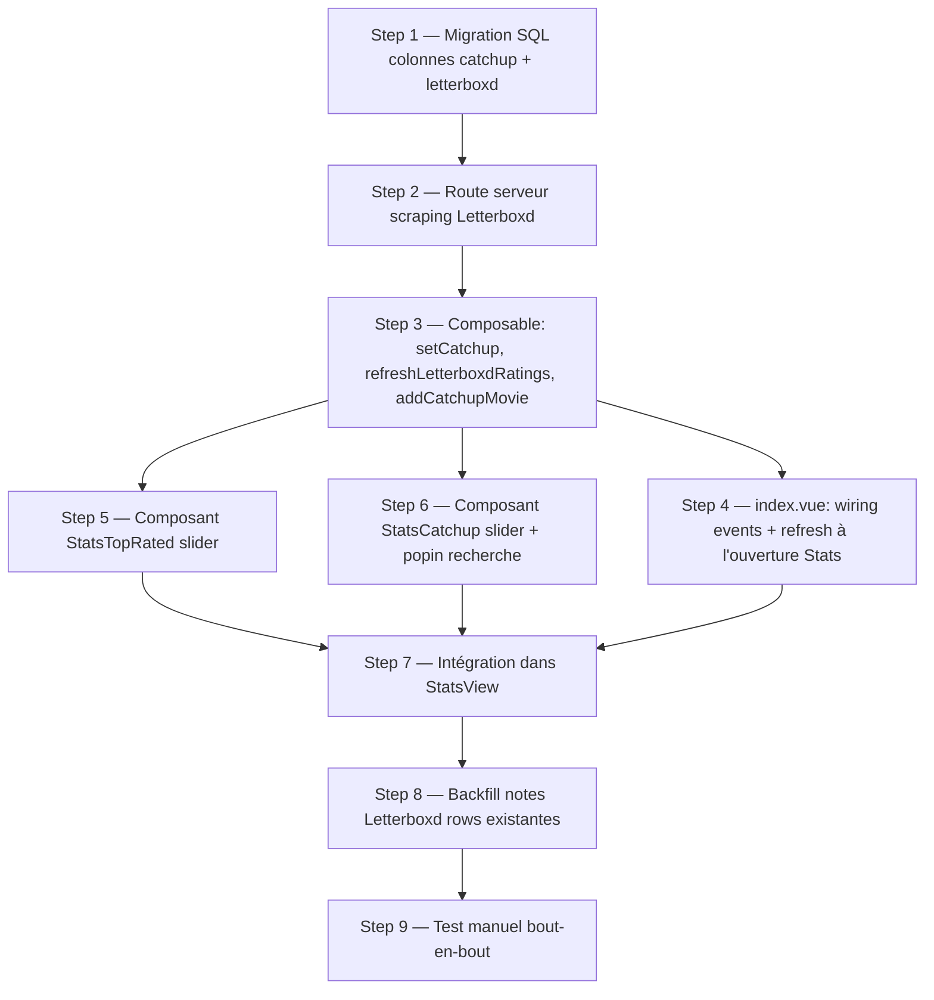

# Stats — Top 10 Letterboxd & Liste à rattraper

## Summary of intent

Ajouter deux sections à la vue **Statistiques** (`StatsView`), fidèles au mockup `_ressources/tmpl/Statistiques.html` :

1. **Top 10 Letterboxd** — slider (swiper) des 10 films de l'année sélectionnée que je n'ai **pas encore vus** et **déjà sortis** (date de sortie passée), classés par **note Letterboxd** décroissante. Clic sur une carte → fiche Letterboxd.
2. **À rattraper** — slider (swiper) des films que j'ai personnellement marqués « à rattraper ». Vide au départ (placeholders « Ajouter »). Clic sur un placeholder → **popin** avec champ de recherche + suggestions (films non vus de l'année dans ma liste, sinon fallback API TMDB). Clic sur une carte → le film dans la liste principale (timeline).

« Done » = les deux sliders s'affichent dans la vue Stats au bon endroit et style, les notes Letterboxd sont récupérées et persistées en BDD (perf : pas de scraping à chaque render), la liste à rattraper est persistée en BDD, la popin de recherche fonctionne (liste → TMDB), et ajouter un film TMDB inexistant l'insère aussi dans la liste principale.

## Related context

- **Goal / issue:** demande utilisateur (`/f-plan`) — 2 nouvelles sections dans `Statistiques.html` à intégrer au vrai site Nuxt.
- **Branch:** `feature/stats-top10-letterboxd-et-liste-rattrapage`
- **Rules pertinentes:** `.claude/rules/f-scss-typography-mixins.md` — le repo a adopté le système typo FCINQ (`app/assets/styles/_typography.scss` classes utilitaires + `_typography-mixins.scss` mixins) ; **ne jamais écrire `font-*`/`line-height`/`letter-spacing` à la main**, classe utilitaire d'abord (`class="small-body"`, `class="title-2"`…), mixin `@include typography-mixins.<nom>()` en fallback. La rule cite les chemins `naked-heart` → ici mapper sur `app/assets/styles/`. (`f-github-pr-cross-repo-linking.md` : mono-repo, pertinent seulement à l'étape PR.)
- **Skills mobilisées (cf. `f-plan` Step 1.5):** le projet **embarque les conventions SCSS du FCINQ Starter** (utilitaires `.flex`, `.grid`/`.col`, `.wrapper`, mixins typo — vérifié dans `app/assets/styles/`), donc les skills de **styling** s'appliquent, adaptées au SFC Vue (pas de PHP/ACF) :
  - `f-use-flex` → layouts mono-axe des nouveaux composants et de la popin (rangées carte, header de section, actions modale). *(Steps 5, 6, 7)*
  - `f-use-grid` → tout layout colonnaire interne / placement pleine largeur dans la grille Stats. *(Step 7)*
  - `f-typography-mixins` → **tout** texte des nouvelles sections (titres de section, note, titres de cartes, labels/inputs de la popin) via classe utilitaire ou mixin, jamais de `font:` manuel. *(Steps 5, 6, 7)*

  **N/A (mécanique WordPress absente ici) :** `f-use-svg` (le projet a son propre `<Svg name="…"/>` + `useLoadSvg`, pas le helper PHP `\F\utils\SVG::g` → les pictos passent par `<Svg>`), `f-manage-component` (composants Vue = simples `.vue` auto-importés, pas de scaffolder npm WP), `f-use-js-component` (Vue, pas `AComponent`), `f-figma-*` / `f-acf-*` / `f-use-composer` (aucun Figma/ACF/PHP). `swiper` déjà installé/enregistré, aucune skill ne le couvre. `f-commit` / `f-pr` : après validation, hors périmètre du plan.

## Mockup — ce que dit le template (source de vérité design)

- `_ressources/tmpl/Statistiques.html` est un export « bundler » : tout le DOM est une string JSON échappée (ligne 382). Version lisible extraite pour référence dans le scratchpad de session (`stats.html`, 1161 lignes).
- **Top 10** (mockup l.1001-1037) : `yearFilms.filter(f => f.st !== 'seen').sort((a,b)=> b.lb - a.lb ...).slice(0,10)` → pioche dans **ma liste**, pas un catalogue global. Carte 96×144, badge rang, note Letterboxd + étoile verte.
- **À rattraper** (mockup l.1004, 1013-1044) : `catchup` = tableau d'ids ; cartes + bouton retrait + slots « Ajouter » (dashed) jusqu'à 10 ; compteur `cat.length + '/10'`.
- **Picker** (mockup l.518-534) : modale `pickCatchup` listant `catchupOptions` (poster + titre + date courte + note). ⚠️ Le mockup n'a **pas encore** le champ recherche — c'est l'ajout demandé.
- **`f.lb` est factice** dans le mockup (`Math.round((2.6 + ((i*37)%23)/10)...)`, l.699) → à remplacer par la vraie note Letterboxd.
- Ordre visuel : ratios/genres/pays → **Top10 + À rattraper (pleine largeur, empilés)** → Carte du monde → Films par mois.

## Proposed implementation flow

## Implementation steps

### Step 1 — Migration SQL : colonnes `catchup` + notes Letterboxd

- [x] **Todo:** Créer `_ressources/sql/2608031000-add-catchup-and-letterboxd-columns.sql` ajoutant à la table `calendar` : `catchup boolean not null default false`, `letterboxd_rating numeric`, `letterboxd_rating_at timestamptz`, **`tmdb_vote numeric`** (note TMDB `vote_average`, fallback de tri gratuit). Suivre le format des migrations existantes (commentaire d'en-tête + `add column if not exists`). Exécuter la requête dans le SQL editor Supabase.
- **Files:** `_ressources/sql/2608031000-add-catchup-and-letterboxd-columns.sql` (create)
- **Acceptance:** Les 4 colonnes existent dans `calendar` ; `catchup` vaut `false` par défaut ; `select('*')` les renvoie.

### Step 2 — Route serveur : scraping note Letterboxd

- [x] **Todo:** Créer `server/api/movies/[id]/letterboxd.js` (`defineCachedEventHandler`) qui fetch `https://letterboxd.com/tmdb/{id}/` (redirige vers la fiche film), extrait le bloc `<script type="application/ld+json">` et lit `aggregateRating.ratingValue` (+ `ratingCount`). Retourne `{ rating: number|null, count: number|null }`. Gérer 404 / absence de note / HTML changé → `{ rating: null, count: null }` sans throw. Valider `id` numérique comme dans `[id]/full.js`. Cache long (`maxAge` ~ 24 h, `swr`) car la note bouge lentement.
  Étendre aussi `server/api/movies/[id]/full.js` pour retourner `vote_average: movie.vote_average` (déjà présent dans la réponse TMDB, coût nul) → servira de fallback de tri.
- **Files:** `server/api/movies/[id]/letterboxd.js` (create), `server/api/movies/[id]/full.js` (modify)
- **Acceptance:** `GET /api/movies/<tmdb_id>/letterboxd` renvoie une note plausible (0–5) pour un film connu, et `{ rating: null }` proprement pour un id sans fiche ; `/full` renvoie désormais `vote_average`.
- **Note:** Letterboxd n'expose pas d'API publique → le JSON-LD de la fiche est la seule source fiable. Volume faible + cache BDD → acceptable. Le `vote_average` TMDB (gratuit, déjà fetché) sert de **fallback robuste** quand le scrape échoue. Risque de fragilité tracé plus bas.

### Step 3 — Composable `useMovieCalendar` : catchup + notes + ajout catchup

- [x] **Todo:** Étendre `app/composables/useMovieCalendar.js` :
  - `setCatchup(id, value)` → `update({ catchup: value })` sur `calendar` + patch local `movies.value` (pas de refetch).
  - `refreshLetterboxdRatings(year)` → sélectionne dans `movies.value` les films `state !== 'seen'`, **sortis** (`release_date <= today`), de l'année `year`, dont `letterboxd_rating` est null **ou** `letterboxd_rating_at` périmé (> 7 j). Pour chacun, fetch throttlé (`promisePool`, 8) `/api/movies/{movie_id}/letterboxd`, `update` en base (`letterboxd_rating`, `letterboxd_rating_at`) et patch `movies.value` en un seul réassign (pattern `recheckUpcomingCinema`). Échec → on laisse la note null.
  - `addCatchupMovie({ movieId, media })` → insère une ligne `calendar` (comme `MovieAddForm.addMovie` : résolution `/full`, `state:'unseen'`) avec `catchup: true`, gère le cas « déjà présent » (alors `setCatchup(existing.id, true)`), retourne l'entrée pour intégration via `handleMovieAdded`.
  - **Persister `tmdb_vote`** (= `meta.vote_average`) aux endroits où les métadonnées `/full` sont déjà écrites : filet de sécurité de `getMovies`, `recheckUpcomingCinema` (si manquant). L'insert d'ajout de film (dans `MovieAddForm` + `addCatchupMovie`) le renseigne aussi.
  - Exposer les 3 nouvelles fonctions.
- **Files:** `app/composables/useMovieCalendar.js` (modify), `app/components/nav/MovieAddForm.vue` (modify — persister `tmdb_vote` à l'insert)
- **Acceptance:** Toggle catchup persiste en base et se reflète dans `movies.value` sans rechargement ; `refreshLetterboxdRatings` ne rappelle pas Letterboxd pour une note fraîche déjà en base ; ajouter un film catchup l'insère dans `calendar` avec `catchup=true` ; `tmdb_vote` est renseigné à l'ajout.

### Step 4 — `index.vue` : wiring des events + refresh à l'ouverture Stats

- [x] **Todo:** Dans `app/pages/index.vue` :
  - Récupérer `setCatchup`, `refreshLetterboxdRatings`, `addCatchupMovie` du composable.
  - Déclencher `refreshLetterboxdRatings(selectedYear)` quand `viewMode === 'stats'` (watch sur `viewMode` **et** `selectedYear`) — pas au montage timeline, pour ne rien scraper inutilement.
  - Passer à `<StatsView>` des handlers : `@go-to-movie` → `selectView('timeline')` puis `goToMovie(id)` ; `@toggle-catchup` → `setCatchup` ; `@add-catchup-movie` → `addCatchupMovie` puis `handleMovieAdded`-like (intégration locale) sans forcer le retour timeline.
- **Files:** `app/pages/index.vue` (modify)
- **Acceptance:** Ouvrir l'onglet Stats déclenche le refresh des notes une seule fois par (année, ouverture) ; clic carte à rattraper ramène sur la timeline positionnée sur le film ; ajout catchup TMDB apparaît dans la liste principale.

### Step 5 — Composant `StatsTopRated.vue` (slider Top 10 Letterboxd)

- [x] **Todo:** Créer `app/components/stats/TopRated.vue`. Props : `movies`, `year`. Calcule le top 10 (année, `state!=='seen'`, `release_date <= today`, tri par **`letterboxd_rating ?? tmdb_vote/2`** desc puis titre — fallback TMDB `vote_average` ramené sur l'échelle /5 quand la note Letterboxd manque —, `slice(0,10)`). Rendu en `<swiper-container>` / `<swiper-slide>` (slides libres, scroll horizontal), carte poster (via `poster_path` CDN TMDB, fallback dégradé), badge rang, note + picto étoile (`<Svg>`) ; si note Letterboxd absente, afficher la note TMDB discrètement distinguée (ou masquer l'étoile). Carte = lien `https://letterboxd.com/tmdb/{movie_id}/` (`target="_blank"`, comme `MovieListItem.vue:86`). État vide « Tout est vu pour cette année. ». Style calé sur la maquette (carte 96×144, chrome carte `$color-surface-1` / `$color-border-2`, radius 1.6rem) ; typo via classes/mixins (jamais de `font:` manuel).
- **Files:** `app/components/stats/TopRated.vue` (create)
- **Skill:** `f-use-flex`, `f-typography-mixins`
- **Rules:** `.claude/rules/f-scss-typography-mixins.md`
- **Acceptance:** Le slider affiche jusqu'à 10 films triés par note (Letterboxd, fallback TMDB) desc ; clic ouvre la bonne fiche Letterboxd ; slider scrollable au doigt/molette ; vide géré ; aucun `font-*` écrit à la main.

### Step 6 — Composant `StatsCatchup.vue` (slider À rattraper + popin recherche)

- [x] **Todo:** Créer `app/components/stats/Catchup.vue`. Props : `movies`, `year`. Affiche les films `catchup === true` (de l'année) en `<swiper-container>`, chaque carte : poster + bouton retrait (émet `toggle-catchup {id,false}`), clic carte → émet `go-to-movie {movieId}`. Slots « Ajouter » (dashed) jusqu'à 10, compteur `n/10`. Clic « Ajouter » → ouvre la **popin** (`v-if`, style modale mockup l.519-534) contenant :
  - un **champ recherche** (`refDebounced`, 300 ms, comme `MovieAddForm`) ;
  - **suggestions** : query vide → 10 derniers films non vus de l'année dans `movies` (tri date desc) non déjà catchup ; query non vide → filtre `title` sur les non-vus de l'année dans `movies` (**limite 5**, comme `bestResults` de `MovieAddForm`) ; si 0 résultat → fallback `useFetch('/api/movies/search?query=...')` (**limite 5**) ;
  - sélection d'une suggestion **liste** → émet `toggle-catchup {id,true}` ; sélection d'une suggestion **TMDB** (film absent de la liste) → émet `add-catchup-movie {movieId, media}` ;
  - fermeture au clic overlay / croix.
  - Style popin calé sur la maquette (l.519-534) ; typo via classes/mixins, layout via `.flex`.
- **Files:** `app/components/stats/Catchup.vue` (create)
- **Skill:** `f-use-flex`, `f-typography-mixins`
- **Rules:** `.claude/rules/f-scss-typography-mixins.md`
- **Acceptance:** Slider affiche les films à rattraper + placeholders jusqu'à 10 ; retrait fonctionne ; clic carte ramène au film dans la timeline ; popin : query vide = 10 derniers non-vus de l'année, saisie = 5 max dans la liste puis fallback TMDB 5 max ; ajouter une suggestion TMDB crée le film dans la liste principale ET le marque à rattraper ; aucun `font-*` manuel.

### Step 7 — Intégration dans `StatsView.vue`

- [x] **Todo:** Dans `app/components/StatsView.vue`, insérer `<StatsTopRated>` puis `<StatsCatchup>` dans `.grid` **après** les top-listes genres/pays et **avant** la carte du monde (ordre maquette), chacune en pleine largeur (`grid-column: 1 / -1`). Relayer les events `go-to-movie` / `toggle-catchup` / `add-catchup-movie` vers le parent via `defineEmits` (StatsView → index.vue). Passer `:movies` et `:year` déjà disponibles. Envelopper d'un `<ClientOnly>` si le web-component swiper pose souci en prerender (comme `StatsWorldMap`).
- **Files:** `app/components/StatsView.vue` (modify)
- **Skill:** `f-use-grid`, `f-typography-mixins`
- **Rules:** `.claude/rules/f-scss-typography-mixins.md`
- **Acceptance:** Les deux sliders apparaissent au bon endroit dans la grille Stats, pleine largeur, style cohérent avec les autres cartes ; les events remontent jusqu'à `index.vue`.

### Step 8 — Backfill des notes Letterboxd (lignes existantes)

- [x] **Todo:** Ajouter `scripts/backfill-letterboxd.mjs` (calqué sur `scripts/backfill-movies.mjs`, `promisePool` à 8) qui parcourt les lignes `calendar` non vues et sorties, appelle la route/scraping Letterboxd et remplit `letterboxd_rating` + `letterboxd_rating_at`. Idempotent (skip si note fraîche). Optionnel mais évite d'attendre la population paresseuse à la première ouverture.
- **Files:** `scripts/backfill-letterboxd.mjs` (create)
- **Acceptance:** Le script remplit les notes en base sans doublonner les appels ; relançable sans effet de bord.
- score / 10

### Step 9 — Test manuel bout-en-bout

- [ ] **Todo:** `npm run dev` : vérifier (a) sliders Top10 + À rattraper affichés et scrollables ; (b) notes Letterboxd cohérentes + clic → fiche Letterboxd ; (c) toggle catchup persiste après reload ; (d) popin : suggestions liste puis fallback TMDB, limites respectées ; (e) ajout d'un film TMDB à rattraper apparaît dans la timeline ; (f) clic carte à rattraper ramène au film ; (g) aucun appel Letterboxd superflu en boucle (onglet réseau). Vérifier l'absence de régression sur la timeline et les autres cartes Stats.
- **Files:** —
- **Acceptance:** Tous les points (a)–(g) validés, pas d'erreur console, pas de régression.

## Dependencies and ordering

- Step 1 (SQL) **avant** Step 3 (le composable lit/écrit les colonnes) et Step 8.
- Step 2 (route) **avant** Step 3 (`refreshLetterboxdRatings` l'appelle) et Step 8.
- Step 3 **avant** Step 4 (wiring) et informe les composants 5/6.
- Steps 5 et 6 **avant** Step 7 (intégration).
- Steps 4 et 7 se rejoignent (chaîne d'events index.vue ↔ StatsView ↔ enfants).
- Step 8 après 2/3 ; Step 9 en dernier.

## Risks and unknowns

| Risk / unknown | Mitigation |
|----------------|------------|
| Letterboxd n'a pas d'API publique ; le scraping JSON-LD peut casser si le HTML change, et enfreint potentiellement les ToS | **Décidé** : scraping JSON-LD + cache BDD + refresh throttlé/rare (perf) ; échec/`null` = **fallback tri sur `tmdb_vote`** (gratuit, déjà fetché) → le Top 10 reste toujours triable même si le scrape casse ; volume faible (projet perso). |
| `letterboxd.com/tmdb/{id}` peut 404 pour certains films | Retour `{ rating: null }` géré, film exclu ou affiché sans note. |
| Swiper (web-component) en prerender/SSR de la home | Envelopper les sliders dans `<ClientOnly>` (déjà fait pour `StatsWorldMap`). |
| Contradiction « 10 derniers » vs « limite = formulaire d'ajout (5) » pour les suggestions | Résolu : query vide = 10 derniers non-vus de l'année ; saisie = 5 max (liste puis TMDB). |

## Décisions validées (questions du plan)

- **Pool du Top 10 :** ma liste `calendar` uniquement (films non-vus/sortis de l'année), classés par note Letterboxd décroissante. (fidèle au mockup)
- **Notes Letterboxd :** scraping JSON-LD `aggregateRating` + cache BDD (`letterboxd_rating` / `letterboxd_rating_at`), refresh throttlé/rare. **Fallback** de tri/affichage sur `tmdb_vote` (`vote_average` TMDB, gratuit, déjà fetché via `/full`) quand la note Letterboxd manque.
- **Année :** année **sélectionnée** dans la page Stats (défaut = année courante), pour les 2 sections.

## Handoff to implementation

- **Plan file:** `_ressources/plans/2608031000-stats-top10-letterboxd-et-liste-rattrapage.md`
- **First todo:** Step 1 — Migration SQL colonnes `catchup` + Letterboxd
- **Out of scope:** refonte du reste de la page Stats ; API Letterboxd officielle (indisponible) ; téléchargement/stockage des posters (toujours servis via CDN TMDB) ; notifications ; tests automatisés (aucun harness dans le repo).

**Next action:** Work implementation steps in order, checking off each `- [ ]` as completed.
