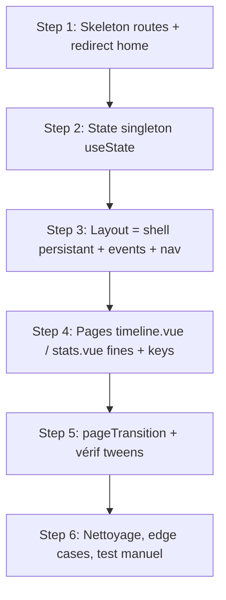

# Réorganisation en pages routées avec transitions continues

## Summary of intent

Aujourd'hui le site n'a qu'une seule vraie page (`index.vue`) qui gère tout via des refs locales (`selectedYear`, `viewMode`). On veut passer à une vraie arborescence routée : `/` redirige vers `/{année-courante}/timeline`, et chaque combinaison année × vue est une URL (`/{year}/timeline`, `/{year}/stats`). Contrainte forte : les micro-animations qui donnent leur qualité à l'app doivent **survivre à la navigation** — la pastille rose du switch Timeline/Stats doit glisser (pas se recréer), et les barres de progression des stats doivent se « remettre à niveau » de façon fluide quand on passe de `/2024/stats` à `/2025/stats`. « Done » = URLs partageables/bookmarkables reflétant année + vue, back/forward navigateur fonctionnels, et **aucune** animation perdue par rapport à l'existant.

## Related context

- **Goal / issue:** Demande utilisateur — arborescence par pages + transitions smooth conservées entre navigations.
- **Branch:** `feature/pages-routing-transitions`
- **Rules pertinentes:** aucune (les rules du repo concernent GitHub cross-repo PR, hors sujet ici).
- **Skills mobilisées (cf. `f-plan` Step 1.5):** **aucune.** Le catalogue de skills disponible est spécifique au starter WordPress/PHP FCINQ (`f-figma-*`, `f-use-grid/flex/wrapper/svg`, `f-manage-component`, `f-acf-*`, `f-create-cpt/taxo`…). Ce projet est un Nuxt 3 / Vue / SCSS pur : aucun signal du ticket (pages, routing, transitions Vue) ne matche une skill. Rien n'est laissé orphelin.

## Décisions validées

- **URL « Sans date » :** slug dédié `/undated/timeline` et `/undated/stats` (l'année `null` interne mappe sur `undated` en URL, et inversement au parse). Reste partageable/bookmarkable, cohérent avec `/{year}/{view}`.
- **Transition de vue :** fondu croisé court (~200ms), les deux vues se chevauchent (mode par défaut, pas `out-in`), pour laisser la pastille glisser en avant-plan sans concurrence visuelle.

## Architecture — pourquoi ça marche (à lire avant d'implémenter)

Le point dur, c'est **transitions de page vs persistance du DOM**. En Nuxt, changer de route démonte le composant de page et en monte un autre : toute transition CSS qui repose sur la persistance d'un nœud DOM (pastille qui glisse, `width` de barre qui tween) est réinitialisée. Trois leviers résolvent ça proprement, sans hack :

1. **Chrome persistant dans le layout.** On sort de la page tout ce qui doit rester monté en permanence : `NavSideNav` (qui contient `NavViewTabs` = la pastille), l'en-tête mobile, le rail `CinemaNowPanel`, la notice catchup, le menu année mobile. Comme le layout ne se démonte jamais entre deux pages, la pastille est un nœud DOM unique : quand la vue active (dérivée de la route) change, sa classe `-view-stats` bascule et le `transform` **transitionne** → glissement conservé « gratuitement ».

2. **State singleton partagé.** `useMovieCalendar()` crée aujourd'hui des refs neuves à chaque appel. Layout + pages doivent partager **une seule** liste `movies`, chargée une fois. On backe l'état par `useState` (SSR-safe, natif Nuxt) → même instance partout, plus de double-fetch. Les listeners d'events window (`movie-added`, `search-movie`, `scroll-to-today`, `movie-exists`) déménagent dans le layout (persistant) au lieu de `index.vue`.

3. **Contrôle de la clé de page (`definePageMeta({ key })`).** Par défaut Nuxt keye la page sur le path → `/2024/stats` ≠ `/2025/stats` = remount + transition = **pas** de tween de `width` (fade out/in à la place). En forçant `key: 'stats'` (constant sur l'année) dans `stats.vue` et `key: 'timeline'` dans `timeline.vue` :
   - **Changement d'année, même vue** (`/2024/stats` → `/2025/stats`) : clé inchangée → Vue **réutilise l'instance**, seuls `route.params.year` et les `computed` changent → les `` de `StatsMeter` transitionnent (`transition: width .3s ease` déjà présent). ✅ Barres qui se remettent à niveau.
   - **Changement de vue** (`/2024/timeline` → `/2024/stats`) : clé `timeline`→`stats` → la `pageTransition` joue (fondu/slide). ✅
   Cette bascule de clé aligne **exactement** la transition de page sur « changement de vue » et le tween d'éléments sur « changement d'année » — ce que l'utilisateur demande.

## Proposed implementation flow

## Implementation steps

### Step 1 — Squelette des routes et redirection home

- [x] **Todo:** Créer l'arbo `app/pages/[year]/timeline.vue` et `app/pages/[year]/stats.vue` (stubs minimaux affichant l'année lue depuis `route.params`), et faire de `app/pages/index.vue` une simple redirection vers `/{annéeCourante}/timeline`. Ajuster `routeRules` dans `nuxt.config.ts` (le prerender ciblait `/` ; adapter pour ne pas prerender une redirection dynamique — soit `'/': { redirect: '/…'}` côté config, soit page de redirection SSR).
- **Files:** `app/pages/[year]/timeline.vue` (create), `app/pages/[year]/stats.vue` (create), `app/pages/index.vue` (rewrite en redirect), `nuxt.config.ts` (modify routeRules)
- **Acceptance:** Ouvrir `/` redirige vers `/2026/timeline` ; `/2024/stats` s'ouvre sans 404 et affiche « 2024 ». Le middleware `auth` protège toujours (le porter dans les nouvelles pages via `definePageMeta({ middleware: ['auth'] })` ou globalement).

### Step 2 — State singleton partagé (`useMovieCalendar` en `useState`)

- [x] **Todo:** Refactorer `useMovieCalendar` pour que `movies`, `sortedMovies`, `moviesWithoutDate` soient backés par `useState` (clés stables) au lieu de `ref()` locaux, garantissant une instance unique partagée entre layout et pages. Garder l'API de retour identique (aucune signature de fonction ne change) pour minimiser l'impact appelants. Ajouter un garde-fou « déjà chargé » sur `getMovies()` (ne pas re-fetch si déjà peuplé) puisqu'il sera appelé depuis le layout persistant.
- **Files:** `app/composables/useMovieCalendar.js` (modify)
- **Acceptance:** Deux composants appelant `useMovieCalendar()` voient la même liste ; naviguer timeline↔stats ne déclenche pas de nouveau fetch Supabase (vérifier onglet réseau). Filtres Pinia (`store.filters` watch) toujours fonctionnels.

### Step 3 — Layout = shell persistant (chrome, events, navigation)

- [x] **Todo:** Déplacer dans `app/layouts/default.vue` tout le chrome persistant et l'orchestration aujourd'hui dans `index.vue` : `NavSideNav` (+ `NavViewTabs`), en-tête mobile (brand + pastille année + `NavViewTabs`), rail/bande `CinemaNowPanel`, notice catchup, menu année mobile. Y monter le state singleton (`useMovieCalendar` + `useMovieScroll`), y attacher/détacher les listeners window (`movie-added`, `movie-exists`, `scroll-to-today`, `search-movie`) et y appeler `getMovies()` + `onScrollToToday()` au mount. Dériver `selectedYear` et `viewMode` depuis `route.params.year` / le dernier segment du path. Câbler les actions de navigation : `selectYear(y)` → `navigateTo('/{y}/{vueCourante}')`, `selectView(mode)` → `navigateTo('/{annéeCourante}/{mode}')`, `goToMovie` → `navigateTo('/{year}/timeline')` puis `scrollToMovie`. Conserver le `watch([viewMode, selectedYear])` qui déclenche `refreshLetterboxdRatings` (désormais basé sur la route). Le layout expose aux pages les données nécessaires via `provide`/`inject` (ou les pages relisent le singleton directement — cf. Step 4).
- **Files:** `app/layouts/default.vue` (rewrite), `app/pages/index.vue` (retirer la logique déménagée), potentiellement `app/components/nav/SideNav.vue` & `ViewTabs.vue` (adapter les props/emit pour être pilotés par la route plutôt que par un ref local — a priori inchangés si on garde les mêmes props)
- **Acceptance:** Sur n'importe quelle page, le rail gauche, la pastille et le rail ciné sont présents et cohérents avec l'URL. Cliquer un onglet ou une année change l'URL. La pastille **glisse** (pas de flash) au switch de vue. Back/forward navigateur mettent à jour vue + année.

### Step 4 — Pages fines `timeline.vue` / `stats.vue` avec clés contrôlées

- [x] **Todo:** Rendre chaque page fine : `timeline.vue` rend `TimelineList` + gère les handlers timeline (`movie-deleted`, `release-date-updated`, `toggle-catchup`) ; `stats.vue` rend `StatsView` + relaie ses events (`go-to-movie`, `toggle-catchup`, `add-catchup-movie`). Chaque page lit `route.params.year` (normalisé en Number, ou `null` pour « Sans date » selon la convention retenue) et le state singleton. **Poser `definePageMeta({ key: 'timeline', middleware: ['auth'] })` et `{ key: 'stats', middleware: ['auth'] }`** pour que le changement d'année ne remonte pas la page (tween des barres) et que seul le changement de vue déclenche la transition. Gérer `onStatsGoToMovie` (depuis stats → navigue vers timeline puis scrolle).
- **Files:** `app/pages/[year]/timeline.vue` (implement), `app/pages/[year]/stats.vue` (implement)
- **Acceptance:** `/2024/stats` → `/2025/stats` : les barres `StatsMeter` **transitionnent** leur largeur (pas de fondu/reset). Ajout/suppression/édition de date depuis la timeline fonctionne. Le refresh Letterboxd ne part qu'en vue stats.

### Step 5 — Transition de page + vérification des tweens

- [x] **Todo:** Définir une `pageTransition` (nommée, ex. `view`) via `definePageMeta` ou globalement dans `nuxt.config.ts` (`app.pageTransition`) + CSS de la transition dans les styles globaux ou `_transitions.scss`. Choisir le mode (`out-in` séquentiel vs fondu croisé — voir question ouverte). Vérifier que, grâce aux clés du Step 4, la transition ne se déclenche **que** sur changement de vue et jamais sur changement d'année. Respecter `prefers-reduced-motion` (désactiver la transition).
- **Files:** `nuxt.config.ts` (modify — `app.pageTransition`) ou `definePageMeta` par page, `app/assets/styles/_transitions.scss` ou `main.scss` (classes `.view-enter-*` / `.view-leave-*`)
- **Acceptance:** Switch Timeline↔Stats = transition douce ; switch d'année sur la même vue = pas de transition de page (les tweens internes s'occupent du mouvement). Aucune animation ne « saute ».

### Step 6 — Nettoyage, edge cases et test manuel

- [x] **Todo:** Traiter les cas limites : (a) `route.params.year` invalide/non numérique → redirect vers l'année courante (accepter aussi le slug `undated`) ; (b) mapping `null` ↔ slug `undated` : un helper de parse (`undated`→`null`, `"2024"`→`2024`) et de build d'URL (`null`→`undated`) partagé par toute la navigation ; (c) supprimer l'event `years-updated` s'il reste mort (aucun listener ne le consomme aujourd'hui) ou le brancher si utile ; (d) vérifier que `/search`, `/login`, `/movies/[id]` fonctionnent toujours (le layout par défaut s'applique à `/search` — s'assurer que le nouveau chrome persistant ne casse pas ces pages, éventuellement via un layout dédié ou une garde sur la présence de données). Test manuel complet + `npm run build` pour valider le prerender.
- **Files:** `app/pages/[year]/*.vue`, `app/composables/useMovieCalendar.js`, `app/layouts/default.vue`, éventuellement un `app/layouts/bare.vue` pour search/login/detail
- **Acceptance:** Aucune régression sur search/login/detail ; URLs invalides gérées ; `npm run dev` et `npm run build` OK ; parcours complet (home→redirect, switch vue, switch année, ajout depuis stats, go-to-movie) validé à la main.

## Dependencies and ordering

- Step 2 (state singleton) **avant** Step 3 : le layout persistant ne peut orchestrer les données que si l'état est partagé.
- Step 3 (chrome + nav dans le layout) **avant** Step 4 : les pages dépendent du fait que la vue/année vient de la route et que le chrome est ailleurs.
- Step 4 (clés de page) **avant** Step 5 : la `pageTransition` ne se comporte correctement (tween année vs transition vue) qu'une fois les clés posées.
- Step 6 en dernier (dépend de tout le reste étant en place).

## Risks and unknowns

| Risk / unknown | Mitigation |
|----------------|------------|
| Le contrôle par `key` ne suffit pas et Nuxt remonte quand même sur changement de param | Fallback : rendre `StatsView` dans le **layout** (toujours monté) et masquer/afficher via `v-show` selon la route — l'instance reste montée, tween garanti. Tester tôt (dès Step 4). |
| `useState` + événements window + SSR : hydratation ou double-listener | Attacher les listeners uniquement client (`onMounted`), garder `getMovies` idempotent, clés `useState` stables. |
| Rail/pastille dans le layout s'affichent aussi sur `/search`, `/login`, `/movies/[id]` | Layout `bare` pour ces routes (`definePageMeta({ layout: 'bare' })`) — `login` est déjà `layout: false`. |
| `CinemaNowPanel` (rail droit) ne doit s'afficher qu'en vue timeline | Dériver la condition de la route dans le layout (comme `viewMode === 'timeline'` aujourd'hui). |
| Prerender de `/` cassé par la redirection dynamique | Utiliser `routeRules['/'] = { redirect: … }` statique OU redirection SSR côté page ; valider via `npm run build`. |
| Scroll timeline après navigation programmatique (goToMovie depuis stats) | `useMovieScroll.scrollToSelector` retry déjà 30×80ms ; déclencher après `await navigateTo` + `nextTick`. |

## Handoff to implementation

- **Plan file:** `_ressources/plans/2608050929-pages-routing-transitions.md`
- **First todo:** Step 1 — Squelette des routes et redirection home
- **Out of scope:** Refonte visuelle des stats/timeline, nouvelles données/colonnes Supabase, i18n des URLs, transitions d'éléments partagés type View Transitions API (sauf si retenu comme évolution ultérieure).

**Next action:** Work implementation steps in order, checking off each `- [ ]` as completed.
