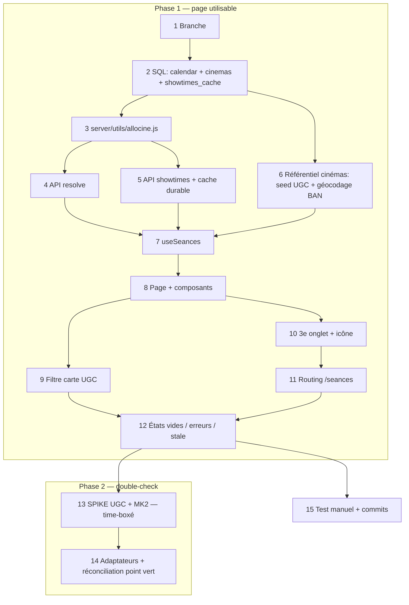

# Page « Séances » — où voir mes films à Paris

## Summary of intent

Ajouter une troisième vue à la cinémathèque, à côté de Timeline et Stats : **Séances**. Elle répond à une seule question — « parmi les films de ma liste encore à l'affiche, où et quand puis-je les voir à Paris, avec ma carte UGC ? ». On part des films marqués `state === 'inTheaters'` (ceux du rail « Au ciné en ce moment »), on récupère leurs séances parisiennes sur 7 jours, et on les présente regroupées par film ou par cinéma, **pré-filtrées sur les salles acceptant la carte UGC**, avec la distance depuis le domicile, filtrables par jour / version (VO·VF) / arrondissement. « Done » = l'onglet Séances affiche des horaires réels et cliquables vers la billetterie, sans casser les vues existantes ni retaper Allociné à chaque visite.

Le travail est découpé en **deux phases** : la Phase 1 livre la page complète et utilisable (source unique Allociné) ; la Phase 2 ajoute le double-check sur les billetteries UGC et MK2 (« point vert »), dont le coût est aujourd'hui **non chiffrable** — voir Steps 13-14 et la section reconnaissance.

## Related context

- **Décisions validées par l'utilisateur (12/08/2026):**
  1. **Source primaire** : API JSON interne Allociné (`/_/showtimes/…`), malgré le `Disallow: /_/` du robots.txt — avec les garde-fous du Step 3.
  2. **Périmètre géo** : Paris intra-muros uniquement (filtre code postal `75xxx`).
  3. **Repli résolution** : carte grisée explicite, pas de saisie manuelle d'identifiant.
  4. **Route** : `/seances` à la racine (pas `/[year]/seances`) — cf. Step 11.
  5. **Cache durable en base** (`showtimes_cache`) et non cache mémoire Nitro — cf. Steps 2 et 5.
  6. **Pré-filtre carte UGC activé par défaut** : ne montrer que les séances utilisables avec la carte. Liste des salles acceptantes **curée par l'utilisateur**, pas scrapée — cf. Steps 6 et 9.
  7. **Distance domicile → cinéma affichée** (sans tri par proximité ni filtre de rayon) — cf. Steps 6 et 8.
  8. **Double-check sur UGC + MK2** demandé, mais **repoussé en Phase 2** derrière un spike : aucune API documentée trouvée sur ces deux sites (cf. reconnaissance ci-dessous).
- **Goal / issue:** demande utilisateur — reprendre le principe de récupération des séances parisiennes de [paris-cine.info](https://paris-cine.info/), avec le style de `_ressources/tmpl/Seances.html`.
- **Branch:** `feature/page-seances-paris`
- **Maquette:** `_ressources/tmpl/Seances.html` (bundle Claude artifact). Le markup exploitable est la vue `seancesEl()` du template extrait, décrite au **Step 8**.
- **Rules pertinentes:**
  - [`f-rscss.md`](../../.claude/rules/f-rscss.md) — convention RSCSS pour les `<style lang="scss" scoped>`. Déjà la norme des composants existants.
  - [`f-scss-variables.md`](../../.claude/rules/f-scss-variables.md) — aucune valeur hexa en dur : tout via `$color-*` / `$font-*` de `_variables.scss` (injecté par `additionalData`, donc **sans** préfixe `variables.`).
  - [`f-scss-spacing-rounding.md`](../../.claude/rules/f-scss-spacing-rounding.md) — margins / paddings arrondis au multiple de 10 ou 8, en `rem` (1rem = 10px). La maquette est truffée de `11px` / `13px` / `18px`.
  - [`f-scss-no-reset-redeclaration.md`](../../.claude/rules/f-scss-no-reset-redeclaration.md) — ne pas redéclarer ce que `_reset.scss` couvre.
  - [`f-component-single-root.md`](../../.claude/rules/f-component-single-root.md) — glob PHP/WordPress, mais le **principe** s'applique aux `.vue` : une seule racine DOM portant la classe du composant.
  - ⚠️ [`f-scss-typography-mixins.md`](../../.claude/rules/f-scss-typography-mixins.md) — **non appliquée**, volontairement : ce projet n'utilise pas les classes utilitaires typo, tous ses composants écrivent `font: $bold 1.2rem/1 $font-body` en shorthand. On reste cohérent avec l'existant.
- **Skills mobilisées (cf. `f-plan` Step 1.5):** aucune skill d'intégration rattachée, et c'est un choix explicite :
  - `f-figma-to-scss`, `f-use-svg`, `f-use-grid`, `f-use-flex`, `f-use-wrapper`, `f-manage-component`, `f-typography-mixins` ciblent **FCINQ Starter v5 (WordPress / PHP)** : elles produisent du markup PHP, des `include_template()`, des `\F\utils\SVG::g()`, des classes `.wrapper` / `.grid` / `.col`. Ce repo est un **Nuxt 3** avec ses propres conventions (`app/components/*.vue`, `Svg.vue` + `app/assets/svg/`). Les rattacher injecterait des idiomes hors-projet.
  - Aucune URL Figma fournie (la source de design est un bundle HTML) → aucun trigger `figma.com/design/…`, ni ACF/CPT/taxo.
  - Skills en aval : `f-implement` (exécution), `f-commit` (Step 15), éventuellement `f-pr`.

---

## Source de données — reconnaissance effectuée

Reddit étant inaccessible depuis l'environnement d'exécution, la mécanique a d'abord été reconstituée en sondant les sources : **une API JSON interne d'Allociné couvre le besoin primaire**, validée en conditions réelles le 12/08/2026. Les 5 fils Reddit, fournis ensuite en captures, **confirment l'approche**.

### Endpoint primaire retenu (vérifié)

```
GET https://www.allocine.fr/_/showtimes/movie-{allocineId}/near-115755/d-{YYYY-MM-DD}/p-{page}/
```

- `115755` = identifiant de localisation **Paris** chez Allociné.
- `d-{date}` prend une **date ISO** (`d-2026-08-14`). ⚠️ `d-1`, `d-2`, `d-3` sont acceptés mais renvoient tous *aujourd'hui* — ne jamais utiliser d'offset numérique.
- Réponse `application/json`, contrat confirmé :

```
{
  error, message, nextDate,          // nextDate = prochaine date avec séances si 0 ce jour-là
  pagination: { page, totalPages, itemsPerPage: 15, totalItems },
  results: [{
    theater: {
      internalId: "C0097",           // code salle Allociné → clé du référentiel `cinemas`
      name: "MK2 Odéon (Côté St Germain)",
      location: { address: "113, bd Saint-Germain", zip: "75006", city: "Paris", region: "Île-de-France" },
      theaterCircuits: { internalId: 10004, name: "MK2 Cinémas" }
    },
    showtimes: {                     // 6 buckets, à aplatir
      original, original_st, original_st_sme,
      multiple, multiple_st, multiple_st_sme
    }
  }]
}
```

- Chaque séance : `startsAt` (`"2026-08-12T15:50:00"`, heure locale **sans offset**), `diffusionVersion` (`ORIGINAL` | `DUBBED`), `tags` (`Localization.Version.Original`, `Localization.Subtitle.French`, `Showtime.Accessibility.Accessible`, `Format.Projection.Digital`…), **`isPreview`** (avant-première — décisif pour le filtre carte, cf. Step 9), `data.ticketing[].urls` (lien de réservation direct chez l'exploitant).
- **Les buckets ne sont pas des doublons** : sur un même film/salle, `original` portait 3 séances `ORIGINAL` et `multiple` 3 séances `DUBBED`, horaires distincts. La version se lit sur `diffusionVersion` **au niveau de la séance**, pas sur la clé du bucket. Mapping : `ORIGINAL` → VO (+ « VOST » si tag `Localization.Subtitle.French`), sinon VF.
- **`location` ne contient aucune coordonnée** (vérifié : s'arrête à `address` / `zip` / `city` / `region`) → géocodage nécessaire pour la distance, cf. Step 6.
- **Périmètre géo** : `near-115755` ratisse Paris **+ toute la couronne**. Mesuré sur un blockbuster : 73 salles, dont **22 seulement en 75xxx** (reste en 60/77/78/91/92/93/94/95). Filtrage sur `location.zip` obligatoire.
- **Coût réel** : 15 salles/page → blockbuster = 5 pages, art et essai = 1 page. Peupler **un onglet de jour** pour ~8 films ≈ **15–30 requêtes sortantes**, parallélisables (`totalPages` connu après la page 1). ⚠️ **Ni quota ni limite** : Allociné n'impose rien, c'est notre volume sortant, payé **une seule fois par (film, date)** grâce au cache durable du Step 5. Cache chaud → naviguer entre les jours coûte **zéro**. Échelle de comparaison : `/film/aucinema/` annonce ~210 films à l'affiche, Tibey parle de 300–400/semaine — on en interroge 8.
- **Fenêtre disponible** : ~10 jours à l'avance (nav de la page salle : `2026-08-12` → `2026-08-21`). Les 7 jours de la maquette rentrent.

### Résolution TMDB → Allociné (vérifié)

Aucun identifiant croisé n'existe entre TMDB et Allociné. Résolution par titre sur la liste des films effectivement à l'affiche :

```
GET https://www.allocine.fr/film/aucinema/?page={1..14}     # ~210 films, HTML
```

Chaque carte donne `fichefilm_gen_cfilm={allocineId}`, le **titre FR** et la **date de sortie FR** — les deux champs déjà stockés en base (`title`, `release_date`, issus de TMDB en français). Parsing validé : 15/16 cartes extraites par page. Match sur titre normalisé, date de sortie en tiebreaker. L'`allocineId` est **persisté** pour ne jamais refaire le travail.

### Géocodage des salles (vérifié)

```
GET https://api-adresse.data.gouv.fr/search/?q={adresse+zip+ville}&limit=1
```

Base Adresse Nationale — **API publique de l'État, gratuite, sans clé**. Testée sur l'adresse réelle du MK2 Odéon, retour conforme :

```json
{"features":[{"geometry":{"coordinates":[2.338267,48.852438]},
  "properties":{"label":"113 Boulevard Saint-Germain 75006 Paris","score":0.693,
                "district":"Paris 6e Arrondissement","postcode":"75006"}}]}
```

Bonus non anticipé : `district` (`"Paris 6e Arrondissement"`) donne l'arrondissement **de façon fiable**, mieux que parser `zip.slice(3)`. Le `score` permet de rejeter un géocodage douteux.

### Ce que confirment les posts du développeur de paris-cine.info (Tibey, 2019 → 2022)

- **Architecture** : *« C'est un script que j'ai fait qui récupère les infos, cherche des données sur différents site web et envoi tout cela dans une base de donnée »* / *« La base de donnée derrière est alimentée par des scripts "maison" qui récupèrent et recoupent les infos à plusieurs endroits »*. → **Ingestion découplée du trafic entrant, stockage en base** : ce qui justifie le cache durable (Steps 2 et 5). Ses milliers de visiteurs/jour tapent sa base, pas les sources.
- **Fiabilité** : *« Toutes les séances sont vérifiées avec deux sources différentes (point vert), en cas de doute on prévient qu'il vaut mieux vérifier sur le site officiel »*, motivé par *« repérer les erreurs de programmation qui peuvent arriver de temps en temps, même sur de gros sites de cinéma »*. → Allociné **se trompe parfois**. C'est l'origine de la Phase 2.
- **Info carte présente chez Allociné, mais faillible** : un utilisateur lui signale que *« la CGR Lilas est donnée comme prenant la carte CIP mais aucune mention à part chez Allociné »*. → Le champ existe **et a été pris en flagrant délit d'erreur**. C'est l'argument décisif pour une liste curée (décision 6, Step 6).
- **Volume du catalogue parisien** : *« entre 300 et 400 différents films peuvent être vus dans les salles parisiennes »* par semaine, dont les sites de nouveautés ne couvrent *« qu'un tiers »*. → Valide le cadrage : on interroge **la liste de l'utilisateur**, jamais le catalogue.
- **Rythme** : *« Chaque mercredi les salles de cinéma mettent à jour leur programmation »*. → Cale les TTL (Step 5).
- **Pas d'API chez lui** : *« non pas d'api pour le moment, le modèle de donnée bouge encore trop souvent »*. → Rien à consommer, et on ne scrape pas son site.
- **Allociné est bien une de ses sources** : *« Allociné te donne les séances par cinéma ou par film »*, *« les infos de cartes sont les mêmes sur allociné »*.
- **Granularité indisponible** : *« les salles ne communiquent pas beaucoup là-dessus »* (n° de salle en multiplexe) → on n'essaie pas.
- **Angles morts connus** : séances « hors les murs » non couvertes ; [contrechamps.paris](https://www.contrechamps.paris/) cité comme complément sur les re-sorties.

### Sources secondaires pour le double-check (UGC, MK2) — état de la reconnaissance

Demandées (décision 8), sondées le 12/08/2026. **Aucune API documentée ni stable trouvée sur l'une ou l'autre.** Détail, parce qu'il conditionne le chiffrage :

| | UGC | MK2 |
|---|---|---|
| Rendu des pages publiques | **Coquille vide** : `/cinemas.html` (64 ko) ne contient **0 lien de cinéma** — liste montée en JS | **Coquille vide** : `/salle/mk2-odeon` (20 ko), 0 horaire, 0 `application/ld+json` |
| Techno | Struts (`.action`), JS maison `v14.35.0-rc5` | Next.js **App Router**, RSC en streaming (`self.__next_f` ×9), pas de `__NEXT_DATA__` |
| Chemin réel des données | Endpoints `/*AjaxAction!*.action` — extraits de leur JS : `/cinemasAjaxAction!getCinemasList.action`, `/searchAjaxAction!getPreviewResults.action` | **Aucun host d'API externe** : tout sur `www.mk2.com` (seuls autres hosts : Prismic CDN, GTM, Cookiebot) |
| `robots.txt` | `Disallow: /dynamique/`, `/AjaxAction!`, `/*?origin=*`. ⚠️ **Nuance** : en matching par préfixe, `Disallow: /AjaxAction!` ne couvre **pas** `/cinemasAjaxAction!…`. La règle telle qu'écrite ne l'interdit pas ; l'intention, si. | `Allow: /` ; seuls `/_next/static`, `/mon-compte`, `/panier`, `/password-reset`, `/email-reset`, `/redirect` exclus. `/_next/static` = **assets**, pas les routes de données → **le plus propre des deux robots-wise** |
| Verdict | Endpoint identifié mais zone grise robots | Robots OK, **mais route des séances non localisée** ; payloads RSC instables à parser |

**Conséquence assumée** : le double-check n'est pas « une source de plus », c'est le reverse-engineering de **deux** endpoints internes non documentés, chacun avec sa fragilité — soit la partie la plus susceptible de casser en silence, pour se protéger d'une erreur Allociné rare. D'où le découpage : **Phase 1 livre la page utilisable**, **Phase 2 attaque le double-check derrière un spike time-boxé** (Step 13) qui décide s'il est raisonnable avant d'écrire la moindre ligne d'adaptateur.

Un actif déjà en main pour la Phase 2 : le payload Allociné contient **l'URL de billetterie de l'exploitant avec son propre identifiant de séance** (ex. `www.ugc.fr/reservationSeances.html?id=330740168526`). C'est un point d'ancrage direct côté UGC, pas un rapprochement à reconstruire.

### Ce que ça implique côté Allociné — franchement

`robots.txt` d'Allociné contient `Disallow: /_/` **pour tous les user-agents** (et `Disallow: /rechercher/`). L'endpoint primaire est donc hors-crawl selon leur politique déclarée. `/film/aucinema/` et `/seance/salle_gen_csalle=CODE.html` sont, eux, autorisés. Les voies conformes ont été explorées et ne tiennent pas :

| Voie | Robots | Verdict |
|------|--------|---------|
| `/_/showtimes/movie-X/near-115755/d-DATE/` (JSON) | ❌ `/_/` | Données parfaites, coût minimal, scale avec **ta** liste. **Retenu.** |
| `/seance/film-{id}/` (HTML public, par film) | ✅ | **Inutilisable** : testé avec et sans `?cgeocode=115755`, aucune séance rendue côté serveur (0 `data-showtime-id`) — la page charge ses horaires via `/_/`. |
| `/seance/salle_gen_csalle=CODE.html` (HTML public, par salle) | ✅ | Séances server-rendered, mais **un seul jour** par page ; changer de jour repasse par `/_/`. Et il faut boucler ~40–90 salles → 300–600 requêtes/jour affiché contre 20. |
| API partenaire Allociné / Webedia | ✅ | Contrat commercial. Hors sujet pour un projet perso. |
| API payante (ex. MovieGlu) | ✅ | Payant, surdimensionné. |

Pour une app **mono-utilisateur, en lecture, à volume dérisoire, avec cache durable, User-Agent honnête et concurrence bridée**, c'est le compromis raisonnable — et très probablement ce que fait paris-cine.info. Ce n'est pas « conforme au robots.txt » pour autant : blocage IP et rupture silencieuse du contrat restent possibles (Steps 3 et 12). Précédent maison de même nature : `server/api/movies/[id]/letterboxd.js`.

---

## Proposed implementation flow



## Implementation steps

### Step 1 — Créer la branche de feature

- [x] **Todo:** Créer et basculer sur `feature/page-seances-paris` depuis `main` à jour.
- **Files:** —
- **Acceptance:** `git branch --show-current` renvoie `feature/page-seances-paris`, working tree propre (hors `_ressources/tmpl/Seances.html` déjà non suivi).

### Step 2 — Migration SQL : colonnes + référentiel cinémas + cache durable

- [x] **Todo:** Écrire `_ressources/sql/2608121539-add-allocine-showtimes.sql` en trois parties, commentaire d'en-tête au format des migrations existantes, `if not exists` partout.
  1. **Colonnes sur `calendar`** : `allocine_id` (`bigint`, nullable — les ids récents dépassent l'int32, ex. `1000037046`) et `allocine_checked_at` (`timestamptz`, nullable — horodatage de la dernière tentative de résolution, pour ne pas s'acharner sur un film introuvable).
  2. **Table `cinemas`** (référentiel, pivot de la feature) : `code text primary key` (code salle Allociné, ex. `C0097`, `W3140`), `name text not null`, `address text`, `zip text`, `arrondissement smallint`, `circuit text`, **`accepts_ugc boolean not null default false`**, `lat double precision`, `lng double precision`, `geocode_score real`, `geocoded_at timestamptz`, `updated_at timestamptz default now()`.
  3. **Table `showtimes_cache`** : `allocine_id bigint not null`, `date date not null`, `payload jsonb not null` (réponse normalisée du Step 3), `fetched_at timestamptz not null default now()`, **clé primaire composite `(allocine_id, date)`** pour que l'écriture soit un `upsert` idempotent, + index sur `fetched_at` pour le ménage.
  - Politiques RLS cohérentes avec `calendar` (lecture/écriture par utilisateur authentifié).
- **Files:** `_ressources/sql/2608121539-add-allocine-showtimes.sql` (create)
- **Acceptance:** SQL exécuté dans l'éditeur Supabase sans erreur ; les colonnes sur `calendar` sont `null` sur les lignes existantes ; un `upsert` manuel sur `showtimes_cache` avec la même `(allocine_id, date)` **met à jour** au lieu de dupliquer.
- ⚠️ **Notes:** `bigint` et pas `integer` (ids réels à 10 chiffres, vérifié). `code` en `text` et pas en entier : les codes Allociné sont alphanumériques (`C0097`, `W3140`).
- 💡 **Pourquoi une table de cache et pas le cache mémoire Nitro** : sur Vercel le cache Nitro vit dans l'instance et meurt au cold start — chaque réveil retaperait Allociné pour rien. Une table le rend durable, partagé entre instances, et inspectable. C'est l'architecture décrite par le développeur de paris-cine.info.

### Step 3 — Client Allociné côté serveur (source unique de vérité du format)

- [x] **Todo:** Créer `server/utils/allocine.js` (auto-importé par Nitro, comme `tmdbDates.js`) exposant : `PARIS_LOCALIZATION = 115755` ; `normalizeTitle(str)` (minuscules, accents dépliés, `’`→`'`, ponctuation et espaces réduits) ; `fetchAucinemaIndex()` → `[{ allocineId, title, normalizedTitle, releaseDate }]` en parcourant `/film/aucinema/?page=1..14` (arrêt dès qu'une page ne renvoie plus de carte) ; `fetchShowtimesPage(allocineId, date, page)` ; `fetchParisShowtimes(allocineId, date)` qui tire la page 1, lit `totalPages`, tire le reste **en parallèle**, aplatit les 6 buckets, **filtre `location.zip` sur `/^75/`**, et renvoie la forme normalisée :

```
{ nextDate, theaters: [{ code, name, address, zip, circuit,
    showtimes: [{ startsAt, time, version, subtitled, accessible, isPreview, projection, booking }] }] }
```

- **Files:** `server/utils/allocine.js` (create)
- **Garde-fous obligatoires** (justifiés par la section reconnaissance) :
  - `User-Agent` honnête et identifiable, aligné sur l'existant : `Mozilla/5.0 (compatible; cine-calendar/1.0)`.
  - `AbortSignal.timeout(8000)` sur chaque `$fetch`, comme dans `letterboxd.js`.
  - Concurrence bornée via `promisePool` (⚠️ `app/utils/promisePool.js` est côté app : en dupliquer une copie minimale dans `server/utils/` plutôt que d'importer à travers les frontières).
  - **Aucun throw qui remonte** : toute erreur réseau / parsing → valeur vide + `console.error`, jamais de 500.
  - `version` dérivée de `diffusionVersion` (`ORIGINAL` → `'VO'`, sinon `'VF'`) ; `subtitled` du tag `Localization.Subtitle.French` ; `accessible` du tag `Showtime.Accessibility.Accessible` ; **`isPreview` et `projection` conservés tels quels** — ils servent au filtre carte du Step 9.
  - `booking` = première URL de `data.ticketing[]` dont le `provider` n'est pas `relay` (les `relay.mvtx.us` sont des redirections internes), sinon `null`.
  - `time` = `startsAt.slice(11, 16)`. ⚠️ **Ne jamais passer par `new Date()`** : `startsAt` est en heure locale sans offset, un `Date` le réinterpréterait en UTC selon l'environnement.
- **Acceptance:** sur un film réellement à l'affiche, la sortie contient ≥ 1 salle 75xxx avec des horaires plausibles ; **aucun** zip non-75 ; le nombre de requêtes émises = `totalPages` du film ; `isPreview` et `booking` présents sur les séances.
- ✅ **Vérifié le 12/08/2026** (« Spider-Man: Brand New Day », 2026-08-14) : 27 salles / 201 séances, 7 requêtes pour `totalPages: 7`, 0 zip hors 75, `booking` sur 201/201 séances. Index : 210 films en 14 requêtes, 0 sans date.
- ⚠️ **Écart au plan — `isPreview` n'existe pas** dans le payload : clés réelles d'une séance = `internalId, startsAt, timeBeforeStart, service, experience, comfort, projection, picture, sound, tags, diffusionVersion, data`. Aucun tag « preview » non plus, et `/film/aucinema/` ne liste que des films déjà sortis (donc aucune avant-première à y observer). Le champ est **lu défensivement** (`showtime.isPreview === true` + repli sur les tags) et vaut aujourd'hui toujours `false` → l'exclusion « avant-première » du Step 9 est en place mais inerte. Impact assumé, cf. Step 9.
- 💡 **Trouvailles non anticipées, utiles en aval** : `theater.loyaltyCards` (`["CCU","UGC_ILLIMITE"]`) porte l'acceptation carte côté Allociné — sert à **proposer** la liste du Step 6 à l'utilisateur, jamais à l'écrire directement. `diffusionVersion` a une 3ᵉ valeur `LOCAL` (film français en français) → traitée comme VF.

### Step 4 — Route de résolution TMDB → Allociné

- [x] **Todo:** Créer `server/api/allocine/resolve.js` (`GET ?title=…&release_date=…`) qui, via `defineCachedEventHandler`, charge l'index `/film/aucinema/` (cache 12 h) et renvoie `{ allocine_id }` — match exact sur titre normalisé, départage par proximité de `release_date` si plusieurs candidats, sinon `{ allocine_id: null }`. Valider les paramètres, **ne jamais throw** sur échec de match.
- **Files:** `server/api/allocine/resolve.js` (create)
- **Acceptance:** titre exact d'un film à l'affiche → `allocine_id` correct (vérifiable via `allocine.fr/film/fichefilm_gen_cfilm={id}.html`) ; titre bidon → `{ allocine_id: null }` en 200 ; deux appels consécutifs ne déclenchent qu'**un** parcours des 14 pages.

### Step 5 — Route de séances, adossée au cache durable

- [x] **Todo:** Créer `server/api/allocine/showtimes.js` (`GET ?id={allocineId}&date=YYYY-MM-DD`) qui valide strictement les deux paramètres (`/^\d+$/`, `/^\d{4}-\d{2}-\d{2}$/`) puis applique **lire le cache → décider → rafraîchir → réécrire** :
  1. `select` sur `showtimes_cache` pour `(allocine_id, date)`.
  2. Ligne existante dans le TTL → **renvoyer le payload tel quel, zéro requête sortante**.
  3. Sinon `fetchParisShowtimes` (Step 3), puis `upsert` et renvoi.
  4. Fetch en échec mais ligne périmée présente → **renvoyer le périmé** avec `stale: true` (des horaires un peu vieux valent mieux qu'une page vide).
  - Au passage, **upsert du référentiel** : toute salle vue dans une réponse et absente de `cinemas` y est insérée (`code`, `name`, `address`, `zip`, `circuit`), avec `accepts_ugc` à `false` et sans coordonnées — le Step 6 complètera. Ça évite d'avoir à deviner la liste des salles à l'avance.
- **TTL, calés sur le rythme réel des salles** (*« chaque mercredi les salles mettent à jour leur programmation »*) : ~2 h pour aujourd'hui et demain, ~12 h au-delà, et **invalidation forcée le mercredi** (entrée écrite avant le dernier mercredi 00 h = périmée, quel que soit son âge).
- **Files:** `server/api/allocine/showtimes.js` (create)
- **Acceptance:** premier appel → requêtes sortantes visibles + ligne écrite dans `showtimes_cache` + salles créées dans `cinemas` ; deuxième appel identique → **aucune** requête sortante ; **redémarrage du serveur puis même appel → toujours aucune requête sortante** (ce que le cache mémoire ne savait pas faire) ; `?id=abc` / `?date=demain` → 400 propre ; date sans séance → `{ theaters: [], nextDate: '…' }` **mis en cache aussi** (sinon on retape à chaque affichage) ; coupure réseau avec cache périmé → `stale: true`.
- ✅ **Vérifié le 12/08/2026** : 4 cas de paramètres invalides → 400 ; référentiel peuplé tout seul (49 salles) ; 18 entrées écrites en cache par la vue ; appel sans session → 200 dégradé, jamais de 500.
- 🐛 **Bug trouvé et corrigé pendant l'implémentation** : Allociné signale « aucune séance à cette date » par `error: true` + `message: "next.showtime.on"` + un `nextDate` exploitable. Le client confondait ce cas avec une panne réseau, avec deux conséquences constatées — la journée vide n'était **jamais mise en cache** (Allociné retapé à chaque affichage, exactement ce que cette acceptance interdit) et le `nextDate` était jeté, donc le message « prochaine séance le … » du Step 12 ne pouvait pas se déclencher. Seule l'absence totale de réponse vaut désormais échec. Vérifié : 2 films sans séance → `ok=true`, 0 salle, `nextDate` 2026-09-04 et 2026-08-16 ; film inexistant (404) → `ok=false`.

### Step 6 — Référentiel cinémas : acceptation carte UGC + géocodage

- [x] **Todo:** Deux livrables complémentaires.
  1. **Seed d'acceptation carte** : `_ressources/sql/2608121539-seed-cinemas-ugc.sql`, un `update cinemas set accepts_ugc = true where code in (…)`. La liste est **fournie par l'utilisateur** (il connaît les salles UGC et partenaires UGC Illimité) ; le script est écrit avec les noms de salles en commentaire à côté de chaque code, pour rester relisible et amendable. **Aucun scraping** de cette donnée : Allociné la porte mais a été pris en flagrant délit d'erreur (cf. reconnaissance).
  2. **Script de géocodage** : `scripts/geocode-cinemas.mjs`, sur le modèle de `scripts/backfill-movies.mjs` — lit les lignes de `cinemas` sans `lat`/`lng`, interroge `api-adresse.data.gouv.fr` (`q = address + ' ' + zip + ' ' + city`), écrit `lat`, `lng`, `geocode_score`, `geocoded_at`, et déduit `arrondissement` de `properties.district` (plus fiable que `zip.slice(3)`). Throttlé via `promisePool` (8). **Rejeter les scores faibles** (< 0,5) en laissant `lat`/`lng` à `null` + log, plutôt que d'écrire une position fausse.
- **Files:** `_ressources/sql/2608121539-seed-cinemas-ugc.sql` (create), `scripts/geocode-cinemas.mjs` (create)
- **Acceptance:** après un passage sur la vue Séances (qui peuple `cinemas` via le Step 5) puis exécution du script, chaque salle a des coordonnées plausibles (contrôle croisé de 2–3 sur une carte) et un `arrondissement` correct ; les salles à score faible sont à `null` et loguées, jamais approximées ; le seed marque bien les salles UGC.
- 💡 **Ordre pratique** : lancer le script **après** un premier affichage de la vue, quand `cinemas` s'est peuplée toute seule. Il est idempotent et relançable à chaque nouvelle salle apparue.
- ✅ **Liste validée par l'utilisateur le 12/08/2026** : 33 salles sur les 48 salles parisiennes relevées (11 UGC, 10 MK2, 6 CIP, 6 divers) ; les 15 « non » sont essentiellement le circuit Pathé. Le relevé est parti du champ `loyaltyCards` d'Allociné — repris **uniquement comme point de départ**, la liste reste curée à la main et n'est jamais re-scrapée. ⏳ **Exécution en attente** : les deux `.sql` et le script de géocodage n'ont pas encore tourné (migration Step 2 non appliquée).

### Step 7 — Composable `useSeances`

- [x] **Todo:** Créer `app/composables/useSeances.js` portant tout l'état et la logique : les **7 jours** (depuis aujourd'hui, libellés `Auj.` / `Lun` / `Mar`… + `dd` + mois court, cf. `MSHORT` de `CinemaNowPanel.vue`), le jour sélectionné, le mode de regroupement (`film` | `cinema`), le filtre version (`all` | `VO` | `VF`), le filtre arrondissement, **le filtre carte UGC (activé par défaut)**, la carte dépliée. Côté données : lire `cinemaNow` de `useMovieCalendar()`, **résoudre puis persister** les `allocine_id` manquants (Step 4 + `update` Supabase + patch local, sur le modèle de `recheckUpcomingCinema` : `promisePool(…, 8)`, un seul réassign de `movies.value`, skip si `allocine_checked_at` récent), charger les séances du jour (`promisePool(…, 4)`), **joindre le référentiel `cinemas`** (chargé une fois par session) pour disposer de `accepts_ugc`, `lat`/`lng` et `arrondissement`, et calculer la **distance haversine** depuis les coordonnées du domicile. Exposer `loading`, `error`, `stale`, les deux regroupements dérivés (`byFilm`, `byCinema`) filtrés, les compteurs (`nbFilms`, `nbSeances`) et la liste des arrondissements présents.
- **Files:** `app/composables/useSeances.js` (create), `app/utils/haversine.js` (create), `.env` + `nuxt.config.ts` (modify — coordonnées du domicile)
- **Cache** : le `useState` clé `movieId:date` est le **L1** (évite l'aller-retour vers notre propre API pendant la visite), devant le **L2** durable de `showtimes_cache`.
- ⚠️ **Domicile** : les coordonnées vont dans `.env` (`NUXT_HOME_LAT` / `NUXT_HOME_LNG`), exposées via `runtimeConfig.public`. **Ni en base, ni dans le repo** — c'est une donnée personnelle, elle n'a rien à faire dans un commit. Absence de coordonnées → distances simplement masquées, pas d'erreur.
- **Acceptance:** changer de jour ne relance que les fetchs manquants ; changer de version / arrondissement / carte / regroupement ne déclenche **aucun** fetch ; les `allocine_id` résolus sont écrits en base et non re-résolus au rechargement ; les distances correspondent à l'ordre de grandeur attendu depuis le domicile.

### Step 8 — Page et composants de la vue Séances

- [x] **Todo:** Créer `app/pages/seances.vue` + les composants sous `app/components/seances/`, en reproduisant la maquette (`seancesEl()` du bundle) avec les tokens du projet.
- **Files:** `app/pages/seances.vue` (create), `app/components/seances/DayStrip.vue` (create), `app/components/seances/SeanceFilters.vue` (create), `app/components/seances/SeanceGroup.vue` (create — carte accordéon, sert aux deux regroupements), `app/components/seances/TimeChip.vue` (create)
- **Rules:** `f-rscss.md`, `f-scss-variables.md`, `f-scss-spacing-rounding.md`, `f-scss-no-reset-redeclaration.md`, principe de `f-component-single-root.md`
- **Correspondance maquette → tokens** (aucune valeur hexa en dur) :
  | Maquette | Token |
  |---|---|
  | `#0c0d11` / `#14161c` / `#181a22` / `#0f1116` | `$color-bg` / `$color-surface-1` / `$color-surface-2` / `$color-surface-4` |
  | `#20232c` / `#262932` | `$color-border-2` / `$color-border-4` |
  | `#f4f2ee` / `#e8e9ed` / `#c9ccd4` / `#8a8f9c` / `#6b7280` / `#565b66` | `$color-text` / `$color-text-body` / `$color-text-dim` / `$color-text-muted` / `$color-text-weaker` / `$color-text-weak` |
  | `#ff3d77` / `#ff6d97` | `$color-primary` / `$color-primary-light` |
  | `#4fe89a` (VO) / `#f0a935` (VF) | `$color-green` (⚠️ `#2FBF71`, nuance différente — voir Risks) / `$color-yellow` |
  | `'Bricolage Grotesque'` / `'Schibsted Grotesk'` / `'Space Mono'` | `$font-title` / `$font-body` / `$font-mono` |
- **Détails à respecter :**
  - En-tête : `Séances à Paris` (800, `$font-title`) + sous-titre `N films de ma liste en salle · M séances`.
  - `DayStrip` : 7 cellules de 6rem, actif en `linear-gradient(145deg, $color-primary, #ff7a3d)` — l'orange n'existe pas dans `_variables.scss`, **ajouter `$color-primary-warm: #FF7A3D`** plutôt qu'un hexa inline. Réutiliser le mixin `stripScroll()` de `_functions.scss` et le composable `useHorizontalStrip` (déjà en place pour la bande mobile).
  - `SeanceFilters` : deux segmented (`Par film` / `Par cinéma`, puis `Toutes` / `VO` / `VF`), le `<select>` `Tout Paris` / `Nème arrondissement` (`1er` pour 1), **et le toggle carte UGC du Step 9**.
  - `SeanceGroup` : carte `$color-surface-1`, radius 1.6rem, en-tête cliquable (affiche 4.4×6.6rem ou pictogramme ticket selon le mode), sous-titre `N séances · M cinémas` (resp. `Xe arr. · N films · M séances`), chevron pivotant de `-90deg` à `0deg` en `.18s`, corps déplié séparé par `border-top: 1px solid $color-border-2`. **En mode « Par cinéma », afficher la distance** à côté de l'arrondissement (`3e arr. · 1,2 km`) ; en mode « Par film », sur la ligne de chaque salle. Distance absente (non géocodée) → on n'affiche rien, pas de `—`.
  - `TimeChip` : `HH:MM` en `$font-mono` + badge `VO`/`VF` (et `VOST` si sous-titré). **Ajout par rapport à la maquette** : quand `booking` existe, le chip est un `<a target="_blank" rel="noopener noreferrer">` vers la billetterie ; sinon un `<span>`.
  - Affiches : `NuxtImg` + `image.tmdb.org/t/p/w342{poster_path}` comme dans `CinemaNowPanel.vue`, jamais de gradient placeholder.
  - Supprimer la mention « Horaires de démonstration » ; la remplacer par une ligne de provenance discrète (« Séances Allociné · Paris intra-muros · mis à jour à HH:MM »).
- **Acceptance:** la vue rend les séances réelles, les filtres et les 2 regroupements fonctionnent, l'accordéon s'ouvre/ferme, un chip ouvre la page de réservation, les distances s'affichent ; aucun hexa en dur ni `font-size` orphelin dans les `<style scoped>`.

### Step 9 — Filtre carte UGC, à deux niveaux

- [x] **Todo:** Implémenter le pré-filtre carte, **activé par défaut**, avec un toggle pour l'ouvrir à tout Paris. Le point clé : « carte acceptée » n'est **pas** qu'une propriété du cinéma, c'en est aussi une de la séance.
  1. **Niveau cinéma** : ne garder que les salles dont `cinemas.accepts_ugc` est `true` (référentiel curé du Step 6).
  2. **Niveau séance** : au sein de ces salles, exclure les séances non couvertes par la carte — `isPreview === true` (avant-premières) et les formats majorés lisibles dans `projection` / `tags` (IMAX, 4DX, et autres à compléter à l'usage). Les exclusions doivent vivre dans **une seule constante commentée**, pas éparpillées en conditions.
  - Le libellé du toggle annonce l'état sans ambiguïté (« Carte UGC uniquement » / « Tout Paris »), et le sous-titre de l'en-tête reflète le décompte filtré.
- **Files:** `app/composables/useSeances.js` (modify), `app/components/seances/SeanceFilters.vue` (modify)
- **Acceptance:** filtre actif → seules des salles marquées `accepts_ugc` apparaissent, et aucune avant-première ; toggle désactivé → tout Paris revient ; le compteur de l'en-tête suit le filtre ; basculer le toggle ne déclenche **aucun** fetch.
- ⚠️ **Limite à assumer** : les exclusions de la carte UGC ne sont pas exhaustivement décrites dans la donnée Allociné. Le filtre sera juste sur le gros (salle + avant-première), approximatif sur les cas exotiques. Le lien billetterie reste l'arbitre final.

### Step 10 — Troisième onglet dans le switch de vue

- [x] **Todo:** Ajouter l'onglet `Séances` dans `ViewTabs.vue` : `grid-template-columns` de `1fr 1fr` à `repeat(3, 1fr)`, pastille de `calc(50% - .6rem)` à `calc(33.333% - .534rem)`, et remplacer le modifier unique `-view-stats` par une translation par vue (`-view-stats` → `translateX(calc(100% + .4rem))`, `-view-seances` → `translateX(calc(200% + .8rem))`). Créer `app/assets/svg/ticket.svg` (viewBox 24×24, `stroke="currentColor"`, `fill="none"`, aligné sur `list.svg` / `chart.svg`).
- **Files:** `app/components/nav/ViewTabs.vue` (modify), `app/assets/svg/ticket.svg` (create)
- **Rules:** `f-scss-variables.md`, `f-scss-spacing-rounding.md`
- **Acceptance:** la pastille se cale exactement sur chacun des 3 onglets (rail desktop **et** en-tête mobile, qui partagent ce composant) et glisse sans saut ; l'icône hérite de la couleur du texte.

### Step 11 — Routing racine `/seances`, layout et mobile

**Décision validée :** la page vit à la **racine**, pas sous `/[year]/`. Sémantiquement juste — la vue ne dépend d'aucune année — mais ça sort du modèle `/[year]/<vue>` sur lequel `useCalendarNav` est bâti. Le piège nº 2 est le seul qui morde vraiment.

- [x] **Todo:** Créer la page à la racine et adapter `useCalendarNav.js` pour que le shell (rail années, pastille année mobile, switch de vue) reste cohérent hors route année.
- **Files:** `app/pages/seances.vue` (modify), `app/composables/useCalendarNav.js` (modify), `app/layouts/default.vue` (modify si nécessaire)
- **Les trois adaptations :**
  1. **`viewMode`** — aujourd'hui `endsWith('stats') ? 'stats' : 'timeline'`. Passer à une lecture explicite de `route.name` : `seances` → `'seances'`, `year-stats` → `'stats'`, sinon `'timeline'`.
  2. ⚠️ **`selectedYear` doit survivre à la route sans param `year`** — le vrai piège. Sur `/seances`, `route.params.year` est `undefined`, donc `parseYearParam` renvoie `undefined` et `selectedYear` retombe à `null` : le rail surlignerait **« Sans date »** et la pastille mobile afficherait `Sans date`. Correctif : mémoriser la dernière année vue dans un `useState('lastSelectedYear', () => currentYear)`, alimenté par un `watch` sur le param quand la route en porte un, et faire de `selectedYear` un computed qui lit le param s'il existe, sinon cette mémoire.
  3. **`selectView` / `selectYear`** — `selectView(mode)` : `mode === 'seances'` → `navigateTo('/seances')`, sinon comportement actuel. `selectYear(year)` : depuis Séances, `/${yearToSlug(year)}/${viewMode.value}` produirait `/2026/seances`, qui n'existe pas → cliquer une année depuis Séances ramène sur `/${yearToSlug(year)}/timeline`.
- **Reste du step :** `definePageMeta({ middleware: ['auth'] })` (**sans** `valid-year`, sans `key`) + `useHead({ title: 'Séances à Paris' })`. Vérifier dans `layouts/default.vue` que le rail droit reste masqué (`viewMode === 'timeline'`, déjà le cas) et que `--rail-space` n'est pas consommé par la nouvelle vue — sinon le retirer du calcul pour récupérer toute la largeur. Sur mobile, conteneur scrollable propre avec le padding bas de 10.8rem qui dégage `NavHeader`.
- **Acceptance:** `/seances` en deep-link avec le bon onglet actif et **l'année courante toujours surlignée** (jamais « Sans date ») ; Timeline → Séances → Stats en crossfade `view` sans reflow du rail ; cliquer une année depuis Séances atterrit sur la timeline de cette année ; mobile OK.
- 🐛 **Quatrième piège, non prévu par le plan** : sur un rechargement direct de `/seances`, le `onMounted` de la **page** se déclenche *avant* celui du layout (Vue monte les enfants avant les parents) — or c'est le layout qui charge `movies`. Le premier `load()` tombait donc sur une liste vide et la vue restait définitivement vide. Corrigé par un `watch` sur la transition 0 → N du nombre de films, qui relance le chargement une fois et une seule. Invisible en venant de la timeline (la liste y est déjà pleine), d'où l'intérêt de tester le deep-link en priorité comme l'annonçait ce step.

### Step 12 — États vides, erreurs et discipline réseau

- [x] **Todo:** Couvrir les chemins non-heureux : aucun film `inTheaters` → invitation à marquer des films en salle depuis la timeline ; films en salle mais 0 séance ce jour-là → `Aucune séance pour ces critères.` + exploitation de `nextDate` (« prochaine séance le … ») ; **0 séance parce que le filtre carte UGC a tout mangé** → message distinct qui propose d'ouvrir à tout Paris (sinon on croit à un bug) ; film dont l'`allocine_id` n'a pas pu être résolu → carte grisée avec mention explicite plutôt qu'une disparition silencieuse ; échec réseau → message + bouton « Réessayer » ; payload `stale: true` → horaires affichés avec mention discrète « horaires possiblement datés, vérifier sur la billetterie ». Vérifier qu'un chargement affiche un skeleton et que **rien n'est fetché avant l'ouverture de l'onglet Séances**.
- **Files:** `app/pages/seances.vue` (modify), `app/composables/useSeances.js` (modify)
- **Acceptance:** les 6 états sont reproductibles (liste vide, date lointaine, filtre carte trop strict, `allocine_id` forcé à `null`, coupure réseau, cache périmé) et aucun ne casse la page ; onglet Timeline ouvert → zéro requête `allocine` dans le Network.

### Step 13 — SPIKE : faisabilité du double-check UGC + MK2 *(time-boxé, début Phase 2)*

- [x] **Todo:** **Exploration à durée fixe (½ journée max), sans écrire de code de production**, pour décider si la Phase 2 est raisonnable. Livrable = une note de conclusion ajoutée à ce plan (ou un `README` dédié), pas une implémentation.

---

#### ✅ Conclusion du spike (12/08/2026) — **recommandation : on fait, mais UGC seulement**

**Décision utilisateur** : piste « vivacité du lien billetterie » retenue ; aucun endpoint interne d'exploitant à rétro-ingénierer. Le verdict ci-dessous porte sur cette piste-là.

**Inventaire réel** : les séances parisiennes renvoient **19 hôtes de billetterie** distincts, pas deux. Répartition sur le cache : `www.ugc.fr` 373 · `s.pathe.fr` 373 · `www.mk2.com` 173 · `www.ticketingcine.com` 61 · `achat.multicine.fr` 42 · `achat.cgrcinemas.fr` 30, puis 13 plateformes d'indépendants à moins de 25 liens chacune.

| Circuit | Verdict | Détail |
|---|---|---|
| **UGC** | ✅ **Retenu** | `reservationSeances.html?id=…` est **rendu côté serveur** et **discrimine parfaitement** : identifiant réel → 21 950 o, identifiant trafiqué d'un chiffre **et** identifiant bidon → 21 474 o, octet pour octet identiques. Robots OK : leurs `Disallow` sont `/dynamique/`, `/AjaxAction!`, `/*?origin=*` — aucun ne couvre cette URL. |
| **Pathé** | ❌ Abandonné | `s.pathe.fr` renvoie **403 sur tout**, identifiant réel compris — protection anti-bot. Zéro pouvoir discriminant, et un refus explicite qu'on ne contourne pas. |
| **MK2** | ❌ Abandonné | L'URL de billetterie est `www.mk2.com/panier/seance/tickets?…` — or leur `robots.txt` **exclut explicitement `/panier`**. Ironie du spike : MK2 était le plus propre des deux sur le papier, c'est le seul dont la ressource visée est franchement interdite. Non sondé, décision sans appel. |
| **16 autres** | ⏸ Hors périmètre | Longue traîne d'indépendants, chacun sa plateforme. Ratio effort/couverture désastreux. |

**Ce que ça rapporte, au-delà de la vivacité** : la page UGC ne dit pas seulement « cette séance existe », elle **re-décrit la séance** — film, cinéma, date, heure, **heure de fin**, version, accessibilité PMR, et **le numéro de salle** (« Salle 15 »). C'est donc une vraie confirmation par seconde source, pas un simple ping. À noter : le n° de salle et l'heure de fin sont listés « hors périmètre » plus haut au motif que *personne ne les publie* — c'était faux, UGC les publie.

**Couverture** : ~100 séances UGC par jour affiché, soit **~30 %** du total (244–337 séances/jour), mais **100 % d'entre elles sont en salle acceptant la carte** — donc l'essentiel de ce que la vue montre avec le pré-filtre actif. Aucune autre plateforme n'est exploitable, le « point vert » ne couvrira jamais Pathé, MK2 ni les indépendants : l'UI doit donc distinguer **confirmé** de **non vérifiable**, et surtout pas de « non confirmé » qui se lirait comme un doute.

⚠️ **Le vrai obstacle n'est pas technique, il est volumétrique.** Vérifier un jour entier = ~100 requêtes vers ugc.fr, contre ~20 vers Allociné pour le même jour : **5× le volume**, sur un site qu'on ménage. Une vérification à l'ouverture de l'onglet est donc exclue. Déclencheur à retenir au Step 14 : **à l'ouverture d'une carte** (accordéon), avec **verdict mis en cache à la même durée de vie que les séances** — le contrôle est alors payé une fois par (séance, jour), proportionnel à l'intérêt réel, et nul en régime chaud.
  - **UGC** : les données passent par `/*AjaxAction!*.action` (identifiés : `/cinemasAjaxAction!getCinemasList.action`, `/searchAjaxAction!getPreviewResults.action`). Chercher l'endpoint qui rend les **séances d'une salle à une date**, documenter méthode/params/forme de réponse, et si un jeton ou un cookie de session est requis. Trancher aussi la question robots : `Disallow: /AjaxAction!` ne couvre pas `/cinemasAjaxAction!…` en matching par préfixe, mais l'intention est claire — **décision utilisateur explicite requise** avant d'aller plus loin côté UGC.
  - **MK2** : Next.js App Router, tout sur `www.mk2.com`, robots permissif. Trouver la route de données des séances (route handler, RSC payload, ou endpoint interne), évaluer la stabilité du parsing.
  - **Point d'ancrage déjà acquis** : le payload Allociné porte l'URL de billetterie de l'exploitant **avec son identifiant de séance** (`ugc.fr/reservationSeances.html?id=330740168526`). Évaluer si une simple **vérification de vivacité** de cette URL (la séance existe-t-elle encore côté UGC ?) suffirait à obtenir 80 % de la confiance pour 10 % du travail — piste sérieuse à ne pas négliger avant de bâtir deux adaptateurs complets.
- **Files:** `_ressources/plans/2608121539-page-seances-paris.md` (modify — section conclusion) ou `_ressources/README-double-check-seances.md` (create)
- **Acceptance:** pour chacune des deux billetteries, une réponse écrite à : endpoint trouvé oui/non, format, authentification requise, fragilité estimée, position robots. Et une **recommandation tranchée** : on fait / on ne fait pas / on fait la version vivacité.
- ⚠️ **Ce step peut légitimement conclure « on ne fait pas »**. C'est son intérêt : découvrir ça en ½ journée d'exploration plutôt qu'en 3 jours d'implémentation.

### Step 14 — Adaptateurs sources secondaires + réconciliation *(Phase 2, conditionné au Step 13)*

- [ ] **Todo:** **Uniquement si le Step 13 conclut favorablement**, et selon la forme qu'il recommande. Cadre cible : un adaptateur par circuit dans `server/utils/showtimeSources/` exposant tous la même signature (`fetchShowtimes(cinemaCode, date)` → `[{ time, version }]`), une fonction de réconciliation qui rapproche les séances par `(salle, date, heure ±5 min)`, et une colonne `confirmed` / `sources` ajoutée au payload de `showtimes_cache`. Côté UI : point vert sur les séances confirmées par deux sources, point orange + « vérifier sur le site de la salle » sinon — la sémantique de paris-cine.info.
- **Files:** `server/utils/showtimeSources/ugc.js` (create), `server/utils/showtimeSources/mk2.js` (create), `server/utils/showtimeSources/reconcile.js` (create), `server/api/allocine/showtimes.js` (modify), `app/components/seances/TimeChip.vue` (modify), migration SQL additive (create)
- **Acceptance:** sur une salle UGC et une salle MK2, les séances concordantes portent le point vert et les divergences sont visibles ; **une source secondaire en panne ne dégrade jamais la page** — elle retombe silencieusement sur « non confirmé », jamais sur une erreur ; le temps de réponse reste acceptable (réconciliation en tâche de fond, pas dans le chemin critique de l'affichage).
- ⚠️ **Non chiffrable aujourd'hui.** Les deux sites sont entièrement rendus côté client, sans API documentée. Ce step est le plus fragile de la feature : c'est le premier qui cassera, et il cassera en silence.

### Step 15 — Test manuel bout-en-bout, puis commits

- [ ] **Todo:** `npm run dev`, puis dérouler : (a) résolution des `allocine_id` au premier passage, persistée en base ; (b) contrôle croisé d'un film — horaires et salles conformes à `allocine.fr/seance/film-{id}/` pour la même date ; (c) filtres VO/VF cohérents ; (d) filtre arrondissement ; (e) **filtre carte UGC** — vérifier sur 2–3 salles que l'acceptation correspond à ce que tu sais, et qu'aucune avant-première ne passe ; (f) **distances** — contrôler 2–3 valeurs à la main ; (g) les deux regroupements ; (h) un lien de réservation ; (i) responsive ≤ 767px et ≥ 1000px ; (j) navigation entre les 3 onglets sans régression Timeline/Stats ; (k) requêtes d'un changement de jour puis retour au jour précédent (le second à zéro), **puis redémarrage de `npm run dev` et revérification qu'aucune requête ne sort** (cache durable) et que `showtimes_cache` s'est peuplée ; (l) routing racine — rechargement direct sur `/seances`, année courante toujours surlignée, clic sur une année → timeline de cette année. Puis découper en commits Conventional Commits : migration SQL, client + routes serveur, référentiel + géocodage, composable, page + composants, filtre carte, 3e onglet, routing.
- **Files:** —
- **Skill:** `f-commit`
- **Rules:** aucun trailer `Co-Authored-By: Claude` dans ce repo.
- **Acceptance:** les 12 points passent ; aucune erreur console ; aucune régression Timeline/Stats ; `npm run build` passe ; `git log --oneline` montre des commits lisibles et indépendants.
- score / 10

## Dependencies and ordering

- **Step 2 avant 5, 6 et 7** : sans les colonnes de `calendar` la résolution ne persiste rien ; sans `showtimes_cache` la route du Step 5 n'a nulle part où écrire ; sans `cinemas` le référentiel n'existe pas.
- **Step 3 avant 4 et 5** : les deux routes sont des enveloppes cachées autour du client.
- **Step 5 avant Step 6** : c'est lui qui peuple `cinemas` automatiquement ; le géocodage et le seed carte travaillent ensuite sur des lignes existantes. Séquence pratique : coder 5 → ouvrir la vue une fois → lancer 6.
- **Steps 4, 5, 6 avant Step 7** : le composable consomme les deux routes **et** le référentiel.
- **Step 7 avant 8 et 9** : les composants sont pilotés par l'état du composable ; l'écrire d'abord évite la logique métier dans les `.vue`.
- **Step 10 indépendant** : purement du switch de vue, faisable en parallèle du serveur.
- **Step 11 après 8 et 10.**
- **Step 12 après 9 et 11** : il valide l'ensemble de la Phase 1.
- **Step 13 après 12** (fin de Phase 1) — et **Step 14 conditionné au verdict du 13**. Ne pas entamer 14 sans la conclusion écrite du 13.
- **Step 15 clôt la Phase 1** et peut être joué avant la Phase 2 : la page est livrable sans double-check.
- Sur les skills : la chaîne WordPress habituelle ne s'applique pas ici (cf. « Skills mobilisées »). Seul enchaînement retenu : `f-implement` → `f-commit` (Step 15) → `f-pr` si tu veux une PR.

## Risks and unknowns

| Risk / unknown | Mitigation |
|----------------|------------|
| **`robots.txt` d'Allociné interdit `/_/`** (endpoint primaire). Risque de blocage IP et d'inconfort éthique. | Volume dérisoire, cache durable, User-Agent identifiable, concurrence bridée à 4, aucun contournement anti-bot. Voies conformes explorées et documentées comme non viables. |
| **Contrat interne non garanti** : Allociné peut renommer la route ou changer la forme du JSON. | Toute la connaissance du format est confinée à `server/utils/allocine.js` (source unique de vérité, comme `tmdbDates.js`) ; échec = `{ theaters: [] }` + message, jamais de 500. Contrat documenté dans ce plan pour re-diagnostiquer vite. |
| ⚠️ **Le double-check (Phase 2) n'est pas chiffrable** : UGC et MK2 sont entièrement rendus côté client, sans API documentée. UGC passe par des endpoints `AjaxAction` en zone grise robots ; la route de données MK2 n'est pas localisée. | Spike time-boxé (Step 13) **avant** toute implémentation, avec autorisation explicite de conclure « on ne fait pas ». Piste allégée à évaluer d'abord : vérification de vivacité de l'URL de billetterie déjà présente dans le payload Allociné. |
| **Zone grise robots côté UGC** : `Disallow: /AjaxAction!` ne couvre pas `/cinemasAjaxAction!…` en matching par préfixe, mais l'intention d'exclure les AJAX est claire. | Décision utilisateur explicite requise au Step 13 avant d'écrire quoi que ce soit côté UGC. MK2 est plus propre (robots permissif) et peut être fait seul. |
| **Allociné se trompe parfois** sur la programmation. | En Phase 1 : lien billetterie sur chaque chip comme échappatoire, provenance annoncée. En Phase 2 : le point vert, si le spike le valide. |
| **Exclusions de la carte UGC mal spécifiées** dans la donnée Allociné (formats majorés, séances événement). | Filtre juste sur le gros (salle + `isPreview`), exclusions dans une constante unique commentée, enrichie à l'usage. Le lien billetterie reste l'arbitre. Limite annoncée dans l'UI plutôt que masquée. |
| **Liste `accepts_ugc` à maintenir à la main** | Assumé : c'est le prix de la fiabilité sur une donnée qu'Allociné a documentée *de travers*. ~40 salles, changements rares (deux fois par an). Le seed est un `.sql` relisible avec les noms en commentaire. |
| **Géocodage BAN imparfait** sur des adresses de salles mal formées. | `score` contrôlé, rejet sous 0,5 avec `lat`/`lng` à `null` + log. Une distance absente ne s'affiche pas ; jamais de position approximée. |
| **Résolution par titre imparfaite** : re-sorties, titres à variantes, films de patrimoine absents de `/film/aucinema/`. | Normalisation agressive + départage par date ; `allocine_checked_at` évite l'acharnement ; carte grisée explicite en cas d'échec. |
| **`state === 'inTheaters'` est collant** : un film flaggé le reste même sorti des salles. | Sans séance il apparaît vide — pas faux, juste bruyant. Amélioration hors périmètre : repasser à `unseen` après N jours sans aucune séance. |
| **`$color-green` du projet (`#2FBF71`) ≠ vert VO de la maquette (`#4fe89a`)** | Garder `$color-green` pour rester cohérent avec la légende « Vu au ciné ». Si le contraste manque sur les chips, ajouter un `$color-green-light` dédié plutôt qu'un hexa inline. |
| **Route racine `/seances` hors du modèle `/[year]/<vue>`** : `selectedYear` retombe à `null`, le rail surligne « Sans date ». | Mémoire `useState('lastSelectedYear')` + `selectView` / `selectYear` adaptés (Step 11). Seul endroit du plan qui touche du code de navigation existant : à tester en priorité. |
| **Fuseau horaire** : `startsAt` est en heure locale sans offset. | Ne jamais passer par `new Date()` + `toLocaleTimeString` (réinterprétation UTC) : découper la chaîne (`startsAt.slice(11, 16)`). |
| **Coordonnées du domicile = donnée personnelle** | `.env` uniquement (`NUXT_HOME_LAT` / `NUXT_HOME_LNG`), jamais en base ni committées. Absentes → distances masquées, pas d'erreur. |

## Handoff to implementation

- **Plan file:** `_ressources/plans/2608121539-page-seances-paris.md`
- **First todo:** Step 1 — Créer la branche `feature/page-seances-paris`
- **Phase 1 = Steps 1 → 12, puis 15.** Page livrable et utilisable sans double-check.
- **Phase 2 = Step 13 (spike) puis 14 (conditionné).**
- **Ce dont j'ai besoin de toi en cours de route :** la **liste des codes salles acceptant la carte UGC** au Step 6 (je peux te sortir la liste des salles parisiennes avec leur code Allociné et leur nom, tu n'auras qu'à cocher), et tes **coordonnées de domicile** pour le `.env` au Step 7.
- **Out of scope:**
  - Séances hors Paris intra-muros (couronne filtrée, localisation `115755` en dur).
  - **Tri par proximité et filtre de rayon** : la distance est affichée, l'ordre reste l'arrondissement (décision 7).
  - **Temps de trajet réel** (à pied, métro) : exigerait une API de routage et une clé. Distance à vol d'oiseau seulement.
  - Double-check **Pathé / Gaumont** : hors des deux circuits demandés.
  - Séances « hors les murs » et petites salles associatives non référencées chez Allociné — angle mort que le développeur de paris-cine.info reconnaît aussi. Idem pour les re-sorties de patrimoine mieux couvertes par [contrechamps.paris](https://www.contrechamps.paris/), source complémentaire possible plus tard.
  - **Numéro de salle** en multiplexe : la donnée n'est publiée par personne.
  - Notifications / alertes « nouvelle séance dispo ».
  - Réservation dans l'app (on redirige vers la billetterie).
  - Filtres 3D / IMAX / accessibilité comme critères exposés — la donnée est captée (`accessible`, `projection`) et sert au filtre carte, mais n'est pas offerte à l'utilisateur.
  - Auto-nettoyage de `state === 'inTheaters'`.
  - Ingestion planifiée (cron) de préchauffage : un préchargement des 7 jours coûterait ~140 requêtes/jour **constantes**, contre ~0 en régime chaud avec le lazy. On garde le lazy.

**Next action:** Work implementation steps in order, checking off each `- [ ]` as completed.
