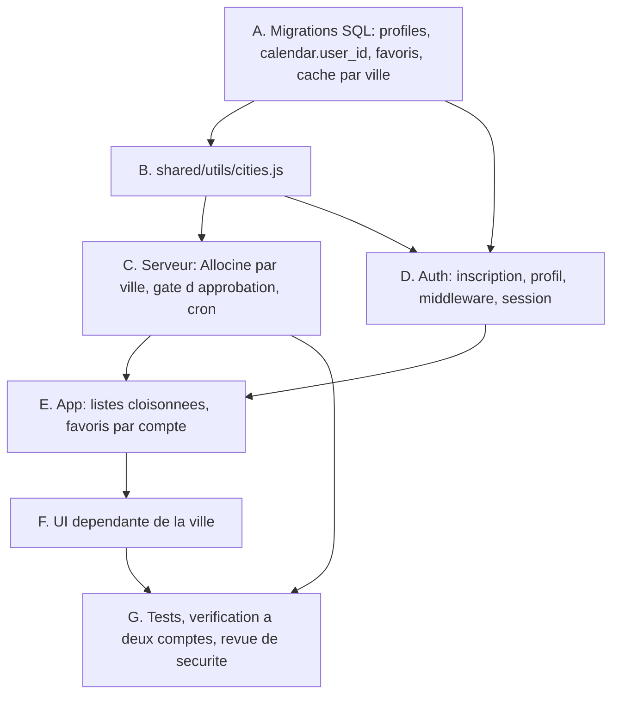

# Comptes multi-utilisateurs et périmètre par ville (Paris / Troyes)

## Summary of intent

Cinégenda est aujourd'hui une application **mono-utilisateur qui s'ignore** : elle exige bien une
authentification, mais aucune donnée ne porte de propriétaire. `calendar` se lit par un
`select('*')` sans filtre, les policies RLS disent `to authenticated using (true)`, l'étoile de
favori d'une salle est une colonne globale, et le périmètre géographique des séances est écrit en
dur dans le client Allociné (`PARIS_LOCALIZATION`, filtre `/^75/`). Un second compte créé
aujourd'hui ne verrait pas sa liste : il verrait **celle d'Alexis**, et y écrirait.

Ce chantier ouvre l'application à un second utilisateur — le père d'Alexis, à Troyes — avec sa
propre liste de films, sa propre ville, ses propres favoris de salle. Il introduit trois notions qui
n'existaient pas : un **propriétaire** sur les données personnelles, un **profil** portant la ville
et l'approbation du compte, et une **ville** comme paramètre de premier ordre du périmètre des
séances. L'inscription est publique (mail + mot de passe + ville) mais un compte n'est utilisable
qu'après approbation manuelle d'Alexis.

« Done » se lit ainsi : Alexis se connecte et retrouve exactement sa timeline, ses séances
parisiennes, ses favoris et ses filtres carte UGC / temps de trajet inchangés ; son père se connecte
et voit une liste vide qu'il remplit lui-même, dont les séances proviennent du CGR Troyes et de
l'Utopia Pont-Sainte-Marie, sans filtre carte UGC ni temps de trajet ; et aucun des deux ne voit ni
ne modifie quoi que ce soit de l'autre.

## Related context

- **Goal / issue:** demande utilisateur du 22/09/2026 — créer un compte pour son père, avec liste
  séparée et périmètre de séances troyen. Fonctionnalités de compte classiques (déconnexion,
  changement de ville, mot de passe oublié) explicitement **hors périmètre** : projet fermé, besoin
  précis.
- **Branch:** `feature/comptes-multi-utilisateurs-paris-troyes`
- **Rules pertinentes** — ce dépôt est un **portage Nuxt du design system du FCINQ Starter v5** : les
  rules SCSS s'y appliquent après transposition du support (SFC Vue au lieu de PHP), pas de la
  convention. Vérifié dans le code, pas supposé :

  | Rule | Transposition | Preuve dans ce dépôt |
  |---|---|---|
  | `f-scss-typography-mixins` | **Directe** | `app/assets/styles/_typography-mixins.scss` (`title-2`, `title-4`, `title-5`, `body`, `small-body`, `input-body`) + classes utilitaires dans `_typography.scss`, déjà employées en markup : `class="text-input input-body"`, `class="small-body release-date"`, `class="title-2"` |
  | `f-scss-spacing-rounding` | **Directe** | `_typography.scss` pose `html { font-size: .625em }` → `10px = 1rem`, la base exacte que la rule suppose. Arrondi au multiple de 10 ou 8 le plus proche, préférence au 8 à égalité |
  | `f-rscss` | **Directe** | Les SFC suivent déjà `.composant > .enfant` + `-modifier` (cf. `SeanceGroup.vue`, `SelectBtn.vue`). S'applique au `<style lang="scss" scoped>` |
  | `f-scss-no-reset-redeclaration` | **Directe** | `_reset.scss` importé en tête de `main.scss` |
  | `f-component-single-root` | **Adaptée** | La rule vise `inc/components/**/*.php` ; le raisonnement (encapsulation, point d'entrée SCSS unique, le parent masque/déplace en bloc) vaut identiquement pour un `<template>` de SFC. Vue 3 autorise les fragments — raison de plus de l'écrire |
  | `f-scss-variables` | **Intention seulement** | ⚠️ Le préfixe littéral `variables.$name` **casserait le build** ici : `nuxt.config.ts` auto-injecte `_variables.scss` via `additionalData`, donc `$color-primary` sans namespace. Ce qui transpose est l'interdit sous-jacent — aucune couleur ni fonte en dur |
  | `f-php-*`, `f-acf-json-naming` | **Non** | Syntaxe PHP, méthodes de modèle, nommage de champs ACF : sans objet hors WordPress |
  | `f-github-pr-cross-repo-linking` | **Non** | Mono-repo, aucune issue cross-repo, aucun step de PR dans ce plan |

- **Skills mobilisées (cf. `f-plan` Step 1.5)** — même méthode : retenues quand le système qu'elles
  pilotent **existe réellement ici**, écartées quand l'outillage qu'elles invoquent est absent.

  | Skill | Step | Justification mesurée |
  |---|---|---|
  | `f-typography-mixins` | 11, 12, 14, 17 | `_typography-mixins.scss` et `_typography.scss` sont présents et vivants. La priorité de la skill (classe utilitaire en markup d'abord, `@include` ensuite, jamais une classe utilitaire comme sélecteur) est **déjà la pratique du dépôt** |
  | `f-use-flex` | 11, 12, 14, 17 | `components/_flex.scss` importé dans `main.scss`, avec les modifiers d'origine (`-align-center`, `-justify-center`, `-direction-column`, `-flow-wrap`). **Employé dans 10 composants** — c'est une convention vivante, pas un vestige |
  | `f-use-grid` | 17 | `components/_grid.scss` importé, avec `--grid-col-number` / `--grid-gap` et les modifiers `.-half` / `.-one` / `.-auto` / `.-no-gap`. Priorité 1 sur tout layout colonnaire, cf. la skill |
  | `security-review` | 18 | Ce chantier crée la frontière que ce dépôt n'avait jamais eue : cloisonnement RLS, gate d'approbation, route d'inscription publique |
  | `f-use-wrapper` | — | ⚠️ **Disponible et vivante, mais hors sujet ici.** *(Corrigé le 22/09/2026 : le plan affirmait d'abord qu'aucun composant ne s'en servait — c'était faux, mon grep était tronqué. `search/index.vue` et `movies/[id].vue` portent bien `class="wrapper -medium -padded"`.)* La vraie raison de ne pas la rattacher est une question de taille : le plus petit wrapper de la map `$wrappers` fait 84rem (840 px), soit plus du double des 40rem d'une carte d'authentification. Le wrapper borne la largeur d'une **page**, pas d'un formulaire centré |
  | `f-use-svg` | — | Le pipeline export Figma → `currentColor` transpose, mais le helper de sortie est `\F\utils\SVG::g()` en PHP ; ce dépôt passe par `Svg.vue` + `vite-svg-loader`. Aucun picto neuf n'est prévu — à rattacher seulement si un step en ajoute |
  | `f-manage-component` | — | Écartée sur **preuve**, pas sur l'étiquette WordPress : `package.json` n'expose que `dev`, `build`, `generate`, `preview`, `test`. Les tâches `npm run create:component` que la skill pilote n'existent pas, et `include_template()` non plus. La rattacher enverrait `f-implement` exécuter des commandes absentes |
  | `f-figma-*`, `f-acf-*`, `f-create-cpt`, `f-create-taxo`, `f-create-wp-menu`, `f-use-composer`, `f-use-ajax`, `f-use-js-component` | — | Aucun signal dans la demande, et aucun substrat ici (pas de Figma fourni, pas d'ACF, pas de Composer, pas d'`AComponent`) |

### Ce que le spike Allociné a déjà tranché (fait le 22/09/2026)

Vérifié en direct, il n'y a donc rien à découvrir à l'implémentation :

| Question | Réponse mesurée |
|---|---|
| Identifiant de localisation Troyes | `87008` (`/_/localization_city/troyes`, zip 10000) |
| `near-87008` fonctionne-t-il comme `near-115755` ? | Oui, même forme de réponse, `totalPages: 1` |
| Salles rendues par `near-87008` | **exactement deux** : `P0983` CGR Troyes (10000) et `W1015` Utopia Pont-Sainte-Marie (10150) |
| « Utopia Troyes » existe-t-il sous ce nom ? | Non — l'enseigne troyenne est **Utopia Pont-Sainte-Marie**, commune limitrophe. C'est bien celle visée. |

Conséquence directe : le filtre de salles de Troyes ne peut pas être un préfixe de code postal calqué
sur `/^75/` (il faudrait `/^10/`, ce qui marcherait par chance aujourd'hui mais laisserait entrer
toute nouvelle salle auboise). Ce sera une **liste blanche de deux codes**, qui encode littéralement
la demande.

### Ce que l'exploration a mis au jour, et qui n'était pas dans la demande

Cinq points structurants. Les quatre premiers étaient invisibles tant qu'il n'y avait qu'un compte ; le cinquième concerne les pages que ce chantier allait créer :

1. **`calendar` n'a aucune colonne propriétaire.** Environ trente sites d'appel (`app/composables/`,
   `app/components/`, `app/utils/letterboxdDirectors.js`, `server/api/cron/warm.js`, quatre scripts)
   lisent et écrivent cette table sans jamais dire pour qui.
2. **`showtimes_cache` a pour clé primaire `(allocine_id, date)`** et son payload ne contient que des
   salles parisiennes. Sans dimension de ville, le père et Alexis se disputeraient la même ligne :
   le dernier à rafraîchir écraserait les séances de l'autre, et chacun verrait par intermittence la
   ville du voisin. **C'est le défaut le plus silencieux du lot** — rien ne planterait.
3. **Le cookie de session est déjà réglé sur un an** (`nuxt.config.ts`, `cookieOptions.maxAge =
   60 * 60 * 24 * 365`). La reconnexion tous les deux jours a donc une autre cause, à diagnostiquer
   plutôt qu'à corriger à l'aveugle (Step 16).
4. **La migration `2608151000-tighten-cinemas-rls.sql` avait anticipé ce jour**, par écrit : « Le
   jour où un second compte existe, la suite est un trigger qui rejette toute mise à jour touchant
   autre chose que `favorite` / `updated_at`. » Ce jour est arrivé, et la sortie est meilleure que
   prévue — les favoris quittent `cinemas`, donc plus aucune écriture navigateur sur le référentiel.
5. **`/login` est la seule page du dépôt hors design system**, ce qui compte parce que `/register`
   et `/pending` allaient être calquées dessus. Sur les 132 références de fonte du dépôt, elle porte
   l'**unique** `$font-do-hyeon` et l'**unique** `$font-futura` (tout le reste : `$font-body` ×94,
   `$font-mono` ×26, `$font-title` ×10), code ses tailles en dur (`font-size: 1.5rem` sur les
   `input`) là où le reste du dépôt écrit `class="text-input input-body"`, et affiche encore
   **« CinéCal »** alors que le commit `b50030e` a renommé l'application en « Cinégenda ».
   Les deux pages neuves suivent le design system, et `/login` est réalignée (Step 12).

## Proposed implementation flow

## Implementation steps

### Step 1 — Migration : table `profiles` (ville + approbation)

- [x] **Todo:** Écrire `_ressources/sql/2609221212-add-profiles.sql` créant `profiles (user_id uuid
  primary key references auth.users on delete cascade, city text not null check (city in
  ('paris','troyes')), approved boolean not null default false, created_at timestamptz default
  now())`, activer RLS, et poser deux policies : lecture de **sa seule** ligne (`user_id =
  auth.uid()`), aucune écriture depuis le navigateur. Insérer la ligne d'Alexis (`city = 'paris'`,
  `approved = true`) via la sous-requête
  `(select id from auth.users where email = 'alexchoc521@gmail.com')` plutôt qu'un UUID recopié à la
  main : un identifiant collé de travers passerait sans erreur et créerait un profil orphelin.
- **Files:** `_ressources/sql/2609221212-add-profiles.sql` (create)
- **Acceptance:** La migration est idempotente (`if not exists`, `drop policy if exists`). Jouée
  dans le SQL editor Supabase, `select * from profiles` rend la ligne d'Alexis et rien d'autre
  depuis une session navigateur.
- **Pourquoi aucune écriture navigateur :** `approved` est la serrure. Une policy d'`update` même
  restreinte à sa propre ligne permettrait à un compte de s'auto-approuver. La ligne est créée par
  la route d'inscription en service-role (Step 11) et modifiée par Alexis dans le dashboard.

### Step 2 — Migration : `calendar.user_id`, backfill et RLS

- [x] **Todo:** Écrire `_ressources/sql/2609221213-add-calendar-owner.sql` : ajouter
  `user_id uuid references auth.users`, backfiller **toutes** les lignes existantes vers
  `(select id from auth.users where email = 'alexchoc521@gmail.com')` — même sous-requête qu'au
  Step 1, jamais un UUID recopié —, passer la colonne en `not null` une fois le backfill vérifié, poser
  `default auth.uid()`, créer l'index `calendar_user_id_idx`, puis remplacer la policy
  `using (true)` par quatre policies `select` / `insert` / `update` / `delete` sur
  `user_id = auth.uid()` — la clause `insert` en `with check` pour qu'une ligne ne puisse pas naître
  au nom d'un autre.
- **Files:** `_ressources/sql/2609221213-add-calendar-owner.sql` (create)
- **Acceptance:** `select count(*) from calendar where user_id is null` rend `0` avant le passage en
  `not null`. Depuis une session de test non-Alexis, `select * from calendar` rend zéro ligne.
- **⚠️ Ordre impératif :** le backfill **avant** le `not null` et **avant** la nouvelle policy. Poser
  la policy d'abord rendrait les lignes invisibles à la requête de backfill elle-même.

### Step 3 — Migration : favoris de salle par utilisateur

- [x] **Todo:** Écrire `_ressources/sql/2609221214-per-user-cinema-favorites.sql` : créer
  `cinema_favorites (user_id uuid not null references auth.users on delete cascade, code text not
  null references cinemas(code), created_at timestamptz default now(), primary key (user_id, code))`,
  RLS complète sur `user_id = auth.uid()` (select / insert / delete — pas d'`update`, un favori
  n'a pas d'état), et backfiller depuis `cinemas.favorite = true` vers le compte d'Alexis. Retirer
  la policy `"cinemas: bascule favori"` posée par `2608151000` : plus aucune écriture navigateur sur
  le référentiel. Laisser `cinemas.favorite` en place, marquée obsolète en commentaire — elle est la
  trace du backfill, la supprimer n'apporte rien et casserait une relecture d'historique.
- **Files:** `_ressources/sql/2609221214-per-user-cinema-favorites.sql` (create)
- **Acceptance:** Les salles favorites d'Alexis existent en lignes dans `cinema_favorites`. Depuis
  une session navigateur, un `update cinemas set accepts_ugc = …` est refusé.
- **Bénéfice de bord :** ferme la limite que `2608151000-tighten-cinemas-rls.sql` documentait comme
  assumée (« un compte authentifié peut encore écrire une autre colonne s'il forge la requête »),
  sans avoir à écrire le trigger que ce fichier annonçait.

### Step 4 — Migration : dimension ville dans `showtimes_cache`

- [x] **Todo:** Écrire `_ressources/sql/2609221215-showtimes-cache-city.sql` : ajouter
  `city text not null default 'paris'` à `showtimes_cache`, refaire la clé primaire en
  `(allocine_id, city, date)`, retirer le `default` une fois la table migrée pour qu'aucune écriture
  future ne puisse omettre la ville. Ne **pas** toucher à `theater_events_cache` ni à
  `event_detail_cache` : leurs clés portent déjà un `theater_code` / `cinema_key`, qui est
  intrinsèquement propre à une ville.
- **Files:** `_ressources/sql/2609221215-showtimes-cache-city.sql` (create)
- **Acceptance:** `\d showtimes_cache` montre la clé composite à trois colonnes. Les lignes
  existantes portent toutes `city = 'paris'` — elles ne contiennent que des salles 75xxx, le défaut
  est donc exact et non une supposition.
- **Pourquoi `default 'paris'` puis retrait :** le défaut sert **uniquement** à migrer les lignes
  existantes sans les réécrire une à une. Le garder ensuite ferait qu'un appel serveur ayant perdu
  sa ville écrirait des séances troyennes sous l'étiquette « paris », en silence.

### Step 5 — `shared/utils/cities.js` : la ville comme source unique

- [x] **Todo:** Créer `shared/utils/cities.js`, sans dépendance (contrainte de `shared/`, cf.
  CLAUDE.md), exportant la table des villes et les prédicats qui en découlent : `CITIES` (clé,
  libellé, `allocineLocalization`, règle d'appartenance d'une salle, drapeaux de capacité
  `hasUgcCard` / `hasTransitTimes` / `groupsByArrondissement`), `isCityKey`, `cityOf` avec repli sur
  `'paris'`, et `belongsToCity(theater, city)`. Paris : localisation `115755`, appartenance par
  `/^75/` sur le zip — la règle actuelle, déplacée sans la changer. Troyes : localisation `87008`,
  appartenance par liste blanche `['P0983', 'W1015']`, les trois capacités à `false`.
- **Files:** `shared/utils/cities.js` (create)
- **Acceptance:** `node -e "import('./shared/utils/cities.js').then(m => console.log(m.CITIES))"`
  s'exécute sans erreur depuis un Node nu, sans passer par Nuxt.
- **Pourquoi dans `shared/` :** CLAUDE.md nomme trois invariants qui y vivent « chacun parce qu'une
  copie divergente y avait déjà causé un bug silencieux ». La ville est le quatrième candidat
  évident : elle est lue par l'app (affichage, filtres), par le serveur (appel Allociné, clé de
  cache) et par les scripts (`check-seances.mjs`). Une copie divergente ici ferait afficher une ville
  et mettre en cache l'autre.
- **Pourquoi une liste blanche de codes et non `/^10/` :** cf. le spike — `near-87008` ne rend que
  ces deux salles aujourd'hui, mais un préfixe de code postal laisserait entrer sans préavis toute
  salle auboise qu'Allociné rattacherait plus tard à Troyes. La demande nomme deux cinémas ; la
  règle en nomme deux.

### Step 6 — `fetchParisShowtimes` → `fetchCityShowtimes`

- [x] **Todo:** Dans `server/utils/allocine.js`, renommer `fetchParisShowtimes` en
  `fetchCityShowtimes(allocineId, date, city)` et remplacer les deux constantes parisiennes en dur
  par une lecture de `CITIES[city]` : la localisation dans l'URL de `fetchShowtimesPage`, et le test
  `/^75/.test(zip)` par `belongsToCity(theater, city)`. Mettre à jour l'encadré d'en-tête, qui
  annonce aujourd'hui « séances d'un film à une date, autour de Paris », et le commentaire de
  `PARIS_LOCALIZATION`, qui devient une entrée de la table des villes.
- **Files:** `server/utils/allocine.js` (modify)
- **Acceptance:** `grep -n "PARIS_LOCALIZATION\|\^75" server/` ne rend plus rien hors
  `shared/utils/cities.js`. Un appel manuel à `fetchCityShowtimes(id, date, 'troyes')` rend les deux
  salles troyennes ; le même avec `'paris'` rend ce qu'il rendait avant.
- **Conserver tel quel :** le tri final par zip puis nom reste valable dans les deux villes ; `ugcCard`
  reste lu sur la réponse Allociné, il vaudra simplement `false` partout à Troyes.

### Step 7 — `refreshShowtimes` porte la ville jusqu'au cache

- [x] **Todo:** Dans `server/utils/refreshShowtimes.js`, faire passer `city` en paramètre, l'ajouter
  au `.eq()` de la relecture du cache, le poser dans l'`upsert` avec `onConflict:
  'allocine_id,city,date'`, et le transmettre à `fetchCityShowtimes`. Vérifier que `rememberTheaters`
  reste correct : il insère en `ignoreDuplicates`, une salle troyenne entrera donc au référentiel
  sans jamais écraser une parisienne.
- **Files:** `server/utils/refreshShowtimes.js` (modify)
- **Acceptance:** Deux rafraîchissements du même film pour la même date, l'un en `'paris'` l'autre en
  `'troyes'`, produisent **deux** lignes distinctes dans `showtimes_cache` — et non une ligne
  réécrite deux fois.
- **⚠️ Le piège central du chantier :** c'est le seul fichier qui sorte chez Allociné *et* écrive en
  base (« une divergence ici s'écrirait en base », dit son en-tête). Un `city` oublié dans l'`upsert`
  ne lèverait aucune erreur : Postgres accepterait la ligne, et les deux villes se recouvriraient
  par intermittence selon qui rafraîchit en dernier.

### Step 8 — Les routes Allociné lisent la ville du profil, jamais du client

- [x] **Todo:** Dans `server/api/allocine/showtimes.js`, `refresh.js`, `events.js` et
  `events-refresh.js`, résoudre la ville **depuis le profil de l'utilisateur** (retour de
  `requireUser`, ou lecture de `profiles` pour les routes qui ne l'appellent pas) et la passer à
  `refreshShowtimes`. Ne jamais accepter la ville depuis la query string.
- **Files:** `server/api/allocine/showtimes.js`, `server/api/allocine/refresh.js`,
  `server/api/allocine/events.js`, `server/api/allocine/events-refresh.js` (modify)
- **Acceptance:** Forger `GET /api/allocine/showtimes?city=troyes` depuis le compte d'Alexis rend
  ses séances parisiennes — le paramètre est ignoré.
- **Pourquoi pas un query param :** ce serait laisser n'importe quel compte préchauffer n'importe
  quelle ville, donc multiplier à volonté les sorties vers Allociné depuis l'IP du déploiement. C'est
  exactement le risque que `requireUser` a été écrit pour fermer.
- **↪ Déviation assumée (22/09/2026) :** seules `showtimes.js` (lecture) et `refresh.js` (écriture)
  ont reçu la ville. `events.js` et `events-refresh.js` sont adressées **par code salle**, et un code
  salle appartient à une ville et une seule — la dimension est déjà portée par la clé. C'est le
  raisonnement que le Step 4 tient déjà pour ne pas toucher à `theater_events_cache` ; le Step 8 les
  listait par symétrie de façade. Leur ajouter une ville en aurait fait une donnée dérivée, donc
  divergente. Les deux routes portent désormais ce « pourquoi pas » en commentaire, pour qu'on n'y
  lise pas un oubli.
- **↪ Coût du chemin chaud :** résolu par `server/utils/userCity.js` (créé), un mémo en mémoire
  d'instance calqué sur `rateLimit.js` — une lecture de `profiles` par session toutes les 5 min au
  lieu d'une par affichage. Clé du mémo = **empreinte** des cookies `sb-`, jamais le jeton en clair.
- **⚠️ Coût de lecture :** `showtimes` et `events` sont « le chemin le plus chaud du projet » et se
  passent volontairement de `requireUser`. Ajouter une lecture de `profiles` à chaque appel
  annulerait cette économie. Mémoriser la ville dans le cache mémoire d'instance, à côté du compteur
  de `rateLimit.js`, ou la dériver du JWT déjà présent dans la requête.

### Step 9 — `requireUser` refuse les comptes non approuvés

- [x] **Todo:** Étendre `server/utils/requireUser.js` pour lire le profil de l'utilisateur après
  l'avoir identifié et lever un `403` si `approved` est faux ; rendre `{ user, profile }` plutôt que
  `user` seul, pour que les appelants de Step 8 disposent de la ville sans requête supplémentaire.
  Un profil absent est traité comme non approuvé.
- **Files:** `server/utils/requireUser.js` (modify), les cinq appelants (modify)
- **Acceptance:** Un compte fraîchement inscrit et non approuvé reçoit `403` sur
  `/api/allocine/refresh` et sur `/api/movies/:id/letterboxd`.
- **Pourquoi c'est ici et pas seulement dans le middleware de page :** l'en-tête de ce fichier
  l'explique déjà pour l'authentification — « `app/middleware/auth.js` protège les **pages** Nuxt,
  pas les handlers Nitro ». L'approbation suit la même logique : une garde qui ne vit que dans le
  middleware de page laisse un compte non approuvé faire émettre des requêtes vers Allociné, UGC,
  Dulac et MK2 depuis l'IP du déploiement. Profil absent = non approuvé, parce qu'une garde qui
  s'ouvre sur une donnée manquante n'est pas une garde.

### Step 10 — Le préchauffage balaie les villes réellement utilisées

- [x] **Todo:** Dans `server/api/cron/warm.js`, joindre `profiles` pour ne préchauffer, par ville,
  que les films des comptes **approuvés** de cette ville ; boucler le plan de travail sur les couples
  (film, ville, date) au lieu de (film, date). Relire `MAX_FETCHES_PER_DAY` (60) : le périmètre est
  maintenant multiplié par le nombre de villes actives, un plafond inchangé tronquerait
  silencieusement. Mettre à jour l'en-tête et `.github/workflows/warm-showtimes.yml` si la durée d'un
  passage s'en trouve allongée.
- **Files:** `server/api/cron/warm.js` (modify), `.github/workflows/warm-showtimes.yml` (modify si
  nécessaire)
- **Acceptance:** Un déclenchement manuel `?scope=near` journalise un résumé où `films` couvre les
  deux listes et `truncated` reste à `0`.
- **⚠️ Compte non approuvé :** ne jamais préchauffer sa ville. Sinon l'approbation cesse d'être une
  serrure — il suffirait de s'inscrire pour faire travailler le cron.
- **Ne pas relâcher le TTL :** l'en-tête du fichier le dit en toutes lettres, la cadence du cron
  **suit** `showtimesFreshness.js` et ne l'autorise pas à s'allonger. Si le périmètre doublé rend les
  passages trop longs, découper par ville avec le paramètre `days` existant — ne pas allonger
  `FRESH_NEAR` / `FRESH_FAR`.

### Step 11 — Page d'inscription `/register`

- [x] **Todo:** Créer `app/pages/register/index.vue` (layout `false`) : e-mail, mot de passe, choix
  de ville Paris / Troyes via `SelectBtn.vue`, appel `signUp`, puis création de la ligne `profiles`
  correspondante. Le compte naît `approved = false` : rediriger vers `/pending` (Step 14) avec un
  message expliquant que l'accès doit être validé. Ajouter depuis `/register` le lien de retour vers
  `/login` (le lien réciproque est posé au Step 12, avec le reste de la reprise de `/login`).
- **Files:** `app/pages/register/index.vue` (create), `server/api/auth/register.post.js` (create)
- **Skill:** `f-typography-mixins`, `f-use-flex`
- **Rules:** `f-rscss`, `f-scss-typography-mixins`, `f-scss-spacing-rounding`,
  `f-scss-no-reset-redeclaration`, `f-component-single-root`, `f-scss-variables` (intention seule —
  **ne pas** écrire `variables.$…`, cf. le tableau des rules)
- **Acceptance:** Une inscription crée bien une ligne `auth.users` **et** une ligne `profiles`
  portant la ville choisie et `approved = false`. Passer le drapeau à `true` dans le dashboard
  Supabase suffit à débloquer le compte à la connexion suivante. Aucune déclaration `font-family` /
  `font-size` / `line-height` à la main dans la page, et aucun `margin` / `padding` hors multiple de
  10 ou de 8.
- **⚠️ Ne pas calquer `/login` tel quel :** c'est la seule page du dépôt hors design system
  (constat 5). Le modèle à suivre pour un champ est celui de `app/pages/search/index.vue` —
  `class="text-input input-body"`, soit une classe dédiée sans typo plus la classe utilitaire qui
  l'apporte, exactement la priorité 1 de `f-typography-mixins`.
- **Pourquoi une route serveur et pas un insert depuis le navigateur :** `profiles` n'a aucune policy
  d'écriture (Step 1), précisément pour qu'`approved` ne soit pas à portée du client. La route crée
  la ligne en service-role, en forçant `approved = false` — la ville vient du formulaire, jamais le
  drapeau.
- **⚠️ Route publique qui écrit :** c'est la seule du projet. Elle appelle `rateLimit(event)` et
  valide la ville contre `isCityKey` avant tout.

### Step 12 — Réaligner `/login` sur le design system

- [x] **Todo:** Reprendre `app/pages/login/index.vue` : remplacer `$font-do-hyeon` / `$font-futura`
  par `$font-title` / `$font-body`, remplacer les tailles et graisses codées en dur par les classes
  utilitaires (`input-body` sur les champs, `small-body` sur les libellés, `title-2` sur le logo),
  corriger le logo « CinéCal » en « Cinégenda », passer les couleurs héritées (`$color-xdark-grey`,
  `$color-dark-grey`) sur les jetons actuels (`$color-bg`, `$color-surface-*`, `$color-border-*`),
  arrondir les `margin` / `padding` au multiple de 10 ou de 8, et ajouter le lien vers `/register`.
- **Files:** `app/pages/login/index.vue` (modify)
- **Skill:** `f-typography-mixins`, `f-use-flex`
- **Rules:** `f-rscss`, `f-scss-typography-mixins`, `f-scss-spacing-rounding`,
  `f-scss-no-reset-redeclaration`, `f-component-single-root`, `f-scss-variables` (intention seule —
  **ne pas** écrire `variables.$…`, cf. le tableau des rules)
- **Acceptance:** `grep -n 'font-do-hyeon\|font-futura' app/pages/login/index.vue` ne rend plus rien,
  et ces deux variables ne sont **plus référencées nulle part** dans `app/` — elles étaient les
  seules deux occurrences du dépôt (`$font-do-hyeon` ×1, `$font-futura` ×1 sur 132 références de
  fonte). Le formulaire est visuellement cohérent avec `/register` et `/pending`, et la page affiche
  « Cinégenda ».
- **Pourquoi un step à part et pas une clause du Step 11 :** c'est une modification de page
  existante, pas la création d'une neuve. La séparer rend le diff relisible — si le réalignement
  casse quelque chose à la connexion, il se révoque sans toucher à l'inscription.
- **⚠️ Ne pas toucher à la logique d'authentification** en passant : `signInWithPassword`, la gestion
  d'erreur et la redirection fonctionnent et ne font pas partie de cette reprise. Step 12 est du
  style et un mot, rien d'autre.
- **Vérifier si `$font-do-hyeon` / `$font-futura` peuvent sortir de `_variables.scss`** une fois la
  page reprise. Ne les retirer que si `_fonts.scss` ne déclare plus les `@font-face` correspondants
  — sinon on laisse des règles `@font-face` orphelines qui téléchargent des fichiers que plus
  personne n'utilise.

### Step 13 — `useProfile` : la ville et l'approbation, une fois par visite

- [x] **Todo:** Créer `app/composables/useProfile.js` exposant `profile`, `city`, `isApproved` et
  `loadProfile`, sur le modèle de `useCinemas` : `useState` pour le partage entre layout et pages, et
  la garde d'*inflight* sur `nuxtApp` — pas sur le résultat, pas en variable de module.
- **Files:** `app/composables/useProfile.js` (create)
- **Acceptance:** Le rail gauche et la page Séances montés ensemble ne déclenchent **qu'une** lecture
  de `profiles` (visible dans l'onglet réseau).
- **Reproduire exactement le motif de `useCinemas` :** son commentaire explique pourquoi la garde vit
  sur la requête en vol et pourquoi elle est portée par `nuxtApp` — une promesse ne se sérialise pas
  dans le payload SSR, et une variable de module serait partagée entre requêtes SSR concurrentes,
  donc **entre visiteurs**. Ce dernier point n'était qu'une hypothèse jusqu'ici ; il devient un vrai
  défaut de cloisonnement dès qu'il y a deux comptes.

### Step 14 — Middleware d'authentification et page d'attente

- [x] **Todo:** Étendre `app/middleware/auth.js` : charger le profil après avoir constaté la session,
  rediriger vers `/pending` si `approved` est faux. Créer `app/pages/pending.vue` (layout `bare`),
  qui annonce que le compte attend une validation. Laisser `/login`, `/register` et `/pending` hors
  de la garde.
- **Files:** `app/middleware/auth.js` (modify), `app/pages/pending.vue` (create)
- **Skill:** `f-typography-mixins`, `f-use-flex`
- **Rules:** `f-rscss`, `f-scss-typography-mixins`, `f-scss-spacing-rounding`,
  `f-component-single-root`
- **Acceptance:** Un compte non approuvé qui atteint `/` arrive sur `/pending` et ne peut naviguer
  nulle part ailleurs. Une fois approuvé, il atteint sa timeline sans reconnexion. `/pending` est
  centrée via `.flex -align-center -justify-center` plutôt qu'un `display: flex` réécrit à la main.

### Step 15 — Toutes les écritures `calendar` portent leur propriétaire

- [x] **Todo:** Passer en revue les ~30 sites d'appel `from('calendar')` et poser `user_id` sur
  **chaque insertion**. Les lectures et les mises à jour sont couvertes par RLS (Step 2) et n'ont pas
  besoin d'un `.eq('user_id', …)` explicite. Traiter les quatre scripts à part : ils tournent en
  service-role, que RLS ne regarde pas — `backfill-movies.mjs`, `backfill-letterboxd.mjs`,
  `check-seances.mjs` et `transit-times.mjs` doivent donc filtrer explicitement, ou être documentés
  comme opérant sur toutes les listes quand c'est le comportement voulu.
- **Files:** `app/components/nav/MovieAddForm.vue`, `app/composables/useMovieCalendar.js`,
  `app/composables/useInTheatersSync.js`, `app/composables/useUpcomingEvents.js`,
  `app/composables/useSeanceEvents.js`, `app/composables/useShowtimes.js`,
  `app/utils/letterboxdDirectors.js`, `scripts/*.mjs` (modify)
- **Acceptance:** Un film ajouté depuis le compte du père apparaît dans sa timeline et **pas** dans
  celle d'Alexis. `grep -rn "from('calendar')" scripts/` ne rend aucun appel service-role sans
  filtre ni commentaire justifiant son absence.
- **⚠️ Le cas le plus fin :** `useMovieCalendar.applyAutoInTheaters` fait un
  `.update(…).in('id', ids)` sur des identifiants issus de la liste déjà chargée. RLS le protège, la
  requête ne peut pas déborder — mais les scripts en service-role font le même geste **sans** ce
  filet.
- **⚠️ `check-seances.mjs`** écrit des signalements d'absence de salle. Ils sont partagés et doivent
  le rester : une salle muette l'est pour tout le monde. Ne pas le cloisonner par réflexe.

### Step 16 — Favoris par compte, et diagnostic de la session de deux jours

- [x] **Todo (a) :** Réécrire `useCinemas` pour lire les favoris depuis `cinema_favorites` et faire
  de `toggleFavorite` un `insert` / `delete`, en gardant la bascule optimiste et son retour arrière
  en cas d'échec d'écriture.
- [x] **Todo (b) :** Diagnostiquer la reconnexion tous les deux jours **avant** d'y toucher. Le
  cookie est déjà à un an (`nuxt.config.ts`, `maxAge: 60 * 60 * 24 * 365`) : la demande est donc déjà
  satisfaite côté configuration, et la cause est ailleurs. Pistes à écarter dans l'ordre : durée de
  vie du refresh token côté Supabase (Auth → Sessions : *time-box* et *inactivity timeout*), rotation
  du refresh token dont le cookie ne serait pas réécrit, et `secure: true` qui fait tomber le cookie
  en développement sur `http://localhost`.

#### Résultat du diagnostic (22/09/2026) — **le cookie n'est pas en cause**

Vérifié dans le code, pas supposé :

| Vérification | Résultat |
|---|---|
| `cookieOptions.maxAge` dans `nuxt.config.ts` | `60 * 60 * 24 * 365` — un an. Le défaut du module est 8 h, l'override est donc bien intentionnel et présent |
| La version installée honore-t-elle l'option ? | Oui. `@nuxtjs/supabase` 2.0.5, et `cookieOptions` est transmis à `@supabase/ssr` **des deux côtés** — `runtime/plugins/supabase.client.js`, `runtime/plugins/supabase.server.js` et `runtime/server/services/serverSupabaseClient.js` |
| `secure: true` bloque-t-il en dev ? | Non sur Chrome, qui traite `localhost` comme une origine sûre. À surveiller si le symptôme n'apparaît que sur Safari ou Firefox en `http://localhost` |

**Conclusion : rien à corriger dans le dépôt, et `nuxt.config.ts` n'a donc pas été touché.** Un
cookie d'un an ne sert à rien si le **refresh token** qu'il transporte meurt avant : le JWT expire en
1 h et n'est renouvelable que tant que le refresh token vit. La cause restante est donc dans les
réglages du projet Supabase, que le code ne peut pas lire.

**À vérifier par Alexis** — Dashboard Supabase → Authentication → Sessions :
1. **Inactivity timeout** — le suspect principal. S'il est réglé à ~2 jours, il explique exactement
   le symptôme pour quelqu'un qui passe sur le site de façon espacée : le cookie est toujours là,
   mais le refresh token qu'il porte a été invalidé entre-temps.
2. **Time-box user sessions** — même effet, mais en durée absolue plutôt qu'en inactivité.
3. **Refresh token rotation** et son *reuse interval* — avec une rotation agressive, deux onglets ou
   deux appareils qui rafraîchissent en même temps peuvent s'invalider l'un l'autre.

- **Files:** `app/composables/useCinemas.js`, `app/components/nav/SideNav.vue` (modify) ;
  `nuxt.config.ts` (modify **seulement si** le diagnostic le désigne)
- **Acceptance:** Une étoile posée par le père ne déplace aucune salle dans la vue d'Alexis. Le
  diagnostic de session est **écrit dans ce fichier de plan** avec sa cause, avant toute
  modification.
- **Pourquoi ne pas juste rallonger le cookie :** il est déjà au maximum demandé. Le rallonger encore
  serait changer quelque chose qui n'est pas en cause et déclarer le problème réglé sans l'avoir
  observé.

### Step 17 — Vue Séances dépendante de la ville

- [x] **Todo:** Piloter par les capacités de `CITIES[city]` : masquer le filtre carte UGC et la
  pastille de temps de trajet quand la ville ne les porte pas, et remplacer le regroupement par
  arrondissement par un regroupement par commune. Vérifier `seancesGrouping.js`
  (`arrondissementFromZip`, `compareTheaters`, `groupByCinema`) : un zip `10150` n'a pas
  d'arrondissement, le tri doit rester déterministe sans lui. Vérifier le pré-filtre
  `isKnownExhibitorVenue` — ni le CGR ni l'Utopia n'ont de connecteur d'exploitant, il rendra `false`
  partout à Troyes et **c'est le comportement correct** : les séances événement y seront marquées
  par le vocabulaire Allociné, sans texte libre.
- **Files:** `app/composables/useSeances.js`, `app/utils/seancesGrouping.js`,
  `app/components/seances/SeanceFilters.vue`, `app/components/seances/SeanceGroup.vue`,
  `app/components/nav/SideNav.vue` (modify)
- **Skill:** `f-use-flex`, `f-use-grid`, `f-typography-mixins`
- **Rules:** `f-rscss`, `f-scss-typography-mixins`, `f-scss-spacing-rounding`,
  `f-component-single-root`
- **Acceptance:** Sur le compte troyen, ni filtre carte ni « X min » à l'écran, et les deux salles
  sont groupées sous leur commune. Sur le compte d'Alexis, la vue est **strictement** celle d'avant.
- **Sur les skills de layout ici :** ce step **retire** des éléments d'une rangée de filtres existante
  plus qu'il n'en ajoute. `f-use-flex` sert donc surtout de garde-fou — la rangée est déjà
  `class="filter-options flex -align-center"`, et retirer un enfant ne doit pas donner prétexte à
  réécrire un `display: flex` local. `f-use-grid` ne s'applique que si le regroupement par commune
  demande une vraie mise en colonnes ; sinon, ne pas l'invoquer pour le plaisir.
- **⚠️ Filtre carte actif par défaut :** `useCinemas` documente qu'un `accepts_ugc` illisible produit
  « une page vide alors que le pré-filtre carte est actif par défaut ». À Troyes, aucune salle
  n'accepte la carte : si le filtre est masqué mais reste actif dans l'état, la page sera vide. Le
  masquer **et** le neutraliser.

### Step 18 — Tests, vérification à deux comptes, revue de sécurité

- [x] **Todo:** Étendre `scripts/test-seances-rules.mjs` aux règles de ville (`belongsToCity` sur les
  deux villes, `cityOf` et son repli, capacités), lancer `npm test`, puis vérifier à la main dans le
  navigateur avec **deux sessions simultanées** (une fenêtre privée pour le second compte) : liste,
  séances, favoris, filtres. Terminer par la revue de sécurité sur le diff complet de la branche.
- **Files:** `scripts/test-seances-rules.mjs` (modify)
- **Skill:** `security-review`
- **Acceptance:** `npm test` sort en code 0. La vérification à deux sessions ne montre aucune fuite
  dans un sens ni dans l'autre. La revue de sécurité ne laisse aucune constatation non traitée sur
  le cloisonnement RLS, le gate d'approbation et la route d'inscription publique.
- **Points que la revue doit spécifiquement regarder :** un compte non approuvé peut-il atteindre une
  route qui sort sur le réseau ? Un compte peut-il s'auto-approuver ? La route d'inscription
  peut-elle servir à énumérer les comptes existants ? Le service-role fuit-il vers le navigateur ?
- **⚠️ Ne pas lancer `npm run build` pendant qu'un serveur de dev tourne** (CLAUDE.md) : il écrit
  dans `.nuxt` au format production. Nettoyage si ça arrive :
  `rm -rf .nuxt .output .nitro && npx nuxt prepare`.

## Dependencies and ordering

- **Step 1 → 2 → 3 → 4** : les quatre migrations dans cet ordre. Step 2 dépend de Step 1 (la RLS de
  `calendar` s'appuiera sur `profiles` pour la ville), et son backfill doit précéder le `not null`
  comme la nouvelle policy.
- **Step 5 avant 6, 7, 8, 10, 16** : `shared/utils/cities.js` est le socle commun. Tout ce qui parle
  de ville en dépend.
- **Step 6 → 7 → 8** : le sens du flux, du client Allociné jusqu'aux routes. Step 7 dépend aussi de
  Step 4 (la clé de cache à trois colonnes doit exister avant l'`upsert` qui la vise).
- **Step 9 avant 10** : le cron filtre sur les comptes approuvés, notion posée par le gate.
- **Step 11 → 13 → 14** : la chaîne d'authentification. Step 11 dépend de Step 1 (la table
  `profiles`) et de Step 5 (la validation de la ville).
- **Step 15 après Step 2**, **Step 16(a) après Step 3**, **Step 17 après Step 5 et 12**.
- **Step 18 en dernier**, sur le diff complet de la branche.
- **Ordre des skills :** les skills de style ne s'enchaînent pas entre elles, elles s'appliquent
  **en même temps** sur chaque step front — `f-use-flex` / `f-use-grid` décident du layout,
  `f-typography-mixins` habille le texte une fois le markup posé, donc typo **après** structure au
  sein d'un même step. `security-review` est la seule à s'enchaîner, et elle vient en clôture
  (Step 18), après que tout le reste est écrit.

### Jalon vérifiable à mi-parcours

Après **Step 9**, l'application doit fonctionner **exactement comme avant** pour Alexis, seul compte
approuvé — toute la moitié base + serveur est en place sans qu'aucun comportement visible n'ait
changé. Si quelque chose bouge dans sa vue à ce stade, c'est une régression du cloisonnement, pas un
effet de bord du second compte : la diagnostiquer ici plutôt qu'à la fin, quand deux listes se
mélangeront.

## Risks and unknowns

| Risk / unknown | Mitigation |
|---|---|
| **Collision silencieuse du cache entre villes.** Un `city` oublié dans l'`upsert` de `refreshShowtimes` ne lève aucune erreur : les deux villes se recouvrent par intermittence. C'est le défaut le plus coûteux du chantier, et le plus discret. | Retirer le `default 'paris'` après la migration (Step 4), pour qu'une écriture sans ville échoue au lieu de mentir. Vérification explicite en Step 7 : deux lignes distinctes pour (même film, même date, deux villes). |
| **Backfill de `calendar.user_id` dans le mauvais ordre.** Poser la policy avant le backfill rend les lignes invisibles à la requête de backfill elle-même — table vidée de facto. | Ordre écrit dans Step 2, avec le `select count(*) … where user_id is null` comme porte de sortie avant le `not null`. Sauvegarde Supabase avant de jouer la migration. |
| **Trente sites d'appel `calendar`, dont quatre scripts en service-role.** RLS couvre le navigateur ; les scripts la contournent par construction. | Step 15 les traite séparément, avec le `grep` en critère d'acceptation. `check-seances.mjs` est explicitement exclu du cloisonnement — ses signalements sont partagés à dessein. |
| **Cause de la reconnexion tous les deux jours inconnue.** Le cookie est déjà à un an ; la demande porte sur un symptôme dont la cause n'est pas celle qu'on croit. | Step 16(b) est un diagnostic, pas un correctif. Trois pistes ordonnées, et la cause écrite dans ce plan avant toute modification. |
| **Filtre carte UGC actif par défaut à Troyes → page vide.** Aucune salle troyenne n'accepte la carte. Masquer le filtre sans le neutraliser produit une vue vide sans message. | Step 17 le masque **et** le neutralise, via les capacités de `CITIES[city]`. |
| **Budget du préchauffage silencieusement dépassé.** `MAX_FETCHES_PER_DAY = 60` tronque sans échouer ; le périmètre est maintenant multiplié par le nombre de villes. | Step 10 relit le plafond et prend `truncated == 0` comme critère d'acceptation. Découper par ville via le paramètre `days` existant plutôt que d'allonger le TTL. |
| **Deux salles troyennes seulement, sans connecteur d'exploitant.** Pas de texte libre d'événement (« en présence du réalisateur ») à Troyes. | Comportement correct, pas un défaut : le vocabulaire Allociné (« Avant-première », « Séance unique ») reste disponible. Documenté en Step 17 pour que ça ne se lise pas comme un bug. |
| **`transit_minutes` reste calculé depuis le domicile d'Alexis.** Colonne globale sur `cinemas`, alimentée par `scripts/transit-times.mjs` avec `HOME_LAT` / `HOME_LNG`. | Masqué à Troyes (Step 17). Un temps de trajet par utilisateur serait un chantier à part — hors périmètre, et sans objet pour deux salles dans la même agglomération. |
| **Route d'inscription publique = seule route publique qui écrit.** Surface d'abus nouvelle pour ce dépôt. | `rateLimit(event)` dès l'entrée, ville validée contre `isCityKey`, `approved` forcé à `false` côté serveur et hors de portée du client. Revue de sécurité en Step 18 avec ce point nommé. |
| **Réalignement de `/login` : ajout de périmètre, validé le 22/09/2026.** La demande initiale ne mentionnait pas cette page ; elle est reprise au Step 12 (fontes hors design system, tailles en dur, « CinéCal »). | Décidé, plus un arbitrage ouvert. Isolé dans son propre step pour rester révocable seul : si la reprise casse quelque chose à la connexion, elle se révoque sans toucher à l'inscription. Le step est borné au style et à un mot — **ne pas toucher à `signInWithPassword`** ni à la redirection. |
| **Une salle troyenne pourrait changer de code Allociné** (fusion, reprise d'enseigne). La liste blanche deviendrait muette sans rien signaler. | Symptôme visible immédiatement (vue Séances vide côté Troyes), et `check-seances.mjs` signale déjà les salles absentes d'Allociné. Le coût du diagnostic reste faible pour deux salles. |

## Handoff to implementation

- **Plan file:** `_ressources/plans/2609221212-comptes-multi-utilisateurs-paris-troyes.md`
- **Branch:** `feature/comptes-multi-utilisateurs-paris-troyes` (mono-repo, aucune règle cross-repo
  applicable)
- **First todo:** Step 1 — Migration : table `profiles` (ville + approbation)
- **Ajout de périmètre validé le 22/09/2026 :** le réalignement de `/login` sur le design system
  (Step 12), hors de la demande initiale. Isolé dans son propre step pour rester révocable seul.
- **Out of scope**, sur décision explicite de l'utilisateur (« projet fermé, besoins très précis ») :
  bouton de déconnexion, changement de ville depuis l'interface, mot de passe oublié, invitation par
  e-mail, interface d'administration des comptes (l'approbation se fait dans le dashboard Supabase),
  troisième ville, partage de liste entre comptes, temps de trajet par utilisateur, connecteur
  d'exploitant pour le CGR ou l'Utopia.

**Next action:** Work implementation steps in order, checking off each `- [ ]` as completed.
