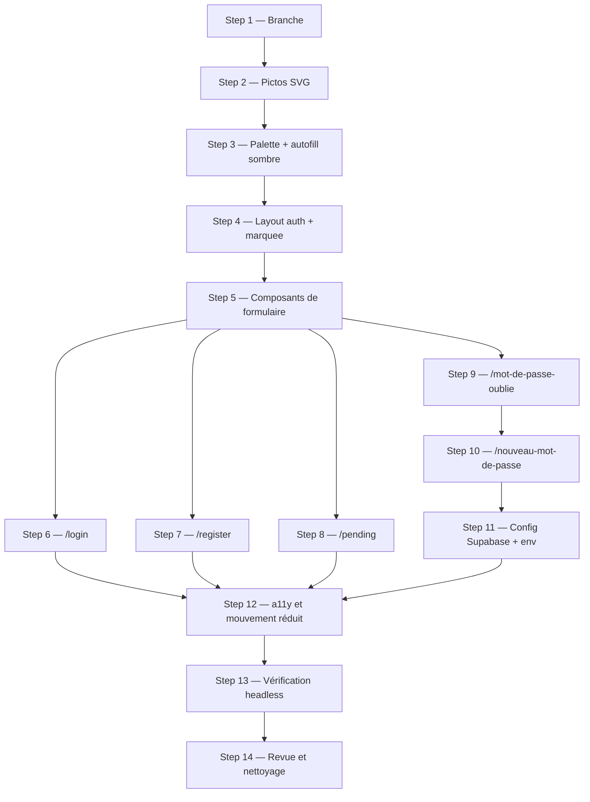

# Refonte des pages d'authentification d'après les maquettes (+ mot de passe oublié)

## Summary of intent

Les quatre pages qui entourent l'entrée dans Cinégenda — connexion, inscription, attente de
validation, et le mot de passe oublié qui n'existe pas encore — sont aujourd'hui les seules à ne pas
porter le design de l'application. Elles affichent une carte centrée de 40rem sur fond noir, héritée
d'avant la refonte Timeline : correcte, mais sans rapport avec ce que voit l'utilisateur une fois
connecté. Les maquettes de `_ressources/tmpl/` proposent autre chose — un écran coupé en deux, un
panneau visuel à gauche (logo, marquee de titres de films en contour, accroche) et le formulaire à
droite, avec un basculement Connexion / Inscription, un œil pour révéler le mot de passe, une jauge
de robustesse, un choix de ville en cartes, et une carte « ticket » perforée pour l'attente de
validation.

Ce chantier intègre ces quatre écrans dans le code du projet — SCSS scoped, variables de palette,
composants Vue, aucune dépendance nouvelle — et **met en place le parcours de mot de passe oublié de
bout en bout** : demande du lien, envoi par Supabase, page de choix du nouveau mot de passe (absente
des maquettes, déduite de la même grammaire visuelle), retour dans l'application.

« Done » se lit ainsi : les cinq écrans ressemblent aux maquettes au pixel près à l'arrondi de
spacing du projet, se parcourent au clavier avec un anneau de focus visible, se lisent sur un
téléphone, et quelqu'un qui a oublié son mot de passe peut le changer seul sans qu'Alexis ouvre le
dashboard Supabase.

## Related context

- **Goal / issue:** demande utilisateur du 23/09/2026 — « Pour le design des pages
  login/register/pending j'ai ajouté des modèles dans `_ressources/tmpl/`. J'ai aussi ajouté un
  modèle pour la page mot de passe oublié. Que je voudrais aussi mettre en place. Du coup pour
  l'inté front je veux que ça ressemble comme les templates html en adaptant évidemment le code à
  celui du projet. »
- **Branch:** `feature/refonte-pages-auth` (mono-repo, aucune règle cross-repo applicable —
  `.claude/rules/f-github-pr-cross-repo-linking.md` ne concerne que les PR liant deux dépôts)
- **Arbitrages validés par Alexis le 23/09/2026 (les trois questions posées avant rédaction) :**
  1. **Typographie → shorthand `font:` en SCSS scoped**, comme `seances.vue` / `evenements.vue`
     (`font: 800 3.8rem/1 $font-title`). Pas de nouveau palier dans `_typography-mixins.scss` :
     les maquettes introduisent une dizaine de styles qui ne serviraient qu'ici.
     ⚠️ Conséquence assumée : les trois pages auth perdent leur « aucune propriété typographique »
     actuelle. Le reste de la rule tient — aucune fonte ni graisse en dur, tout passe par
     `$font-title` / `$font-body` / `$font-mono` et `$bold` / `$semi-bold` / `$medium` / `$normal`.
  2. **Mot de passe oublié → flux complet**, page de nouveau mot de passe comprise.
  3. **Routes en français** : `/mot-de-passe-oublie` et `/nouveau-mot-de-passe`, alignées sur
     `/seances` et `/evenements`.
  4. **`/nouveau-mot-de-passe` se calque sur `Mot-de-passe-oublie.html`** — pas de maquette
     supplémentaire à produire. ⚠️ Cette maquette porte les deux états de la **demande** du lien
     (formulaire, puis « Lien envoyé. ») ; l'écran de **saisie** du nouveau mot de passe n'y figure
     pas. Il en reprend donc la grammaire à l'identique — même lien de retour, même bloc
     titre + sous-titre, même champ, même bouton sans picto — et n'ajoute que ce que la fonction
     impose (cf. Step 10).
  5. **Le marquee garde la liste de films de la maquette, en dur.** Pas de liste alimentée par la
     base : ces écrans s'affichent **avant** toute session, ils n'ont accès à aucune liste.

### D'où vient le design, et comment le relire

Les quatre fichiers de `_ressources/tmpl/` (`Connexion.html`, `Inscription.html`,
`Attente-validation.html`, `Mot-de-passe-oublie.html`) ne sont pas du HTML lisible : ce sont des
**bundles d'artifact React de ~460 Ko**, dont le markup réel est un JSON gzippé + base64 dans une
balise `<script type="__bundler/manifest">`. Les quatre contiennent **exactement le même template**
(`md5` identique sur le bundle applicatif) : un seul composant `x-dc` qui porte les quatre écrans,
choisis par une prop `startScreen` (`login` / `signup` / `forgot` / `pending`). Il n'y a donc **pas
quatre maquettes à concilier, mais une seule à découper**.

Le template décodé (markup + logique + les deux SVG) a été extrait dans le scratchpad de session :
`<scratchpad>/Connexion/clean.html`. ⚠️ **À ré-extraire avant d'implémenter** — le scratchpad est
propre à la session qui a écrit ce plan :

```bash
# script d'extraction : lit le manifest, dégzippe chaque entrée, écrit le template et les SVG
node <scratchpad>/extract.mjs _ressources/tmpl/Connexion.html <scratchpad>/Connexion
```

- **Rules pertinentes** — ce dépôt est un portage Nuxt des conventions SCSS du FCINQ Starter v5 ; la
  transposition est celle déjà établie et vérifiée dans le plan `2609221212`, reprise ici :

  | Rule | Transposition | Application dans ce chantier |
  |---|---|---|
  | `f-rscss` | **Directe** | Tout le SCSS écrit ici : `.auth-form > .field > .label`, variantes `-active` / `-error`. Imbrication qui suit le DOM, jamais de chaînes à plat |
  | `f-scss-spacing-rounding` | **Directe** (`html { font-size: .625em }` → `10px = 1rem`) | Chaque padding / margin / gap des maquettes est arrondi au multiple de 10 ou de 8 le plus proche. **Deux exceptions écrites plus bas** : hauteurs / rayons, et inset ≤ 4px |
  | `f-scss-no-reset-redeclaration` | **Directe** | `_reset.scss` pose déjà `margin/padding: 0`, `list-style: none`, `box-sizing`, `input { -webkit-appearance: none; border-radius: 0 }`. Ne pas les réécrire |
  | `f-component-single-root` | **Adaptée** | Vue 3 autorise les fragments — raison de plus de l'écrire : une racine unique par SFC, y compris pour les six composants du Step 5 |
  | `f-scss-typography-mixins` | **Partielle, sur décision d'Alexis** | L'interdit « aucune fonte, graisse ou taille en dur » tient ; la priorité « classe utilitaire d'abord » est levée pour ce chantier (cf. arbitrage 1). La règle absolue — ne jamais utiliser une classe utilitaire comme sélecteur — reste **non négociable** |
  | `f-scss-variables` | **Intention seulement** | ⚠️ Le préfixe `variables.$name` **casserait le build** : `nuxt.config.ts` auto-injecte `_variables.scss` via `additionalData`. Ce qui transpose : aucune couleur en dur, tout par variable |
  | `f-php-*`, `f-acf-json-naming` | **Non** | Sans objet hors WordPress |

- **Skills mobilisées (cf. `f-plan` Step 1.5)** — retenues quand le système qu'elles pilotent existe
  réellement ici, écartées sur preuve :

  | Skill | Step | Justification mesurée |
  |---|---|---|
  | `f-use-flex` | 4, 5, 6, 7, 8, 9, 10 | `components/_flex.scss` est importé dans `main.scss` et employé dans dix composants, **dont les trois pages auth actuelles** (`class="flex -direction-column"`). Toute la mise en page des maquettes est mono-axe : colonne de champs, rangée logo + nom, ligne label / lien « Oublié ? » |
  | `f-typography-mixins` | 6, 7, 8, 9, 10 | Mobilisée pour sa **règle absolue** (jamais une classe utilitaire comme sélecteur) et son interdit de typo en dur, pas pour sa priorité « classe d'abord » — levée par l'arbitrage 1 |
  | `f-use-svg` | 2 | Le pipeline de la skill (couleurs → `currentColor`, un fichier par picto) est **la convention réelle du dépôt** : `app/assets/svg/*.svg` en `currentColor`, sortis par `Svg.vue` + `vite-svg-loader`. Seul le helper de sortie diffère (`<Svg name="…"/>` et non `\F\utils\SVG::g()`). ⚠️ Exception documentée au Step 2 : le **logo** est une illustration bicolore, il garde ses couleurs |
  | `security-review` | 14 | Le chantier ajoute un parcours de réinitialisation de mot de passe — envoi d'e-mail, jeton de récupération, écriture d'un mot de passe. C'est une surface d'authentification neuve dans un dépôt qui vient d'en fermer deux (`25e9a24`, `604b318`) |
  | `f-use-grid` | — | ⚠️ Écartée sur mesure, pas par principe. `components/_grid.scss` est vivant (`search/index.vue` porte `class="col -auto -one"`), mais il est réglé sur **8 colonnes à gap 4rem** pour une page. Les grilles des maquettes sont des paires locales à gap 1rem (onglets, cartes de ville) et le partage gauche/droite est un `flex: 1.1` / `flex: 1` — la grille du projet ne les exprime pas |
  | `f-use-wrapper` | — | Écartée pour la raison déjà établie : le plus petit wrapper de `$wrappers` fait 84rem, la colonne de formulaire des maquettes en fait 40 |
  | `f-manage-component` | — | Écartée sur preuve : `package.json` n'expose que `dev`, `build`, `generate`, `preview`, `test`, `check:seances`. Les tâches `npm run create:component` que la skill pilote n'existent pas. Les composants du Step 5 se créent à la main, comme les 27 autres du dépôt |
  | `f-figma-*` | — | Aucune URL ni node Figma dans la demande : la source est un bundle HTML, déjà décodé |
  | `f-acf-*`, `f-create-cpt`, `f-create-taxo`, `f-create-wp-menu`, `f-use-composer`, `f-use-ajax`, `f-use-js-component` | — | Aucun signal, aucun substrat (pas d'ACF, pas de Composer, pas d'`AComponent`) |

### Correspondance maquette → palette du projet

Établie couleur par couleur, pour qu'aucune valeur hexadécimale n'atterrisse dans un SFC. Les écarts
sont tous sous le seuil de perception (≤ 2 points par canal) sauf mention.

| Maquette | Usage | Variable du projet |
|---|---|---|
| `#0c0d11` | fond de page, pastilles de perforation | `$color-bg` |
| `#101117` | fond du panneau visuel | `$color-surface-4` (`#0F1116`) |
| `#13151b` | fond des champs, du sélecteur d'onglets, de la carte d'attente | `$color-surface-1` (`#14161C`) |
| `#191b23` | filets du panneau visuel | `$color-border-1` |
| `#1f222b` | bordure de carte et de sélecteur | `$color-border-2` (`#20232C`) |
| `#1f222b` (fond) | **onglet actif** | `$color-hover-strong` (`#22252F`) — sémantiquement « option active » |
| `#1b1d25` | survol du bouton œil | `$color-hover` (`#1C1F27`) |
| `#23262f` | bordure des champs au repos | `$color-border-3` |
| `#262932` | segments vides de la jauge, filet en pointillés | `$color-border-4` |
| `#2a2d37` | contour des titres du marquee | `$color-border-5` (`#2A2D36`) |
| `#3a3e4a` | bordure de carte de ville au survol, cercle du radio | `$color-status-grey` (`#3A3F4A`) |
| `#f4f2ee` | titres, nom de marque | `$color-text` |
| `#e8e9ed` | valeurs de la carte d'attente | `$color-text-body` |
| `#8b909b` | sous-titres, libellés, liens secondaires | `$color-text-muted` (`#8A8F9C`) |
| `#565b66` | placeholders, libellés de la carte, œil au repos | `$color-text-weak` |
| `#ff3d77` | accent, bouton, bordure active, titre pair du marquee | `$color-primary` |
| `#ff6d97` | liens, accroche, œil actif | `$color-primary-light` |
| `#ff5a8c` | survol du bouton primaire | `$color-primary-light` — **pas de nouveau token**, un ton plus clair pour un survol |
| `#ff9bb8` | survol des liens | `$color-primary-lighter` |
| `#ff8aa9` | texte d'erreur | `$color-primary-lighter` |
| `rgba(255,61,119,.08)` | fond du bloc d'erreur | `rgba($color-primary, .08)` |
| `rgba(255,61,119,.07)` | fond de la carte de ville active | `rgba($color-primary, .07)` |
| `rgba(255,61,119,.18)` | halo de focus des champs | `rgba($color-primary, .18)` |
| `#f2b249` | pastille « en attente », jauge niveau 2 | `$color-yellow` (`#F0A935`) |
| `rgba(242,178,73,.55)` | pulsation de la pastille | `rgba($color-yellow, .55)` |
| `#2fbf71` | coche « lien envoyé », jauge niveau 4 | `$color-green` |
| `rgba(47,191,113,.12)` | fond de la pastille de succès | `rgba($color-green, .12)` |
| `#9bd36a` | jauge niveau 3 | ⚠️ **seule couleur sans équivalent** → nouveau token `$color-green-light` (Step 3) |

### Correspondance maquette → typographie

Toutes en shorthand `font:` dans le SCSS scoped de la page ou du composant, **en dernière position
du bloc** (habitude du dépôt et de `f-typography-mixins`).

| Rôle | Maquette | SCSS |
|---|---|---|
| Nom de marque | `800 26px/1 Bricolage, ls -.8` | `font: 800 2.6rem/1 $font-title` — **même valeur que le titre de section de `seances.vue:507`** |
| Titre d'écran | `800 38px/1, ls -1.2` | `font: 800 3.8rem/1 $font-title` |
| Titre « Lien envoyé. » | `800 34px/1.05, ls -1` | `font: 800 3.4rem/1.05 $font-title` |
| Titre carte d'attente | `800 32px/1.05, ls -1` | `font: 800 3.2rem/1.05 $font-title` |
| Titre de ville | `700 17px Bricolage` | `font: $bold 1.7rem/1 $font-title` |
| Sous-titre | `400 15px/1.5` | `font: $normal 1.5rem/1.5 $font-body` |
| Libellé de champ | `700 10.5px mono, ls 1.4, uppercase` | `font: $bold 1.05rem/1 $font-mono` |
| Libellé de carte d'attente | `700 10px mono, ls 1.3` | `font: $bold 1rem/1 $font-mono` |
| Accroche du panneau | `700 11px mono, ls 1.6` | `font: $bold 1.1rem/1 $font-mono` |
| Onglet | `600 14px` | `font: $semi-bold 1.4rem/1 $font-body` |
| Champ de saisie | `500 16px` | `font: $medium 1.6rem/1.1 $font-body` |
| Bouton primaire | `700 16px` | `font: $bold 1.6rem/1 $font-body` |
| Message d'erreur | `500 13.5px` | `font: $medium 1.35rem/1.4 $font-body` |
| Lien secondaire | `500 13–14px` | `font: $medium 1.4rem/1 $font-body` |
| Valeur de la carte | `600 15px` | `font: $semi-bold 1.5rem/1 $font-body` |
| Marquee | `800 64px` / `34px` mobile, `ls -1.5` | `font: 800 6.4rem/1 $font-title` / `3.4rem` |

### Arrondis de spacing — la règle et ses deux exceptions

`f-scss-spacing-rounding` s'applique à tout `padding` / `margin` / `gap` : multiple de 10 ou de 8 le
plus proche, préférence au 8 à égalité. Les conversions structurantes :

| Maquette | Arrondi | SCSS |
|---|---|---|
| `44px 48px` (panneau, desktop) | 48 / 48 | `4.8rem` |
| `28px 22px` (panneau, mobile) | 30 / 24 | `3rem 2.4rem` |
| `48px` (colonne formulaire) | 48 | `4.8rem` |
| `32px 22px 48px` (colonne, mobile) | 32 / 24 / 48 | `3.2rem 2.4rem 4.8rem` |
| `26px 26px 22px` (carte d'attente) | 24 / 24 / 24 | `2.4rem` |
| `18px 26px 24px` | 16 / 24 / 24 | `1.6rem 2.4rem 2.4rem` |
| `14px 16px` (carte de ville) | 16 / 16 | `1.6rem` |
| `10px 14px` (bloc d'erreur) | 10 / 16 | `1rem 1.6rem` |
| gaps `28 / 22 / 18 / 14 / 12 / 10 / 8` | 30 / 24 / 16 / 16 / 10 / 10 / 8 | `3 / 2.4 / 1.6 / 1.6 / 1 / 1 / .8rem` |

⚠️ **Exception 1 — hauteurs, largeurs et rayons ne s'arrondissent pas** (la rule les exclut
explicitement) : champ `52px` → `5.2rem`, bouton `54px` → `5.4rem`, bouton œil `44px` → `4.4rem`,
logo `44px`, perforation `22px`, pastille `9px`, rayons `9px` / `12px` / `14px` / `18px`, panneau
mobile `230px` → `23rem`, colonne `max-width: 400px` → `40rem`.

⚠️ **Exception 2 — les inset de 4px restent à `.4rem`.** L'arrondi les enverrait à 0 (multiple de 10)
ou à 8 (multiple de 8, soit le double). Ce sont des filets, pas du spacing : `padding: 4px` du
conteneur d'onglets, `top/right: 4px` du bouton œil, `gap: 4px` des segments de jauge. Même
traitement que les bordures, que la rule exclut déjà.

## Proposed implementation flow



## Implementation steps

### Step 1 — Branche de travail

- [x] **Todo:** Créer `feature/refonte-pages-auth` depuis `main` à jour. Ne rien committer avant
  qu'Alexis ait relu (cf. sa consigne permanente : éditer, annoncer, laisser relire avant
  `/f-commit`).
- **Files:** —
- **Acceptance:** `git branch --show-current` rend `feature/refonte-pages-auth`, `git status` propre.

### Step 2 — Les cinq pictos des maquettes

- [x] **Todo:** Ajouter dans `app/assets/svg/` les pictos que les maquettes posent en SVG inline, un
  fichier par picto, **couleurs remplacées par `currentColor`** comme les 21 fichiers existants
  (vérifié sur `ticket.svg`) :
  `arrow-right.svg` (`M5 12h14m0 0-5-5m5 5-5 5`, stroke 2, round), `arrow-left.svg` (miroir),
  `eye.svg` (contour d'œil + pupille pleine), `check.svg` (`m5 12.5 4.5 4.5L19 7.5`, stroke 2.2).
  Et le **logo** : `logo.svg`, repris tel quel du manifest décodé
  (`97200995-…svg`, carré arrondi + quatre perforations + deux barres).
- **Files:** `app/assets/svg/{arrow-right,arrow-left,eye,check,logo}.svg` (create)
- **Skill:** `f-use-svg`
- **Acceptance:** `<Svg name="arrow-right" />` rend le picto et prend la couleur du parent via
  `color:`. Le logo garde ses trois couleurs.
- **⚠️ L'exception assumée :** le logo n'est **pas** passé en `currentColor`. C'est une illustration
  bicolore (barre verte `#2FBF71`, barre rose `#FF3D77`) et non une icône — le pipeline de
  `f-use-svg` réserve `currentColor` aux icônes. Le fichier garde ses hexadécimaux : ce sont
  exactement `$color-green` et `$color-primary`, mais un SVG ne lit pas les variables SCSS.

### Step 3 — Un token de palette, et l'autofill sombre

- [x] **Todo:** (a) Ajouter `$color-green-light: #9BD36A` dans `_variables.scss`, à côté de
  `$color-green`, avec le commentaire qui dit son unique emploi (niveau 3 de la jauge de robustesse)
  — seule couleur des maquettes sans équivalent dans la palette Timeline.
  (b) Corriger `_form.scss` : sa règle d'autofill pose aujourd'hui un fond **blanc**
  (`box-shadow: 0 0 0 1000px #ffffff inset`), vestige d'un thème clair, et le fichier est
  **commenté dans `main.scss`** — donc Chrome repeint les champs auto-remplis en bleu pâle sur les
  pages auth. Remplacer par `-webkit-box-shadow: 0 0 0 4rem $color-surface-1 inset` +
  `-webkit-text-fill-color: $color-text` (ce que font les maquettes), et décommenter
  `@import '_form';` dans `main.scss`.
- **Files:** `app/assets/styles/_variables.scss` (modify), `app/assets/styles/_form.scss` (modify),
  `app/assets/styles/main.scss` (modify)
- **Rules:** `f-scss-variables` (intention : aucune couleur en dur)
- **Acceptance:** Un mot de passe enregistré dans Chrome, champ auto-rempli sur `/login` → fond
  sombre, texte clair. Aucune autre page n'est affectée (la règle est scopée à `form`).

### Step 4 — Layout `auth` et marquee

- [x] **Todo:** Créer `app/layouts/auth.vue` : racine unique `.auth-layout` en flex, avec
  `> .art` (le panneau visuel) et `> .content` (la colonne de formulaire, `<slot />` centré,
  `max-width: 40rem`). Le panneau porte les deux filets perforés
  (`repeating-linear-gradient(90deg, transparent 0 10px, $color-border-1 10px 22px)`) haut et bas,
  le logo + « Ciné**genda** » (l'accent rose sur `genda` via `<span class="accent">`, exactement le markup des trois pages auth actuelles), l'accroche
  (« TON AGENDA DE CINÉMA » + la phrase d'accroche), et `<AuthMarquee />` en fond.
  Créer `app/components/auth/Marquee.vue` : quatre rangées de titres de films (la liste des
  maquettes, en constante de module), chaque rangée **dupliquée** pour la boucle, défilement
  alterné gauche / droite via deux keyframes, durée `60s + index * 12s`, titres en contour
  (`color: transparent` + `-webkit-text-stroke: 1.2px $color-border-5`) sauf un sur quatre en
  `$color-primary`. Rotation `-4deg` du bloc, `pointer-events: none`, `aria-hidden="true"`.
  Responsive : sous `$tablet-portrait` (960px), `flex-direction: column`, panneau à `23rem` de haut,
  accroche masquée, marquee à `3.4rem`.
- **Files:** `app/layouts/auth.vue` (create), `app/components/auth/Marquee.vue` (create)
- **Skill:** `f-use-flex`, `f-typography-mixins`
- **Rules:** `f-rscss`, `f-component-single-root`, `f-scss-spacing-rounding`
- **Acceptance:** Une page vide en `definePageMeta({ layout: 'auth' })` affiche le panneau à gauche
  et sa zone de contenu à droite ; à 900px de large l'écran passe en colonne ; le marquee défile sans
  débordement horizontal de la page (`overflow: hidden` sur `.art`).
- **Pourquoi un layout et pas un composant :** Nuxt **conserve le layout monté** quand on navigue
  entre deux pages qui le partagent. Le panneau visuel et son marquee ne se remontent donc pas entre
  `/login` et `/register` — la transition `view` du projet (crossfade 200ms, `nuxt.config.ts`) ne
  joue que sur la colonne de droite. C'est exactement le basculement d'onglet des maquettes, obtenu
  sans état de page.
- **⚠️ Le seuil de bascule :** les maquettes basculent à 860px, une valeur que le projet n'a pas.
  `$tablet-portrait` (960px) est le token le plus proche — la bascule arrive 100px plus tôt, sur une
  plage où la colonne de formulaire est déjà à l'étroit. Ne pas inventer un breakpoint de 860px pour
  ces cinq pages.

### Step 5 — Les composants de formulaire partagés

- [x] **Todo:** Créer les cinq composants que les cinq écrans se partagent, chacun à racine unique :
  - `app/components/auth/Tabs.vue` — le sélecteur Connexion / Inscription, deux `<NuxtLink>` vers
    `/login` et `/register`, état actif déduit de `useRoute().path` (pas d'état local : la route
    **est** l'état).
  - `app/components/auth/Field.vue` — libellé mono + `<slot />` pour le contrôle + `<slot name="action" />`
    pour le lien « Oublié ? ». Props : `label`, `inputId` (posé en `for`).
  - `app/components/auth/Input.vue` — **le champ, e-mail comme mot de passe** (renommé en cours
    d'implémentation : l'habillage du champ est identique partout, un composant réservé au mot de
    passe aurait obligé à recopier hauteur / fond / bordure / halo de focus dans les cinq pages).
    `v-model`, prop `type`, et deux options qui ne servent qu'au mot de passe : le bouton œil
    (`aria-label` + `aria-pressed`, bascule `type` entre `password` et `text`) et la jauge de
    robustesse à quatre segments, calculée comme dans les maquettes
    (`min(4, longueur ≥ 8 + majuscule + chiffre + caractère spécial)`).
  - `app/components/auth/Notice.vue` — le bloc de message d'erreur, `role="alert"`. Pas de
    variante `-success` : vérifié à l'implémentation, aucun écran n'en affiche — le succès de
    « Lien envoyé. » est un écran entier, pas un message glissé dans un formulaire.
  - `app/components/auth/SubmitBtn.vue` — bouton primaire pleine largeur, props `label`,
    `loadingLabel`, `loading`, `disabled`, et **`icon` (défaut : `arrow-right`, `null` pour aucun)**.
    ⚠️ Relevé dans la maquette, à ne pas uniformiser : « Se connecter », « Créer mon compte » et
    « Ma demande a été validée » portent la flèche ; « Envoyer le lien » et « Retour à la
    connexion » n'en ont pas.
- **Files:** `app/components/auth/{Tabs,Field,PasswordInput,Notice,SubmitBtn}.vue` (create)
- **Skill:** `f-use-flex`, `f-typography-mixins`
- **Rules:** `f-rscss`, `f-component-single-root`, `f-scss-no-reset-redeclaration`
- **Acceptance:** Chaque composant se monte isolément dans `/login` sans warning console. Le SCSS de
  chacun ne cible aucune classe utilitaire (`grep -n "^\s*\.flex\|\.small-body\|\.input-body\|\.title-" app/components/auth/*.vue`
  ne rend rien en position de sélecteur).
- **Ce qui ne devient pas un composant, et pourquoi :** les **cartes de ville** de l'inscription
  (un seul emploi, Step 7) et la **carte-ticket** de l'attente (un seul emploi, Step 8) restent dans
  leur page. Un composant à usage unique déplace le code sans le factoriser.
- **⚠️ La jauge est cosmétique.** Le minimum réel — 8 caractères — est imposé par
  `server/api/auth/register.post.js` (`MIN_PASSWORD`), et c'est lui qui refuse. La jauge ne bloque
  jamais la soumission : elle informe. Ne pas déplacer la règle de validation ici.

### Step 6 — `/login` refondue

- [x] **Todo:** Réécrire `app/pages/login/index.vue` : `definePageMeta({ layout: 'auth' })` à la
  place de `layout: false`, `<AuthTabs />`, titre « Bon retour. », sous-titre « Connecte-toi pour
  retrouver ta liste et les séances du jour. », `<AuthField>` e-mail, `<AuthField>` mot de passe avec
  `<AuthPasswordInput>` (sans jauge) et le lien « Oublié ? » vers `/mot-de-passe-oublie` en slot
  `action`, `<AuthNotice>` d'erreur, `<AuthSubmitBtn label="Se connecter">`.
  **Ne toucher ni à `signInWithPassword` ni à la redirection `router.push('/')`** — le commit
  `25e9a24` a fermé l'oracle d'existence de compte sur cette page, sa logique est déjà tranchée.
- **Files:** `app/pages/login/index.vue` (modify)
- **Skill:** `f-use-flex`, `f-typography-mixins`
- **Rules:** `f-rscss`, `f-scss-spacing-rounding`, `f-scss-no-reset-redeclaration`
- **Acceptance:** Connexion avec les identifiants d'Alexis → `/`. Mauvais mot de passe → le message
  d'erreur uniformisé actuel, dans le bloc rose. L'écran est superposable à la maquette `login`.

### Step 7 — `/register` refondue (dont les cartes de ville)

- [x] **Todo:** Réécrire `app/pages/register/index.vue` : layout `auth`, `<AuthTabs />`, titre
  « Prends ta place. », sous-titre « Crée ton compte pour commencer ta liste de films. », e-mail,
  mot de passe avec **jauge** et placeholder « 8 caractères minimum », puis le choix de ville en deux
  cartes (nom + pastille radio) alimentées par `CITIES` (auto-import de `shared/utils/cities.js`,
  **jamais une liste recopiée**), erreur, `<AuthSubmitBtn label="Créer mon compte">`.
  ⚠️ **Garder la structure `fieldset` / `legend` + `<input type="radio">` réels** de la version
  actuelle, les inputs visuellement masqués (mixin `srOnly` de `_a11y.scss`) et l'état actif lu par
  `:has(.radio:checked)` — la carte est l'habillage du radio, pas son remplacement. Le commentaire
  qui explique ce choix est déjà dans le fichier : le reprendre, pas le perdre.
- **Files:** `app/pages/register/index.vue` (modify)
- **Skill:** `f-use-flex`, `f-typography-mixins`
- **Rules:** `f-rscss`, `f-scss-spacing-rounding`
- **Acceptance:** Les deux villes viennent de `CITIES` (renommer `Troyes` dans `cities.js` le
  changerait à l'écran). Au clavier : Tab atteint le groupe, les flèches changent de ville, la carte
  active se voit. Inscription → `/pending`. L'écran est superposable à la maquette `signup`.

### Step 8 — `/pending` refondue en carte-ticket

- [x] **Todo:** (a) Étendre le `select` de `app/composables/useProfile.js` à
  `city, approved, created_at` — la carte des maquettes affiche la date de demande, et la colonne
  existe déjà (`_ressources/sql/2609221212-add-profiles.sql`).
  (b) Réécrire `app/pages/pending.vue` : layout `auth`, carte en deux moitiés séparées par le filet
  en pointillés et les deux pastilles de perforation, pastille ambre pulsante + « EN ATTENTE DE
  VALIDATION », titre « Ta place est réservée. », texte, puis la grille Compte (e-mail de
  `useSupabaseUser()`) / Ville (`cityInfo.label`) / Demande (`created_at` formaté par
  `Intl.DateTimeFormat('fr-FR', { day: 'numeric', month: 'short', year: 'numeric' })`, comme
  `movieHelpers.js:70`). Bouton primaire « Ma demande a été validée » câblé sur le `recheck()`
  existant (état `checking` → « Vérification… »), et « Se déconnecter » en dessous.
  **Ne toucher ni au `watchEffect` de redirection ni à `signOut`** : ce sont les deux sorties de
  secours de la page, et leurs commentaires disent pourquoi.
- **Files:** `app/composables/useProfile.js` (modify), `app/pages/pending.vue` (modify)
- **Skill:** `f-use-flex`, `f-typography-mixins`
- **Rules:** `f-rscss`, `f-scss-spacing-rounding`
- **Acceptance:** Un compte non approuvé voit son e-mail, sa ville et sa date d'inscription.
  ⚠️ **Le cas du profil absent est traité** : `useProfile` rend alors
  `{ city: null, approved: false, missing: true }` — la carte doit afficher un tiret pour la ville et
  la date, jamais « undefined » ni planter. Le tester en coupant la table (le repli est déjà écrit
  dans le composable).
- **Pourquoi cette page ne change pas de comportement :** elle couvre trois situations
  indistinguables (compte en attente, profil absent, lecture en échec) et la conduite à tenir est la
  même. Le chantier l'habille, il ne la requalifie pas.

### Step 9 — `/mot-de-passe-oublie` (demande du lien)

- [x] **Todo:** Créer `app/pages/mot-de-passe-oublie.vue`, layout `auth`, **sans middleware `auth`**
  (on y arrive sans session). Deux états dans la page, comme la maquette :
  - *formulaire* — lien de retour « ← Retour à la connexion », titre « Mot de passe oublié »,
    sous-titre, champ e-mail, bouton « Envoyer le lien ».
  - *envoyé* — pastille verte à coche, « Lien envoyé. », le texte qui nomme l'adresse saisie en
    `$color-text`, bouton « Retour à la connexion », lien « Renvoyer le lien » qui revient au
    formulaire.
  Au submit : `client.auth.resetPasswordForEmail(email, { redirectTo })` avec
  `redirectTo = ${siteUrl || origin}/nouveau-mot-de-passe` (`useRuntimeConfig().public.siteUrl` et
  `useRequestURL().origin`, exactement le calcul de `app/app.vue:8`).
  ⚠️ **Afficher l'écran « Lien envoyé. » quelle que soit la réponse.**
  *(Corrigé le 23/09/2026 après la revue de sécurité du Step 14 : ce step prévoyait d'exempter le
  429 — « il parle du service, pas du compte ». C'était faux. Supabase rend 200 pour une adresse
  inconnue et ne rend 429 qu'**après** avoir résolu l'utilisateur : le 429 ne désigne donc qu'une
  adresse existante, et deux soumissions suffisaient à lire l'oracle. Le retour de
  `resetPasswordForEmail` n'est plus lu du tout ; le délai d'un renvoi est décompté localement.)*
- **Files:** `app/pages/mot-de-passe-oublie.vue` (create)
- **Skill:** `f-use-flex`, `f-typography-mixins`
- **Rules:** `f-rscss`, `f-component-single-root`, `f-scss-spacing-rounding`
- **Acceptance:** Une adresse inexistante et une adresse existante donnent **le même écran, au même
  délai perçu**. Le lien reçu pointe vers `/nouveau-mot-de-passe`.

### Step 10 — `/nouveau-mot-de-passe` (consommation du lien)

- [x] **Todo:** Créer `app/pages/nouveau-mot-de-passe.vue`, layout `auth`, **sans middleware `auth`**.
  **Maquette de référence : l'écran `forgot` de `Mot-de-passe-oublie.html`** (décision d'Alexis du
  23/09/2026), repris tel quel — lien de retour « ← Retour à la connexion », bloc titre + sous-titre,
  champ, bouton pleine largeur **sans picto**. Trois écarts, et seulement ceux-là : le titre devient
  « Nouveau mot de passe », le champ e-mail devient un `<AuthPasswordInput>` avec jauge
  (`autocomplete="new-password"`) suivi d'un champ de confirmation, et le bouton dit
  « Enregistrer ». L'écran de succès réutilise la pastille verte à coche de l'état « Lien envoyé. ».
  À l'ouverture : si `route.query.code` est présent et qu'il n'y a pas de session, appeler
  `client.auth.exchangeCodeForSession(code)` ; traiter aussi `error_description` (lien expiré) que
  Supabase renvoie en query ou en fragment. Sans session utilisable → afficher l'état « Lien expiré
  ou déjà utilisé » avec un lien vers `/mot-de-passe-oublie`, et **ne pas montrer le formulaire**.
  Au submit : refuser si les deux champs diffèrent ou si le mot de passe fait moins de 8 caractères
  (même seuil que `MIN_PASSWORD`, écrit une fois dans la page et commenté comme miroir du serveur),
  puis `client.auth.updateUser({ password })` et `router.push('/')` — le middleware `auth` renverra
  sur `/pending` si le compte n'est pas approuvé, ce qui est le comportement voulu.
- **Files:** `app/pages/nouveau-mot-de-passe.vue` (create)
- **Skill:** `f-use-flex`, `f-typography-mixins`
- **Rules:** `f-rscss`, `f-component-single-root`
- **Acceptance:** Parcours complet dans un navigateur : demande → e-mail → lien → nouveau mot de
  passe → `/` (ou `/pending`). Le même lien rejoué une seconde fois affiche « Lien expiré ou déjà
  utilisé » au lieu d'un formulaire inerte.
- **⚠️ Le piège PKCE :** `@nuxtjs/supabase` 2.0.5 s'appuie sur `@supabase/ssr`, dont le client
  navigateur est en flux PKCE. Le vérificateur est stocké **dans le navigateur qui a demandé le
  lien** : ouvrir le lien dans un autre navigateur (ou après purge du stockage) fait échouer
  `exchangeCodeForSession`. C'est un cas normal, pas un bug — il doit produire le même écran
  « Lien expiré ou déjà utilisé », pas une erreur brute.

### Step 11 — Configuration Supabase et variables d'environnement

- [x] **Todo:** (a) Documenter `NUXT_PUBLIC_SITE_URL` dans `.env.example` : la clé existe déjà dans
  `runtimeConfig.public.siteUrl` (`nuxt.config.ts:51`) et sert aux balises Open Graph, mais **elle
  n'est documentée nulle part** ; elle devient structurante ici, puisqu'elle compose le `redirectTo`
  du lien de réinitialisation.
  (b) Dans le dashboard Supabase → *Authentication → URL Configuration*, ajouter
  `http://localhost:3000/nouveau-mot-de-passe` et l'URL de production à la liste des *Redirect URLs*
  (sans quoi Supabase renvoie sur le *Site URL* par défaut et le lien tombe à côté).
  (c) Vérifier l'expéditeur d'e-mails : le service SMTP intégré de Supabase est plafonné (quelques
  messages par heure) et, sur les projets récents, **n'écrit qu'aux adresses membres du projet**.
  Si l'adresse du père d'Alexis n'est pas membre, configurer un SMTP tiers (Brevo / Resend, offre
  gratuite) — c'est la seule étape du chantier qui ne se fait pas dans le code.
  ⚠️ **« Compte approuvé » et « adresse membre du projet Supabase » sont deux choses sans rapport.**
  L'approbation vit dans `profiles.approved` et n'ouvre que l'application ; l'autorisation d'envoi du
  SMTP intégré se règle dans les membres de l'organisation Supabase. Un compte parfaitement approuvé
  peut donc ne jamais recevoir son e-mail de réinitialisation — c'est exactement ce que ce point (c)
  vérifie.
  (d) Ajouter au `CLAUDE.md` du projet la ligne qui manque au tableau des variables :
  `NUXT_PUBLIC_SITE_URL` (Open Graph + lien de réinitialisation).
- **Files:** `.env.example` (modify), `CLAUDE.md` (modify), dashboard Supabase (hors dépôt)
- **Acceptance:** Un e-mail de réinitialisation arrive réellement sur l'adresse de test, et son lien
  atterrit sur `/nouveau-mot-de-passe` avec un `code` exploitable.
- **⚠️ Le seul vrai bloquant du chantier est ici**, pas dans le code : une intégration parfaite ne
  sert à rien si l'e-mail ne part pas. Traiter ce step **avant** de déclarer le Step 10 terminé.

### Step 12 — Accessibilité et mouvement réduit

- [x] **Todo:** Passe transverse sur les cinq écrans :
  - `@include focusRing()` sur chaque champ, bouton, onglet, carte de ville et lien secondaire —
    ⚠️ **indispensable** : `_reset.scss:60` coupe les contours de tout le document
    (`html:not(.a11y):not(.no-js) * { outline: none }`) derrière une classe opt-in que rien n'active.
  - `for` / `id` sur chaque paire libellé / champ, `autocomplete` correct
    (`email`, `current-password` sur `/login`, `new-password` ailleurs).
  - `role="alert"` conservé sur tous les blocs d'erreur (déjà commenté dans les pages actuelles :
    le message apparaît après la soumission, donc hors du flux de lecture).
  - Marquee et jauge en `aria-hidden="true"` (décoratifs) ; le bouton œil annonce son état.
  - `@media (prefers-reduced-motion: reduce)` : marquee arrêté, pulsation de la pastille ambre
    coupée, animation `pop` d'entrée neutralisée. Le projet a déjà ce réflexe dans `main.scss`.
- **Files:** `app/layouts/auth.vue`, `app/components/auth/*.vue`, les cinq pages (modify)
- **Skill:** `f-use-flex`
- **Acceptance:** Les cinq écrans se parcourent entièrement au clavier avec un repère visible à
  chaque arrêt. Avec « réduire les animations » activé dans macOS, plus rien ne bouge.

### Step 13 — Vérification visuelle headless

- [x] **Todo:** `npm run dev`, puis captures des cinq écrans en **Chrome headless piloté depuis un
  script** (jamais l'extension, jamais de fenêtre) à 1440×900 et 390×844, comparées aux maquettes
  rendues. ⚠️ **Playwright n'est installé ni dans ce projet ni globalement** (vérifié) : utiliser la
  variante CDP du CLAUDE.md global — Chrome système en
  `--headless=new --remote-debugging-port=<port> --user-data-dir=<dossier temporaire>`, piloté par
  un script Node dans le scratchpad (Node 22.18 expose `WebSocket` en global, aucune dépendance à
  installer). **Ne pas lancer `npx playwright install`.**
  Vérifier aussi : console sans erreur, aucun débordement horizontal, et le parcours complet
  inscription → attente → réinitialisation.
- **Files:** scripts de capture dans le scratchpad de session, **jamais dans le dépôt**
- **Acceptance:** Dix captures conformes aux maquettes, console propre. Le navigateur est fermé dans
  un `finally`, y compris en cas d'échec.
- **⚠️ Ne pas lancer `npm run build` pendant que le serveur de dev tourne** (`CLAUDE.md`) : il écrit
  dans `.nuxt` au format production et le dev suivant échoue sur `#internal/nuxt/paths`.

### Step 14 — Revue, nettoyage, et remise à Alexis

- [x] **Todo:** (a) `npm test` — les règles pures des vues Séances / Événements ne sont pas touchées,
  mais c'est la garde de non-régression du dépôt et elle coûte une seconde.
  (b) Relire le diff : aucune couleur ni fonte en dur, aucune classe utilitaire en position de
  sélecteur, aucun `margin` externe posé par un composant sur lui-même (`f-rscss` §5), aucune
  redéclaration de reset.
  (c) Vérifier qu'aucun style mort ne subsiste des anciennes pages (les `.card`, `.text-input`,
  `.choice` scoped disparaissent avec leur page — s'assurer qu'aucun autre fichier ne les attendait).
  (d) Revue de sécurité du parcours de réinitialisation : pas de divulgation d'existence de compte,
  pas de jeton journalisé, pas de mot de passe dans une URL.
  (e) **Annoncer à Alexis et s'arrêter là** — ne pas committer de sa propre initiative.
- **Files:** —
- **Skill:** `security-review`, puis `f-commit` **seulement si Alexis le demande**
- **Acceptance:** `npm test` passe, le diff est propre, Alexis a la main.

## Dependencies and ordering

- **Step 2 → 4/5** : le layout et les composants consomment les pictos ; les poser avant évite un
  `<Svg>` qui journalise « Couldn't find SVG ».
- **Step 3 → tout le SCSS** : `$color-green-light` est lu par la jauge du Step 5.
- **Step 4 → 5 → 6/7/8/9** : le layout d'abord (il décide de la largeur de la colonne), les
  composants ensuite, les pages enfin. Les quatre pages sont **indépendantes entre elles** et
  peuvent se faire dans n'importe quel ordre une fois le Step 5 posé.
- **Step 9 → 10** : la page de demande fixe le `redirectTo` que la page de saisie doit honorer.
- **Step 11 en parallèle de 9/10, mais terminé avant de valider le Step 10** : sans URL autorisée ni
  expéditeur fonctionnel, le parcours ne peut pas être vérifié de bout en bout.
- **Step 12 après les pages** : une passe transverse sur du markup stabilisé, pas cinq passes
  partielles.
- **Ordre des skills au sein d'un step front** : `f-use-flex` décide de la structure,
  `f-typography-mixins` habille le texte ensuite — donc typo **après** structure.
  `security-review` est la seule à s'enchaîner, en clôture (Step 14).

### Jalon vérifiable à mi-parcours

Après le **Step 8**, les trois pages existantes doivent fonctionner **exactement comme avant** —
mêmes appels Supabase, mêmes redirections, mêmes messages — avec seulement l'apparence changée. Si
une connexion échoue ou si `/pending` ne débloque plus après approbation à ce stade, c'est une
régression d'intégration, pas un effet du mot de passe oublié : la diagnostiquer ici, avant
d'empiler deux pages neuves par-dessus.

## Risks and unknowns

| Risk / unknown | Mitigation |
|---|---|
| **L'e-mail de réinitialisation ne part pas.** Le SMTP intégré de Supabase est plafonné et, sur les projets récents, réservé aux adresses membres du projet. Le parcours serait impeccable et inutilisable. ⚠️ Le fait que le compte soit approuvé dans l'application n'y change rien : `profiles.approved` et les membres de l'organisation Supabase sont deux listes distinctes. | Step 11(c) traite la question **avant** de valider le Step 10 : vérifier l'expéditeur, configurer un SMTP tiers gratuit si l'adresse cible n'est pas membre. C'est le seul bloquant hors code du chantier. |
| **Lien de récupération ouvert dans un autre navigateur → échec PKCE.** Le vérificateur vit dans le navigateur qui a fait la demande. Cas courant : demande sur ordinateur, e-mail lu sur téléphone. | Step 10 traite l'échec comme un état attendu (« Lien expiré ou déjà utilisé » + retour vers la demande), jamais comme une erreur brute. À vérifier explicitement au Step 13. |
| **Réouverture de l'oracle d'existence de compte.** Un écran « aucun compte pour cette adresse » sur la page de mot de passe oublié annulerait ce que `25e9a24` et `register.post.js` ont fermé. | Step 9 impose le même écran dans tous les cas sauf quota dépassé. Point nommé de la revue de sécurité (Step 14d). |
| **Perte des commentaires qui portent des décisions.** Les trois pages actuelles documentent en commentaire pourquoi `role="alert"`, pourquoi `fieldset`/`legend`, pourquoi `:has()` plutôt qu'un `ref`, pourquoi pas de `signUp` côté client. Une réécriture les efface sans bruit. | Les Steps 6, 7 et 8 disent explicitement de les **reprendre**. Relecture du diff au Step 14b avec ce point en tête. |
| **Le seuil de bascule à 860px n'existe pas dans le projet.** Le prendre au pied de la lettre ajouterait un sixième breakpoint pour cinq pages. | `$tablet-portrait` (960px) retenu et documenté au Step 4. L'écart se voit sur une plage de 100px où la colonne est déjà étroite. |
| **Arrondi de spacing appliqué mécaniquement aux inset de 4px.** `padding: 4px` du conteneur d'onglets deviendrait 0 ou 8 — le sélecteur perdrait son liseré ou doublerait d'épaisseur. | Exception 2 écrite dans le plan, avec les trois emplacements concernés. |
| **`prefers-reduced-motion` oublié sur le marquee.** Quatre rangées de 64px qui défilent en continu, c'est l'animation la plus agressive du projet. | Step 12, et le dépôt a déjà le réflexe (`main.scss` coupe déjà six transitions). |
| **Régression d'autofill sur d'autres formulaires.** Décommenter `_form.scss` réactive une règle globale restée morte jusqu'ici. | La règle est scopée à `form` et ne touche que les champs auto-remplis. À vérifier au Step 13 sur `/search` et le formulaire d'ajout de film de la nav. |
| **La carte d'attente affiche une ville et une date qui peuvent manquer.** Profil absent = compte créé directement dans le dashboard ; `useProfile` rend alors `city: null`. | Step 8 exige le tiret plutôt que « undefined », et le repli est déjà écrit dans le composable. |
| **Cinq composants neufs pour cinq pages — sur-découpage possible.** | Arbitré : composant si ≥ 2 emplois (onglets, champ, mot de passe, message, bouton), dans la page sinon (cartes de ville, carte-ticket). Écrit au Step 5. |

## Handoff to implementation

- **Plan file:** `_ressources/plans/2609231217-refonte-pages-auth.md`
- **Branch:** `feature/refonte-pages-auth` (mono-repo, aucune règle cross-repo applicable)
- **First todo:** Step 1 — Branche de travail
- **Sources du design:** `_ressources/tmpl/{Connexion,Inscription,Attente-validation,Mot-de-passe-oublie}.html`
  — bundles React, même template pour les quatre, à décoder avant implémentation (cf. « D'où vient le
  design »). `/nouveau-mot-de-passe` n'a pas d'écran propre dans ce template : elle se calque sur
  l'écran `forgot`, avec les trois écarts nommés au Step 10.
- **Out of scope**, sauf demande explicite : changement de mot de passe depuis un compte connecté
  (l'application n'a pas d'écran de réglages), changement de ville depuis l'interface, vérification
  d'adresse e-mail à l'inscription (`email_confirm: true` la court-circuite à dessein), interface
  d'administration des comptes (l'approbation reste dans le dashboard), refonte des autres pages
  (`/search`, `/movies/[id]`), et tout changement de comportement des appels Supabase existants.

## Ajouts de périmètre validés en cours de route (23/09/2026)

Trois demandes d'Alexis après la première livraison, toutes faites et vérifiées :

### Step 15 — Transition propre aux écrans d'authentification

- [x] **Todo:** Remplacer le fondu croisé global par une transition dédiée `auth` en `out-in` (règles
  dans `main.scss`, `pageTransition` dans le `definePageMeta` des cinq pages). Le crossfade
  superposait deux formulaires de hauteurs et de contenus différents ; et `.view-leave-active`
  détachait la vue sortante en `position: absolute; inset: 0`, qui sans ancêtre positionné se calait
  sur le **viewport** — le formulaire sortant s'étalait sur tout l'écran.
- **Files:** `app/assets/styles/main.scss`, les cinq pages, `app/layouts/auth.vue` (modify)
- **Acceptance:** Mesuré pendant la transition — **une seule vue affichée à la fois**, jamais deux,
  et aucune ne déborde de la colonne.

### Step 16 — Responsive de la v2 des maquettes

- [x] **Todo:** Reporter les trois valeurs qui changent entre la v1 et la v2 : panneau mobile
  230 → **180px**, titre d'écran mobile 38 → **32px**, et **plus aucun titre rose** dans le marquee
  en mobile. Ce dernier point en **CSS** et non via `window.innerWidth` comme la maquette : une
  largeur lue au montage divergerait entre rendu serveur et client.
- **Files:** `app/layouts/auth.vue`, `app/components/auth/Marquee.vue`, les quatre pages à titre
  (modify)
- **Acceptance:** Capture mobile conforme à la v2. La prop `forceMobile` des maquettes n'est pas
  transposée : c'est un outil de prévisualisation de l'éditeur.

### Step 17 — Page d'erreur (404), et le bug qu'elle a révélé

- [x] **Todo:** Créer `app/error.vue` d'après `_ressources/tmpl/404.html`, en extrayant la marque
  dans `app/components/Brand.vue` (deux emplois) et en ajoutant une variante `-muted` au marquee.
  La page reçoit **toutes** les erreurs : le gros chiffre affiche le code réel et le texte s'adapte.
  ⚠️ **Prérequis découvert à l'intégration** : le rendu des pages d'erreur était **déjà cassé**, y
  compris avec l'écran par défaut de Nuxt — une 404 sortait en 500. Cause mesurée : le *payload
  reducer* de `@pinia/nuxt` 0.9 appelle `obj.hasOwnProperty(…)` sur chaque valeur du payload, or le
  payload racine de Nuxt est créé sans prototype. D'où `app/plugins/pinia-payload-guard.js`.
- **Files:** `app/error.vue`, `app/components/Brand.vue`, `app/plugins/pinia-payload-guard.js`
  (create) ; `app/layouts/auth.vue`, `app/components/auth/Marquee.vue` (modify)
- **Acceptance:** `/page-qui-nexiste-pas` rend un vrai **404** (et non 500) avec la page d'erreur du
  projet ; chiffres « 4 0(rose) 4 » ; zéro titre coloré dans le marquee ; le bouton vide l'état
  d'erreur et redirige.

## Écarts d'implémentation (23/09/2026, tous les steps faits)

Ce que le code fait et que le plan ne disait pas, ou disait autrement :

| Écart | Raison |
|---|---|
| `auth/PasswordInput.vue` → **`auth/Input.vue`** | L'habillage du champ est identique pour l'e-mail et le mot de passe ; un composant réservé au second aurait obligé à recopier hauteur / fond / bordure / halo dans les cinq pages. |
| `auth/Notice.vue` **sans variante `-success`** | Vérifié à l'implémentation : aucun écran n'en affiche. Le succès de « Lien envoyé. » est un écran entier. |
| `auth/SubmitBtn.vue` gagne une prop **`to`** | « Retour à la connexion » navigue : ce doit être un lien (nouvel onglet, copie, survol), pas un bouton qui appelle `router.push`. |
| `auth/SubmitBtn.vue` pose **`display: flex` explicite** | `main.scss` importe `components/_btn` **après** `components/_flex` : à spécificité égale, le `display: block` de `.btn` gagne. Invisible sur un `<button>`, mais la variante lien affichait son libellé collé en haut à gauche. |
| `/pending` affiche un message quand la vérification ne change rien | Sans lui le bouton « Ma demande a été validée » semble mort : la page est déjà la bonne, rien ne bouge. La maquette prévoyait cet état (`stillPending`) dans sa logique sans le rendre. |
| Les libellés de la carte d'attente en **`$color-text-quiet`** et non le `#565b66` de la maquette | `_variables.scss` réserve explicitement `$color-text-weak` (2,66:1) au décoratif. Ces libellés sont du texte : 4,51:1, donc AA. |
| Ajout de `_ressources/README-pages-auth.md` | Demandé à l'exécution. Mode d'emploi + pièges, sur le modèle de `README-seances.md`. |
| **`/mot-de-passe-oublie` n'exempte plus le 429** ; délai de renvoi décompté localement | Correctif de la revue de sécurité (Step 14) : la branche 429 rouvrait l'oracle d'existence de compte. Détaillé au Step 9 et dans le README. |

**Reste à faire, hors dépôt** (Step 11 b et c) : les deux réglages du dashboard Supabase — l'URL
`<site>/nouveau-mot-de-passe` dans les *Redirect URLs*, et l'expéditeur d'e-mails. Sans eux le
parcours de réinitialisation est complet côté code et invérifiable en vrai.

**Next action:** Work implementation steps in order, checking off each `- [ ]` as completed.
