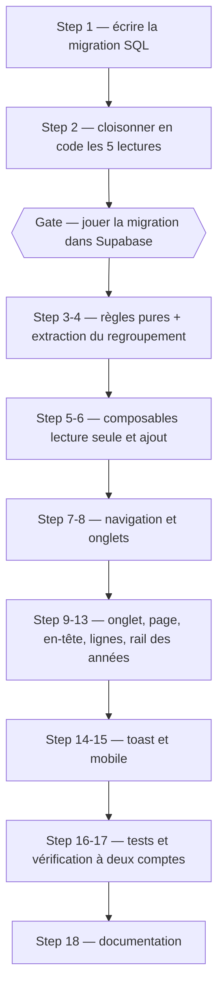

# Listes partagées : voir la timeline d'un autre compte, et y piocher

## Summary of intent

Cinégenda est ouverte à deux comptes depuis le chantier `2609221212`, mais les deux listes ne se
voient pas : chacun a sa timeline, et personne ne sait ce que l'autre suit. Ce chantier ajoute un
**onglet par liste partagée** dans le rail — « Liste de Papa » à côté de Timeline et Stats — qui
ouvre la timeline de l'autre compte avec la même grammaire visuelle que la sienne : navigation par
année, regroupement par mois, mêmes lignes de films. En lecture seule, avec deux ajouts : une
bascule « Seulement ceux que je n'ai pas », et sur chaque ligne un menu « Ajouter à ma liste » qui
recopie le film chez soi.

Le partage est **mutuel et symétrique** : le même mécanisme rend ma liste visible à l'autre. Il
s'ouvre par un seul geste, dans le dashboard Supabase — renseigner `profiles.display_name`. Un
compte sans nom n'apparaît nulle part et sa liste reste illisible.

« Done » se lit ainsi : depuis mon compte je vois l'onglet « Liste de Papa » avec le nombre de films
qu'il a et que je n'ai pas ; je l'ouvre, je navigue dans ses années, je coche « Seulement ceux que je
n'ai pas », j'ajoute un film chez moi en deux clics et je le retrouve dans ma timeline sans
rechargement ; depuis son compte il voit « Liste d'Alexis » et fait la même chose ; et **ma propre
timeline n'a pas changé d'un film**.

## Related context

- **Goal / issue:** demande utilisateur du 23/09/2026 — « rajouter un onglet où je peux voir la
  timeline des autres utilisateurs et inversement afin que l'on puisse voir quels films ils ont
  ajouté à leur liste et s'il y en a que je n'ai pas alors je peux les ajouter à la mienne. Vu que
  pour le moment il n'y a pas de nom d'utilisateur il faut rajouter un champ en BDD que je vais
  moi-même à la main dans supabase remplir. Si je suis dans la liste d'un autre utilisateur je peux
  naviguer à travers les différentes années, et je peux filtrer pour ne voir que ceux que je n'ai
  pas. » + maquette mise à jour dans `_ressources/tmpl/Timeline.html`.
- **Branch:** `feature/listes-partagees` (mono-repo — `.claude/rules/f-github-pr-cross-repo-linking.md`
  ne concerne que les PR liant deux dépôts, donc aucune règle cross-repo applicable ici).
- **Rules pertinentes:** aucune. La seule rule du dépôt (`f-github-pr-cross-repo-linking.md`) ne
  s'applique qu'au moment de la PR, et seulement en multi-repo.
- **Skills mobilisées (cf. `f-plan` Step 1.5):** **aucune skill de la table des quick triggers ne
  matche.** Balayage fait : pas d'URL ni de node Figma (la maquette est un bundle d'artifact local),
  pas d'ACF ni de WordPress (projet Nuxt 3), pas de `.grid` / `.flex` / `.wrapper` FCINQ (le projet a
  son propre SCSS scoped), pas de nouveau SVG à exporter (`add.svg` et `check.svg` existent déjà dans
  `app/assets/svg/`), pas de mixin de typo FCINQ (le projet écrit `font:` en shorthand, arbitrage
  acté au plan `2609231217`), pas de dépendance PHP, pas de composant `AComponent`, pas de CPT /
  taxonomie / menu. Les seules skills du cycle sont `f-implement` (exécution de ce plan) puis
  `f-commit` et `f-pr` en sortie.

### Arbitrages validés par Alexis le 23/09/2026 (les trois questions posées avant rédaction)

1. **Lecture par policy RLS**, pas par route Nitro en service-role. Une cinquième policy `select` sur
   `calendar` laisse un compte approuvé lire les lignes des comptes partagés. Zéro route, zéro
   service-role, le client Supabase existant suffit.
   ⚠️ **Conséquence majeure, traitée au Step 2 :** RLS ne cloisonne plus les lectures de `calendar`,
   donc c'est désormais le **code** qui doit filtrer. Cinq sites d'appel en dépendent aujourd'hui
   sans le savoir.
2. **`display_name` renseigné = liste partagée.** Un seul champ, rempli à la main dans le dashboard,
   qui sert à la fois de libellé d'onglet et d'interrupteur. L'effacer retire le partage.
3. **URL en slug** : `/2026/listes/papa`, dérivé de `display_name`, avec contrainte d'unicité en
   base. Renommer un compte change son URL — sans conséquence, rien ne persiste ces liens.

Et les deux écarts à la maquette proposés à la relecture du plan, **validés le 24/09/2026** :

4. **Les filtres état / média s'appliquent aussi à la liste partagée, sans réinitialisation à
   l'entrée** — contrairement à la maquette, qui les remet à `all` dans `showOther`. Remettre à zéro
   un réglage global sans le dire est pire qu'une liste vide qu'on sait expliquer (cf. Step 10).
5. **`manual_release_date`, `state` et `catchup` ne se recopient pas à l'ajout.** Conséquence
   assumée : un film dont l'autre a corrigé la date à la main peut atterrir dans une autre année chez
   moi (cf. Step 6).

### D'où vient le design, et comment le relire

`_ressources/tmpl/Timeline.html` est un **bundle d'artifact de ~1 Mo** : le markup réel est un JSON
dans `<script type="__bundler/template">` (ligne 382), les polices et icônes sont gzippées + base64
dans `<script type="__bundler/manifest">`. Le template décodé a été extrait dans le scratchpad de
session pour écrire ce plan. ⚠️ **À ré-extraire avant d'implémenter** — le scratchpad est propre à la
session qui a écrit ce plan :

```bash
node -e "const fs=require('fs');
  const l=fs.readFileSync('_ressources/tmpl/Timeline.html','utf8').split('\n');
  fs.writeFileSync('<scratchpad>/timeline-src.html', JSON.parse(l[381]));"
```

Le diff avec la version précédente (`git show HEAD:_ressources/tmpl/Timeline.html`, même extraction)
isole exactement ce que la maquette ajoute — c'est la meilleure lecture du besoin :

| Où | Quoi |
|----|------|
| Rail, groupe « Ma liste » | Un 3ᵉ onglet `showOther` : pastille ronde avec l'initiale, libellé « Liste de Papa », compteur à droite = **nombre de films qu'il a et que je n'ai pas** |
| Timeline, en-tête | Bandeau `sticky` de 72 px quand `isOther` : avatar 40 px, nom, sous-titre `{{ otherStat }}` (« 34 films · 12 que tu n'as pas »), et à droite une pilule bascule « Seulement ceux que je n'ai pas » avec une case à cocher |
| En-têtes de mois | `top: {{ monthTop }}` — `72px` en liste partagée (sous le bandeau), `0px` sinon |
| Lignes de film | `openMedia` et `openState` deviennent `this.stop` (inertes), `openMore` ouvre un menu à **une seule entrée** : « Ajouter à ma liste », ou « Déjà dans ta liste » grisée avec un ✓ |
| Bas d'écran | Toast vert « « Titre » ajouté à ta liste », 2,6 s |
| Rail droit | Inchangé — « Au ciné en ce moment » continue d'afficher **mes** films (`enSalle` lit `myFilms`) |

⚠️ **La maquette ne couvre que le desktop.** `showOther` n'apparaît pas dans la section
`<sc-if value="{{ isMobile }}">`. Le Step 13 comble ce trou en reprenant la grammaire existante
(pilule dans la bande d'onglets `-row`, bandeau adapté).

⚠️ **La maquette compare les films par titre normalisé** (`norm()` / `inMine()`) parce que le
prototype n'a pas d'identifiants. Le vrai code compare par `movie_id` (identifiant TMDB) : exact,
insensible aux titres alternatifs, et sans faux positif entre deux films homonymes.

## Proposed implementation flow



## Implementation steps

### Step 1 — Écrire la migration SQL (ne pas la jouer encore)

- [x] **Todo:** Créer `_ressources/sql/2609231743-add-shared-lists.sql`, idempotent et commenté dans
  le style des migrations existantes, qui pose :
  1. **`profiles.display_name text unique`** — nullable. `unique` parce qu'il porte le slug d'URL :
     deux « Papa » rendraient `/2026/listes/papa` ambigu. ⚠️ Pas de `not null` : `null` est
     l'état par défaut et signifie « pas partagé ».
  2. **`public.shared_list_owner_ids() returns uuid[]`**, `stable security definer set search_path =
     public`, qui rend les `user_id` des profils **approuvés et nommés**.
     ⚠️ `security definer` pour la même raison que `is_approved()` : la fonction lit `profiles`, et
     une fonction de garde ne doit pas dépendre d'une policy qu'un futur resserrage casserait.
     ⚠️ **Sans argument et `stable`** : le planificateur peut la replier en InitPlan et l'évaluer une
     fois par requête. Une variante `is_shared_list_owner(uuid)` serait appelée **une fois par
     ligne** sur la lecture la plus chaude du projet.
  3. **Policy `profiles: lecture des profils partagés`** — `for select to authenticated using
     (display_name is not null and public.is_approved())`.
     ⚠️ C'est un **revirement explicite** de l'avertissement de `2609221212` (« Pas de policy select
     ouverte à `authenticated` sur toute la table : elle permettrait d'énumérer les comptes
     existants »). L'écart est assumé et borné : seuls les profils **nommés à la main** sortent, et
     seulement pour un appelant **approuvé**. Un compte en attente ne voit toujours rien, et un
     compte approuvé mais anonyme reste invisible. À écrire dans le fichier, pas seulement ici.
  4. **Policy `calendar: lecture des listes partagées`** — `for select to authenticated using
     (public.is_approved() and user_id = any(public.shared_list_owner_ids()))`. Elle **s'ajoute** à
     `calendar: lecture de sa liste`, qui reste inchangée : les policies s'additionnent, et ma
     propre liste doit rester lisible même si je n'ai pas de `display_name`.
  5. **Un bloc de contrôle final** qui vérifie ce que le fichier vient de faire : cinq policies sur
     `calendar`, les trois d'écriture toujours filtrées sur `auth.uid()` **et** `is_approved()`, et
     `shared_list_owner_ids()` qui ne rend que des profils approuvés.
  6. **Un avertissement en tête** : ⚠️ les blocs de contrôle de `2609221213` (« exactement 4
     policies ») et de `2609231045` (« toute policy mentionne `auth.uid()` ») **ne passent plus** sur
     cette base. Rejouer `2609221213` purgerait au passage la policy de partage, sans le dire. Dire
     explicitement : *si tu rejoues 2609221213, rejoue celle-ci derrière.*
- **Files:** `_ressources/sql/2609231743-add-shared-lists.sql` (create)
- **Acceptance:** Le fichier se relit seul : un lecteur comprend pourquoi chaque policy existe, ce
  qui casse si on la retire, et ce qui casse si on rejoue une ancienne migration. **Rien n'est joué
  dans Supabase à ce stade** (cf. le Gate après le Step 2).
- score / 10

### Step 2 — Cloisonner en code les cinq lectures qui reposaient sur RLS

- [x] **Todo:** ⚠️ **Le step le plus important du chantier.** Cinq sites d'appel supposent
  aujourd'hui que RLS ne rend que les lignes de l'appelant. Dès que les policies du Step 1 sont
  jouées, cette supposition devient fausse et **trois d'entre eux lèvent une exception**
  (`maybeSingle()` sur plusieurs lignes). Les corriger **avant** de jouer la migration :

  | Fichier | Ligne | Aujourd'hui | Symptôme après ouverture | Correction |
  |---|---|---|---|---|
  | `app/composables/useMovieCalendar.js` | `getMovies` | `.select('*')` sans filtre | **Ma timeline affiche les films de Papa**, mélangés aux miens | `.select('*').eq('user_id', user.value?.id)` |
  | `app/composables/useMovieCalendar.js` | `addCatchupMovie` | `.eq('movie_id', …).limit(1)` | Le contrôle « déjà dans ma liste » matche **sa** ligne → l'`update` qui suit touche 0 ligne (RLS écriture) et le film n'est jamais ajouté, sans erreur | ajouter `.eq('user_id', user.value?.id)` |
  | `app/components/nav/MovieAddForm.vue` | `addMovie` | `.eq('movie_id', …).maybeSingle()` | **Lève** dès que lui et moi avons le même film → l'ajout échoue en silence (`catch` → `console.error`) | ajouter `.eq('user_id', user.value?.id)` |
  | `app/composables/useProfile.js` | `fetchProfile` | `.select(…).maybeSingle()` sans filtre | **Lève** → `unavailable = true` → repli fermé → **tout le monde sur `/pending`** | `.eq('user_id', user.value.id)` |
  | `server/utils/requireUser.js` | — | `.select(…).maybeSingle()` sans filtre | **Lève** → 503 sur les cinq routes gardées → **la vue Séances tombe** | `.eq('user_id', userId)` (l'identifiant normalisé déjà calculé juste au-dessus, jamais `user.id` brut — cf. l'avertissement en place sur `sub` vs `id`) |
  | `server/utils/userCity.js` | `cityForRequest` | `.select('city').maybeSingle()` sans filtre | **Trouvé à l'implémentation, absent du plan initial.** L'erreur est avalée par le repli du fichier → **un compte troyen se voit servir Paris en silence** : mauvaise localisation Allociné, mauvais filtre de salles, mauvaise clé de cache | `serverSupabaseUser(event)` (dans un `try`, elle lève sur jeton illisible) + `.eq('user_id', userId)`. ⚠️ Le mémo de 5 min est consulté **avant**, donc l'en-tête du fichier (« pas d'aller-retour d'authentification par affichage ») reste vrai |

  ⚠️ **Réécrire les commentaires qui affirment le contraire**, ils deviennent faux et sont
  précisément ce qui ferait retirer le filtre à la prochaine relecture : le bloc « Pas de
  `.eq('user_id', …)` : la policy ne rend que la ligne de l'appelant » dans `useProfile.js`, et le
  bloc « ⚠️ **Pas de `.eq('user_id', …)`.** […] ne pas réécrire côté code ce que RLS fait déjà »
  dans `requireUser.js`. Les remplacer par la règle nouvelle : *depuis les listes partagées, RLS ne
  cloisonne plus la lecture — le filtre de propriétaire est porté par le code, et il n'est pas
  facultatif.*
- **Files:** `app/composables/useMovieCalendar.js`, `app/components/nav/MovieAddForm.vue`,
  `app/composables/useProfile.js`, `server/utils/requireUser.js`, `server/utils/userCity.js` (modify)
- **Acceptance:** `grep -rn "from('calendar')\|from('profiles')" app server | grep -i select` → chaque
  ligne de lecture porte un filtre de propriétaire explicite, **sauf** celles qui visent
  délibérément une autre liste (Step 5) et celles en service-role (`server/api/cron/warm.js`, les
  scripts), qui ne passent pas par RLS. L'application tourne encore exactement comme avant, policies
  non jouées.
- score / 10

### Gate — Jouer la migration dans Supabase

- [ ] **Todo:** ⚠️ **Ordre impératif : Step 2 d'abord, migration ensuite.** Les deux tournent contre
  le même projet Supabase en local. Jouer le SQL avant le Step 2, c'est voir sa propre timeline se
  remplir des films de l'autre, et `/pending` s'afficher pour tout le monde. Une fois le Step 2
  écrit : jouer `2609231743-add-shared-lists.sql` dans le SQL editor, puis renseigner
  `profiles.display_name` à la main pour les deux comptes (`'Alexis'`, `'Papa'`).
- **Files:** aucun (dashboard Supabase)
- **Acceptance:** Les deux profils portent un nom ; l'application tourne à l'identique ; une lecture
  manuelle `select count(*) from calendar` depuis une session navigateur rend maintenant le total des
  deux listes, ce que le code filtre.
- score / 10

### Step 3 — Les règles pures du partage

- [x] **Todo:** Créer `app/utils/sharedLists.js` — sans dépendance, testable, source unique :
  - `listSlug(displayName)` — minuscules, `NFD` sans diacritiques, non-alphanumériques → `-`,
    compactage des tirets. `'Papa'` → `'papa'`, `'Jean-Éric'` → `'jean-eric'`.
  - `listInitial(displayName)` — la première lettre en capitale, pour l'avatar.
  - `missingFrom(theirs, mine)` — les films de `theirs` dont le `movie_id` n'est dans aucun de
    `mine`. ⚠️ Comparaison sur `Number(movie_id)` : la colonne est numérique mais a transité par des
    `String()` dans les URL, et un `'123' !== 123` produirait un « tu ne l'as pas » faux.
  - `sharedListStat(total, missing)` — « 34 films · 12 que tu n'as pas », avec les accords
    (`1 film`, `0 que tu n'as pas` → « tu les as tous »).
  ⚠️ `listSlug` est la **seule** définition du slug : l'URL, la résolution de la route et le libellé
  d'onglet doivent tous en sortir. Une seconde écriture « à la main » ferait une route qui ne trouve
  jamais son profil.
- **Files:** `app/utils/sharedLists.js` (create)
- **Acceptance:** Le module s'importe depuis un script Node nu (aucun import Nuxt, aucun
  auto-import utilisé à l'intérieur) — vérifié par le Step 14.
- score / 10

### Step 4 — Extraire le regroupement année → mois → jour

- [x] **Todo:** Sortir de `useMovieCalendar.sortMovies` la partie **pure** du tri dans
  `app/utils/moviesGrouping.js` : `groupByYearMonthDay(list)` → `{ grouped, undated }`, où `grouped`
  est l'objet `{ année: { mois: { jour: [films] } } }` déjà rendu par `sortedMovies` et `undated` la
  liste sans date. Le composable ne garde que le branchement sur les filtres du store et l'écriture
  dans ses `useState`.
  ⚠️ **Extraction à comportement constant** : `releaseDateOf`, l'`Intl.DateTimeFormat('fr-FR', {
  month: 'long' })` et l'ordre de tri sont repris tels quels. La timeline actuelle ne doit pas bouger
  d'un pixel — c'est le seul moyen de rendre le Step 9 gratuit.
- **Files:** `app/utils/moviesGrouping.js` (create), `app/composables/useMovieCalendar.js` (modify)
- **Acceptance:** La timeline se rend à l'identique (mêmes mois, même ordre, même section « Sans
  date »). Le regroupement est appelé depuis deux endroits au Step 5.
- score / 10

### Step 5 — `useSharedLists` : les profils partagés et leurs listes, en lecture seule

- [x] **Todo:** Créer `app/composables/useSharedLists.js`, calqué sur `useProfile` / `useCinemas`
  (une lecture par visite, partagée entre layout et pages, garde sur la requête **en vol** posée sur
  `nuxtApp` et non sur son résultat) :
  - `sharedProfiles` (`useState`) — `select('user_id, display_name, city')` sur `profiles`,
    **moins le sien** (`.neq('user_id', me)`), trié par nom. Chaque entrée porte son `slug` et son
    `initial` (Step 3).
  - `loadSharedProfiles()` — appelée depuis le layout, **en tâche de fond et sans `await`**, comme
    `syncInTheaters` : les onglets apparaissent une fraction de seconde après le premier rendu
    plutôt que de le retarder.
  - `sharedListOf(slug)` — les lignes de `calendar` du compte visé :
    `.eq('user_id', id)`, et **une sélection de colonnes explicite** plutôt que `select('*')` — le
    tableau de bord de l'autre (`catchup`, `catchup_at`, `in_theaters_checked_at`, `events`,
    `allocine_id`) n'a rien à faire ici. Colonnes retenues : `id, movie_id, media, state, title,
    poster_path, release_date, manual_release_date, director, genres, countries, tmdb_vote,
    letterboxd_rating, letterboxd_directors`.
  - Mémoïsation par `user_id` dans un `useState` (`{ [user_id]: rows }`) : revenir sur l'onglet ne
    relit pas la base.
  - `missingCountFor(slug)` — `missingFrom(leurs, mes movies).length`, pour le badge de l'onglet.
  - `onlyMissing` (`useState`, `false`) — la bascule, partagée entre l'en-tête et la page.
  ⚠️ **Ce composable n'écrit jamais.** Aucun `applyAutoInTheaters`, aucun `recheckUpcomingCinema`,
  aucun filet de sécurité « titre manquant », aucun rafraîchissement Letterboxd sur ces lignes : ce
  sont les lignes de quelqu'un d'autre, RLS refuserait l'écriture **en silence** (0 ligne touchée,
  pas d'erreur), et le code se mettrait à réessayer indéfiniment. À écrire en tête du fichier.
  ⚠️ Le compteur du badge a besoin de la liste **entière** de l'autre. C'est un second chargement de
  ~450 lignes au démarrage : d'où les colonnes triées ci-dessus, et le chargement en tâche de fond.
- **Files:** `app/composables/useSharedLists.js` (create)
- **Acceptance:** Depuis la console, `useSharedLists().sharedProfiles` rend l'autre compte avec son
  slug ; `sharedListOf('papa')` rend ses films ; aucune requête d'écriture ne part (onglet Réseau).
- score / 10

### Step 6 — Ajouter un film depuis une liste partagée

- [x] **Todo:** Ajouter `addFromSharedList(row)` à `useMovieCalendar`, troisième et dernier point
  d'insertion dans `calendar` (les deux autres : `MovieAddForm.addMovie`, `addCatchupMovie`) :
  - **Aucun appel TMDB.** Les métadonnées sont déjà persistées dans **sa** ligne : `title`,
    `poster_path`, `release_date`, `director`, `genres`, `countries`, `tmdb_vote`,
    `letterboxd_rating`, `letterboxd_directors`. On les recopie. C'est le seul point d'insertion du
    projet qui ne paie pas d'aller-retour réseau.
  - **Ce qui ne se recopie pas, et pourquoi :** `state` (forcé à `'unseen'` — son visionnage n'est
    pas le mien), `catchup` / `catchup_year` / `catchup_at` (sa liste de rattrapage), `manual_release_date`
    (son correctif de date à lui), `in_theaters_checked_at` / `events` / `allocine_id` (état de
    synchronisation, recalculé pour moi au prochain passage de `useInTheatersSync`).
    ⚠️ Conséquence assumée de `manual_release_date` : si Papa a corrigé la date d'un film à la main,
    le film n'atterrit pas forcément dans la même année chez moi que chez lui. C'est correct — sa
    correction est une donnée personnelle — mais c'est surprenant, donc à documenter.
  - `media` **est** recopié : c'est un fait sur le film (il sort au ciné, il est sur Netflix), pas
    une préférence.
  - `user_id: user.value?.id` explicite, comme les deux autres points d'insertion, et pour la même
    raison (cf. le commentaire de `MovieAddForm`).
  - Garde d'idempotence : si le `movie_id` est déjà chez moi, ne rien insérer et rendre `null` — le
    menu affiche déjà « Déjà dans ta liste », mais deux clics rapides ne doivent pas créer un
    doublon.
  - Rend l'entrée à intégrer localement, qui repart dans `handleMovieAdded` → la timeline se met à
    jour sans rechargement, et le badge de l'onglet se décrémente tout seul (`missingCountFor` est
    dérivé de `movies`).
  - `void resolveLetterboxdDirectors(client, entry)` **seulement si** `letterboxd_directors` était
    absent de sa ligne — sinon on repaie un scrape de 8 s pour une donnée qu'on vient de recopier.
- **Files:** `app/composables/useMovieCalendar.js` (modify)
- **Acceptance:** Un film ajouté depuis la liste de Papa apparaît immédiatement dans ma timeline, à
  la bonne date, avec son affiche et son réalisateur cliquable, sans qu'aucune requête TMDB ne parte.
- score / 10

### Step 7 — Navigation : la vue « liste partagée » dans `useCalendarNav`

- [x] **Todo:** Étendre `app/composables/useCalendarNav.js` :
  - `VIEW_BY_ROUTE` reçoit `'year-listes-user': 'shared'`. `viewMode` rend donc `'shared'` sur ces
    pages. ⚠️ `isLibraryView` est défini en négatif (`!isYearlessView`) : `'shared'` est donc déjà
    traité comme une vue de la liste — années + statuts dans le rail, pastille d'année en mobile.
    C'est exactement ce que veut la maquette, et ça ne demande aucune ligne.
  - `sharedSlug` — un `computed` sur `route.params.user`, pour que le rail sache **quel** onglet est
    actif quand il y en a plusieurs.
  - `selectSharedList(slug)` → `navigateTo(/${yearToSlug(selectedYear.value)}/listes/${slug})`, sur
    le modèle de `selectView`, avec le même `clearHighlight()` en tête.
  - `selectYear` : la vue `'shared'` n'est pas dans `YEARLESS_VIEWS`, donc le code actuel
    construirait `/2024/shared`, qui n'existe pas. ⚠️ Ajouter la branche qui reconstruit
    `/${année}/listes/${sharedSlug}`.
- **Files:** `app/composables/useCalendarNav.js` (modify)
- **Acceptance:** Changer d'année depuis la liste de Papa reste dans sa liste. Changer d'onglet
  depuis sa liste revient sur la bonne vue avec l'année conservée.
- score / 10

### Step 8 — Le middleware `valid-year` connaît la nouvelle vue

- [x] **Todo:** `app/middleware/valid-year.js` déduit la vue par `String(to.name).endsWith('stats')`
  et retombe sinon sur `timeline`. ⚠️ Une année invalide sur `/xxxx/listes/papa` renverrait donc sur
  `/2026/timeline` — on perd la liste qu'on regardait. Ajouter la branche qui reconstruit
  `/${année courante}/listes/${to.params.user}`.
- **Files:** `app/middleware/valid-year.js` (modify)
- **Acceptance:** `/abcd/listes/papa` redirige sur `/2026/listes/papa`, pas sur `/2026/timeline`.
- score / 10

### Step 9 — L'onglet dans le rail et dans la bande mobile

- [x] **Todo:** `app/components/nav/ViewTabs.vue` : ajouter au groupe **« Ma liste »** (comme la
  maquette) un onglet par entrée de `sharedProfiles` :
  - libellé `Liste de {display_name}`, pastille ronde de 1,6 rem avec l'initiale à la place du
    picto, compteur à droite = `missingCountFor(slug)` (masqué à 0).
  - actif quand `viewMode === 'shared' && sharedSlug === slug`.
  - émet `select-shared-list` avec le slug ; `SideNav` et le layout le relaient vers
    `selectSharedList`.
  - ⚠️ Le `computed` `GROUPS` lit déjà `cityInfo` : y ajouter `sharedProfiles` suffit, la liste
    d'onglets se recalcule d'elle-même quand le chargement de fond arrive.
  - ⚠️ `TABS` (disposition `-row`, mobile) est dérivé de `GROUPS.flatMap` : les onglets partagés y
    apparaissent **gratuitement**. Vérifier seulement que le recentrage de l'onglet actif
    (`centerActive`) tient avec cinq pilules au lieu de quatre.
  - Nouvelle variable de palette `$color-shared: #5B6BD0;` (indigo de la maquette, aucune couleur
    existante n'en approche) dans `app/assets/styles/_variables.scss`, commentée « avatar d'une liste
    partagée ».
- **Files:** `app/components/nav/ViewTabs.vue`, `app/components/nav/SideNav.vue`,
  `app/layouts/default.vue`, `app/assets/styles/_variables.scss` (modify)
- **Acceptance:** L'onglet « Liste de Papa » apparaît dans le rail desktop **et** dans la bande
  mobile, avec le bon compteur, et se surligne quand on est dessus.
- score / 10

### Step 10 — La page `/[year]/listes/[user]`

- [x] **Todo:** Créer `app/pages/[year]/listes/[user].vue` :
  - `definePageMeta({ key: route => 'liste-' + route.params.user, middleware: ['auth', 'valid-year'] })`.
    ⚠️ Clé **par utilisateur** et non constante comme `'timeline'` : changer d'année ne doit pas
    remonter la page (même raison que la timeline), mais changer de liste doit la remonter — sinon
    l'en-tête garderait le nom précédent le temps d'un tick.
  - `useHead({ title: 'Liste de ' + nom })`.
  - Résolution du profil par slug contre `sharedProfiles` ; **profil introuvable** (slug inconnu,
    nom effacé depuis, partage retiré) → `throw createError({ statusCode: 404 })`, rendu par
    `app/error.vue`. ⚠️ Ne pas rediriger en silence sur la timeline : une liste qui disparaît sans
    rien dire se lit comme un bug.
  - Chargement de la liste, regroupement par `groupByYearMonthDay` (Step 4) **après** application de
    la bascule `onlyMissing` et des filtres du store — dans cet ordre, sinon les compteurs de mois
    mentent.
  - Rend `SharedListHeader` + `TimelineList` en mode lecture seule, et écoute `add-to-list`.
  - ⚠️ Les filtres état / média du store **s'appliquent aussi** à la liste partagée (même règle
    pure, et « ne voir que ce qu'il a vu » est une lecture légitime). Contrairement à la maquette, on
    ne les réinitialise **pas** à l'entrée : remettre à zéro un réglage global sans le dire est pire
    qu'une liste vide qu'on sait expliquer. Le message vide le dit (« Aucun film ne correspond. »).
- **Files:** `app/pages/[year]/listes/[user].vue` (create)
- **Acceptance:** `/2026/listes/papa` affiche ses films de 2026 groupés par mois ; `/2026/listes/inconnu`
  affiche la page 404 du projet.
- score / 10

### Step 11 — L'en-tête de liste partagée

- [x] **Todo:** Créer `app/components/SharedListHeader.vue` d'après la maquette : bandeau `sticky` de
  7,2 rem, avatar rond de 4 rem en `$color-shared` portant l'initiale, nom en `$font-title`,
  sous-titre `sharedListStat(...)` en `$font-mono`, et à droite la pilule bascule « Seulement ceux
  que je n'ai pas » (case + libellé, bordure `$color-primary` à l'état actif).
  - Vrai `<button type="button" role="switch" :aria-checked>` et non une `<div>` cliquable : c'est
    le seul contrôle de la vue, il doit s'atteindre au clavier avec l'anneau de focus du projet
    (`@include focusRing()`).
  - ⚠️ **L'empilement de deux `sticky`.** L'en-tête est à `top: 0; z-index: 3`, les en-têtes de mois
    passent à `top: var(--shared-head-h)` et restent en `z-index: 2`. Poser la hauteur en variable
    CSS sur `.timeline-list`, comme `--head-h` l'est déjà : un chiffre en dur à deux endroits est
    exactement ce qui fait glisser un en-tête sous l'autre au premier ajustement.
  - ⚠️ `.headmask` de `TimelineList` masque la bande haute du scroller : en liste partagée elle doit
    valoir `--shared-head-h + --head-h`, sinon la plaque laisse voir les films sous le bandeau
    pendant un scroll rapide.
- **Files:** `app/components/SharedListHeader.vue` (create), `app/components/TimelineList.vue` (modify)
- **Acceptance:** Au scroll, le bandeau reste en haut, les en-têtes de mois se collent **sous** lui
  sans le chevaucher, et rien ne transparaît entre les deux. La bascule se coche à la barre d'espace.
- score / 10

### Step 12 — Les lignes de film en lecture seule

- [x] **Todo:** Donner à `MovieListItem.vue` un mode « liste d'un autre », activé par une prop
  `shared: Boolean` :
  - Les deux `SelectBtn` (média, état) cèdent la place à des **pastilles inertes** : `MediaBadge`
    pour le média, et l'icône d'état correspondante, sans `@click` et sans `cursor: pointer`.
    ⚠️ Ne pas se contenter de neutraliser le clic : un contrôle qui a l'air d'un menu et n'en ouvre
    aucun se lit comme une panne. Et RLS refuserait l'écriture **en silence**, donc rien ne signalerait
    l'erreur si un chemin oublié écrivait quand même.
  - `MovieActionsBtn` cède la place à un nouveau `app/components/AddToListAction.vue` : même bouton
    `⋯`, même popover, **une seule entrée** — « Ajouter à ma liste » (picto `add.svg`) ou « Déjà dans
    ta liste » (picto `check.svg`, grisée, non cliquable), selon une prop `alreadyMine`.
  - Le lien du titre vers Letterboxd et les liens réalisateurs restent actifs : ils ne dépendent que
    du `movie_id` et de `letterboxd_directors`, recopiés dans sa ligne comme dans la mienne.
  - `TimelineList.vue` relaie la prop `shared` et l'événement `add-to-list`, et remplace le message
    vide par « Tu as déjà tous ses films. » quand la bascule `onlyMissing` est active et que la liste
    filtrée est vide — « Aucun film ne correspond. » serait faux, et inquiétant.
- **Files:** `app/components/MovieListItem.vue`, `app/components/TimelineList.vue` (modify),
  `app/components/AddToListAction.vue` (create)
- **Acceptance:** Dans la liste de Papa, aucun contrôle n'écrit ; le menu `⋯` propose « Ajouter à ma
  liste » sur ce que je n'ai pas et « Déjà dans ta liste » sur le reste ; aucune requête `PATCH` ne
  part de cette vue.
- score / 10

### Step 13 — Le rail des années suit la liste affichée

- [x] **Todo:** Dans `app/layouts/default.vue`, `yearList` est dérivé de `sortedMovies` (ma liste).
  En vue `'shared'`, il doit être dérivé du regroupement de **sa** liste — sinon le rail propose mes
  années et leurs compteurs pendant qu'on regarde les siennes.
  - Extraire le calcul en une fonction locale `yearsOf(grouped, undated)` et l'appeler avec l'une ou
    l'autre source selon `viewMode`.
  - ⚠️ Le regroupement de la liste partagée est calculé par la **page**. Pour que le layout y accède
    sans le recalculer, le poser dans `useSharedLists` (un `useState` `sharedGrouped`) : le layout et
    la page lisent la même chose, et le rail ne peut pas diverger de ce qui est affiché.
  - Le rail droit (« Au ciné en ce moment ») **reste affiché** en vue `'shared'` et continue de
    montrer **mes** films — c'est ce que fait la maquette (`enSalle` lit `myFilms`). La condition
    `v-if="viewMode === 'timeline'"` devient `isLibrary && viewMode !== 'stats'`.
- **Files:** `app/layouts/default.vue`, `app/composables/useSharedLists.js` (modify)
- **Acceptance:** Sur la liste de Papa, le rail des années liste **ses** années avec **ses**
  compteurs ; cliquer 2024 y reste ; le rail droit affiche toujours mes films en salle.
- score / 10

### Step 14 — Le toast « ajouté à ta liste »

- [x] **Todo:** Réutiliser le motif en place (`catchupNotice` dans `useCatchupFlow` + rendu et
  auto-dismiss dans le layout) plutôt qu'en écrire un second : un `useState` `sharedNotice` posé par
  la page, rendu par le layout, `role="status"`, même `<Transition name="notice">`, même timer
  possédé par le layout.
  ⚠️ Un seul timer pour les deux notices, ou deux notices peuvent s'écraser sans que le timer de la
  première soit annulé — c'est déjà le piège documenté sur `catchupNoticeTimer`.
- **Files:** `app/layouts/default.vue`, `app/composables/useSharedLists.js` (modify)
- **Acceptance:** Après un ajout, « « Titre » ajouté à ta liste » s'affiche ~4,5 s puis disparaît, et
  est annoncé par un lecteur d'écran.
- score / 10

### Step 15 — Mobile

- [x] **Todo:** La maquette ne couvre pas le mobile. Reprendre la grammaire existante :
  - la pilule d'onglet arrive gratuitement dans la bande `-row` (Step 9) — vérifier le recentrage et
    la largeur du libellé « Liste de Papa » (le plus long des cinq).
  - `SharedListHeader` en dessous de 1000 px : avatar et titre réduits, sous-titre conservé, et la
    bascule **passe à la ligne** sous le bloc nom plutôt que de comprimer le nom — même logique que
    `.month-head` qui réduit ses paddings. Recalculer `--shared-head-h` au breakpoint.
  - La pastille d'année mobile pilote déjà la vue `'shared'` (elle est conditionnée à `isLibrary`,
    vrai par défaut) : vérifier que le menu année y affiche **ses** années (dépend du Step 13).
- **Files:** `app/components/SharedListHeader.vue`, `app/components/nav/ViewTabs.vue` (modify)
- **Acceptance:** À 375 px : l'onglet est atteignable, l'en-tête tient sur deux lignes sans
  débordement, le menu année montre ses années, et l'ajout fonctionne.
- score / 10

### Step 16 — Tests des règles pures

- [x] **Todo:** Étendre `scripts/test-seances-rules.mjs` (aucun framework, sortie en code 1 au
  premier échec) avec deux familles, importées du code réel :
  - **`sharedLists`** — `listSlug` (accents, espaces, tirets multiples, casse), `listInitial`,
    `missingFrom` (liste vide des deux côtés, `movie_id` en `string` vs `number`, recouvrement
    total, aucun recouvrement), `sharedListStat` (0 / 1 / n, accords).
  - **`moviesGrouping`** — `groupByYearMonthDay` : tri chronologique, films sans date rangés à part,
    plusieurs films le même jour, override `manual_release_date` prioritaire, ordre des mois dans
    l'objet rendu.
  Mettre à jour l'en-tête du fichier (la liste numérotée des familles) et la section **Tests** de
  `CLAUDE.md`, qui énumère ce que `npm test` couvre.
- **Files:** `scripts/test-seances-rules.mjs`, `CLAUDE.md` (modify)
- **Acceptance:** `npm test` passe, et échoue si on casse volontairement `missingFrom` (comparaison
  par `===` sans `Number()`).
- score / 10

### Step 17 — Vérification à deux comptes

- [~] **Todo:** Vérifier le parcours de bout en bout sur `npm run dev`, dans **deux navigateurs
  distincts** (ou une fenêtre privée) pour tenir deux sessions Supabase en parallèle :
  1. Compte A voit l'onglet de B avec le bon compteur ; compte B voit celui de A. Symétrie vérifiée.
  2. Navigation par année dans la liste de l'autre ; bascule « Seulement ceux que je n'ai pas ».
  3. Ajout d'un film → il apparaît dans ma timeline sans rechargement, le compteur de l'onglet
     décroît, le toast s'affiche, et **la liste de l'autre n'a pas bougé** (recharger sa session pour
     le confirmer).
  4. **Non-régression du cloisonnement (Step 2)** : ma timeline ne contient que mes films ; ajouter
     un film que l'autre a déjà fonctionne ; `/seances` et `/evenements` se chargent (elles tombent
     en 503 si `requireUser` a été oublié) ; un compte non approuvé arrive toujours sur `/pending`.
  5. Effacer `display_name` d'un compte dans le dashboard → son onglet disparaît au rechargement, et
     son URL rend 404.
  ⚠️ Vérification en **Chrome headless piloté par script** (`chromium.launch({ channel: 'chrome',
  headless: true })`, script dans le scratchpad de session), jamais par l'extension Chrome ni en mode
  fenêtré.
  ⚠️ Ne pas lancer `npm run build` pendant que le serveur de dev tourne (cf. `CLAUDE.md`).
- **Files:** aucun (vérification)
- **Acceptance:** Les cinq points passent. Le point 4 est le plus important : c'est la non-régression
  de l'ouverture RLS.
- **État au 24/09/2026 — partiel, la suite demande deux sessions :**
  - ✅ **Ce qui a été vérifié sans session.** Le serveur de dev démarre sans erreur ; les quatre
    routes répondent en 200 et le middleware `auth` les renvoie bien sur `/login` ;
    ⚠️ **le nom de route est `year-listes-user`**, confirmé sur le module `routes.mjs` servi par Vite
    — c'était le point à ne pas supposer, `VIEW_BY_ROUTE` retombant **silencieusement** sur
    `'timeline'` en cas d'erreur, et le middleware `valid-year` sur la mauvaise redirection ; les
    dix-sept fichiers touchés se compilent (transformés un par un par Vite, aucune erreur) ; les
    auto-imports se résolvent (`missingFrom`, `groupByYearMonthDay`, `yearsOf`, `useSharedLists`
    vérifiés dans la sortie compilée) ; `npm test` passe (503 assertions) et **échoue bien** si l'on
    retire le `Number()` de `missingFrom`.
  - ⏳ **Ce qui reste à faire, par Alexis :** jouer la migration (Gate), nommer les deux comptes,
    puis les cinq points ci-dessus dans deux navigateurs. Rien de tout cela n'est atteignable sans
    deux sessions Supabase réelles.
- **Correctif du 24/09/2026, après la première connexion réelle.** Migration jouée et profils nommés,
  la connexion renvoyait « Ton compte n'est pas encore validé » sur un compte `approved = true`, avec
  la carte `/pending` vide (ville et date absentes → `profile` valait `null`).
  **Cause :** `useSupabaseUser()` rend les **claims du JWT** et non un objet utilisateur — les deux
  plugins de `@nuxtjs/supabase` 2.0.5 y écrivent `getClaims()`, au rendu serveur comme dans le
  navigateur. L'identifiant s'appelle `sub` ; les `.eq('user_id', user.value?.id)` du Step 2
  envoyaient donc `user_id=eq.undefined`, PostgREST répondait `22P02` (vérifié en direct sur
  l'instance), et le repli fermé de `useProfile` traduisait l'erreur en « non approuvé ».
  C'est **exactement** le piège que `requireUser.js` documente depuis le chantier multi-comptes, et
  que le Step 2 avait réintroduit côté client.
  **Correctif :** `app/utils/currentUser.js` → `userIdOf(user)` = `sub ?? id`, appliqué aux six sites.
  ⚠️ **Trouvé au passage, hors périmètre :** `useCinemas.toggleFavorite` insérait
  `user_id: user.value.id`. Sur `calendar` le `default auth.uid()` rattrapait l'oubli ;
  `cinema_favorites.user_id` est `not null` **sans défaut**, donc le toggle « cinéma favori » était
  cassé depuis le chantier multi-comptes. Corrigé avec le reste — même cause, une ligne.
- score / 10

### Step 18 — Documentation

- [x] **Todo:** Écrire `_ressources/README-listes-partagees.md` sur le modèle de
  `README-seances.md` / `README-pages-auth.md` : comment ouvrir un partage (une ligne dans le
  dashboard), ce que l'autre voit exactement, ce qu'il ne voit pas, ce qui se recopie à l'ajout et ce
  qui ne se recopie pas, et les pièges — **le cloisonnement désormais porté par le code**, l'ordre
  Step 2 → migration, les blocs de contrôle des migrations antérieures qui ne passent plus.
  Puis ajouter à `CLAUDE.md` une section **« Listes partagées »** courte qui renvoie au README, et
  compléter la section **Data flow** : `calendar` n'est plus cloisonnée par RLS en lecture.
- **Files:** `_ressources/README-listes-partagees.md` (create), `CLAUDE.md` (modify)
- **Acceptance:** Quelqu'un qui arrive sur le dépôt six mois plus tard comprend, sans lire le SQL,
  pourquoi `getMovies` porte un `.eq('user_id', …)` et ce qui casse s'il le retire.
- score / 10

### Step 19 — Correctifs issus de la revue (24/09/2026)

- [x] **Todo:** Traiter les sept points de `/f-review` :
  1. **Sécurité — `shared_list_owner_ids()` exécutable par `anon`.** `create function` accorde
     `execute` à `public`, dont `anon` est membre : le `revoke … from anon` de `2609231743` ne
     retirait rien. Mesuré sur l'instance (un RPC avec la seule clé anon rendait les deux UUID).
     → `_ressources/sql/2609241150-fix-shared-function-grants.sql`, plus le commentaire mensonger
     corrigé dans la migration d'origine. ⚠️ **À jouer dans Supabase.**
  2. **`sharedGrouped` écrasé au démontage.** `mode: 'default'` fait monter la page entrante avant le
     démontage de la sortante : d'une liste partagée à une autre, le rail retombait sur mes années.
     → effacement conditionné à `sharedGrouped.value === grouped.value`.
  3. **Deep-link sur une liste avant le chargement de la mienne.** → `ready`, qui suspend le
     compteur, le sous-titre et la bascule tant que `movies` est vide.
  4. **`forgetSharedList` mort** (0 usage) → supprimé.
  5. **Chemin de repli non testé dans `addFromSharedList`** → supprimé. Les colonnes Letterboxd sont
     posées après l'insertion par `patchCalendarRow`, qui porte déjà le repli `PGRST204` et qui est
     testé. L'insertion reprend exactement la forme des deux autres.
  6. **Coût du démarrage** → le compteur ne lit plus que `movie_id` (`loadSharedIds`) ; les quatorze
     colonnes d'affichage ne partent qu'à l'ouverture d'une liste.
  7. **Divers** : bascule indexée par `user_id` (elle restait cochée d'une liste à l'autre), `Échap`
     ferme les deux popovers (`AddToListAction` **et** `MovieActionsBtn`, qui ne l'avait pas non
     plus), `userIdOf` couvert par six assertions, ordre de déclaration remis d'aplomb dans la page.
- **Files:** `_ressources/sql/2609241150-fix-shared-function-grants.sql` (create) ;
  `_ressources/sql/2609231743-add-shared-lists.sql`, `app/composables/{useSharedLists,useMovieCalendar}.js`,
  `app/pages/[year]/listes/[user].vue`, `app/components/{SharedListHeader,AddToListAction,MovieActionsBtn}.vue`,
  `scripts/test-seances-rules.mjs`, `_ressources/README-listes-partagees.md`, `CLAUDE.md` (modify)
- **Acceptance:** `npm test` passe (509 assertions, +6). Tous les modules touchés se recompilent.
  ⏳ Le point 1 n'est **effectif qu'une fois la migration jouée** — tant qu'elle ne l'est pas,
  l'instance rend toujours les UUID à un appel anonyme.
- score / 10

## Dependencies and ordering

- **Step 1 → Step 2 → Gate.** L'ordre est impératif et c'est le point le plus fragile du chantier :
  le fichier SQL s'écrit d'abord, mais **ne se joue qu'après** que le code filtre par propriétaire.
  Jouer la migration avant le Step 2 casse l'application pour les deux comptes en même temps
  (timelines mélangées, `/pending` pour tout le monde, Séances en 503).
- **Step 3 et 4 avant 5** : `useSharedLists` consomme les deux modules purs.
- **Step 4 avant 10 et 13** : la page et le rail des années partagent le même regroupement.
- **Step 5 avant 9** : le badge de l'onglet lit `missingCountFor`.
- **Step 7 et 8 avant 10** : la page n'est atteignable que si la route et le middleware la
  connaissent.
- **Step 11 et 12 avant 15** : le mobile adapte ce qui existe.
- **Step 16 après 3 et 4**, **17 après tout le reste**, **18 en dernier** (elle décrit ce qui a été
  réellement fait, pas ce qui était prévu).
- Aucune skill n'est chaînée (cf. « Skills mobilisées »).

## Risks and unknowns

| Risk / unknown | Mitigation |
|----------------|------------|
| **Le cloisonnement passe du SGBD au code.** Un futur `select` sur `calendar` sans `.eq('user_id')` ré-ouvrira la fuite, silencieusement — la requête ne lève pas, elle rend trop de lignes. | Step 2 : réécrire les commentaires qui affirment le contraire, poser la règle en tête des deux fichiers concernés. Step 18 : la documenter dans `CLAUDE.md`, à côté de la règle `requireUser`. Grep d'acceptance reproductible dans le plan. |
| **Rejouer `2609221213` supprime la policy de partage** (purge exhaustive + « exactement 4 policies »), sans le dire. | Avertissement en tête de la nouvelle migration, et dans le README : *si tu rejoues 2609221213, rejoue celle-ci derrière.* |
| **Trois `maybeSingle()` deviennent des exceptions**, dont un dans `requireUser` qui met toute la vue Séances en 503 — et le repli fermé de `useProfile` envoie tout le monde sur `/pending`. Le symptôme ne ressemble pas à sa cause. | Step 2, corrigé **avant** de jouer la migration. Point 4 du Step 17 en non-régression explicite. |
| **Second chargement de ~450 lignes au démarrage** pour le compteur du badge. | Colonnes explicitement listées (Step 5) plutôt que `select('*')`, chargement en tâche de fond sans `await`, mémoïsation par `user_id`. Si ça pèse, replier sur un premier `select('movie_id')` seul pour le badge — noté, pas fait d'emblée. |
| **`shared_list_owner_ids()` évaluée par ligne** si le planificateur ne la replie pas en InitPlan, sur la lecture la plus chaude du projet. | Fonction **sans argument** et `stable`, forme que Postgres sait replier. Et le code filtre déjà par `user_id` en amont, donc la branche partagée de la policy ne s'évalue que sur la liste qu'on demande. |
| **La policy `profiles` expose `city`, `approved`, `created_at`** des comptes nommés aux comptes approuvés. | Assumé et borné : deux comptes de confiance, aucune donnée sensible (pas d'e-mail dans `profiles`), et l'exposition demande **deux** conditions — profil nommé à la main, appelant approuvé. Écrit dans la migration, pas seulement ici. |
| **`.-id-<movieId>` en double** pendant le crossfade entre ma timeline et une liste partagée (les deux pages coexistent ~200 ms), or `useMovieScroll` fait un `document.querySelector` qui prend le premier. | Sans conséquence en pratique : le scroll ne part que d'une recherche ou d'un clic du rail, tous deux hors période de transition. À vérifier au Step 17 si un scroll paraît viser la mauvaise ligne. |
| **L'onglet partagé vit dans le groupe « Ma liste »** (choix de la maquette), ce qui se lit mal : « Ma liste › Liste de Papa ». | Conforme à la maquette, donc retenu. À 3 listes ou plus, un groupe « Listes partagées » sera plus juste — c'est un déplacement de trois lignes dans `ViewTabs.GROUPS`, pas une refonte. |
| **Les filtres état / média s'appliquent à la liste partagée** sans être réinitialisés à l'entrée (la maquette, elle, les remet à zéro). Un filtre actif oublié peut faire croire à une liste vide. | Le message vide reste explicite (« Aucun film ne correspond. »), distinct de celui de la bascule (« Tu as déjà tous ses films. »). Réinitialiser un réglage global en silence serait pire. |
| **`manual_release_date` non recopié** : un film corrigé à la main chez lui peut atterrir dans une autre année chez moi. | Correct par construction (c'est sa correction, pas la mienne), mais surprenant : documenté au Step 18. |

## Handoff to implementation

- **Plan file:** `_ressources/plans/2609231743-listes-partagees-entre-comptes.md`
- **First todo:** Step 1 — Écrire la migration SQL (sans la jouer)
- **Out of scope:**
  - **Écrire dans la liste d'un autre** (changer son état, supprimer un de ses films) — la lecture
    seule est la règle, et les policies d'écriture restent strictement `user_id = auth.uid()`.
  - **Les Stats d'un autre compte** — l'onglet Stats reste sur ma liste. Rien n'y répond dans la
    maquette, et `useYearStats` suppose la liste courante.
  - **Les vues Séances / Événements partagées** — elles sont indexées sur la ville et sur mes films
    en salle ; aucun besoin exprimé.
  - **Une interface pour nommer un compte** (`display_name` se remplit dans le dashboard, à la main,
    c'est la demande) et **un réglage de partage dans l'application**.
  - **Notifications** quand l'autre ajoute un film.
  - **Plus de deux comptes** : le code est écrit générique (une boucle sur `sharedProfiles`), mais ni
    l'ergonomie du rail ni le coût de chargement n'ont été pensés pour dix listes.

**Next action:** Work implementation steps in order, checking off each `- [ ]` as completed.
